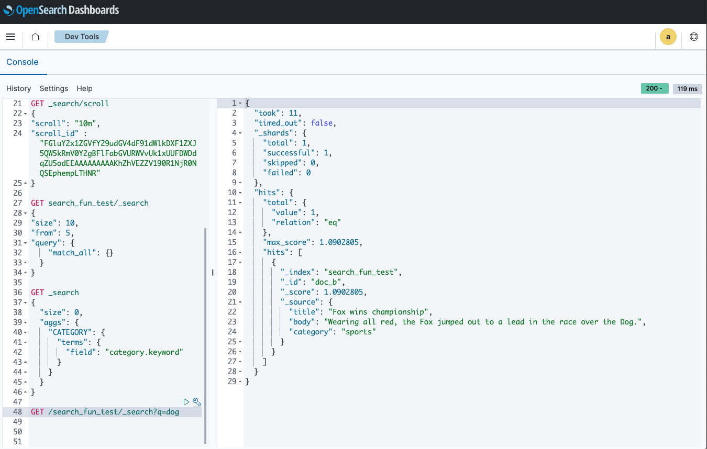
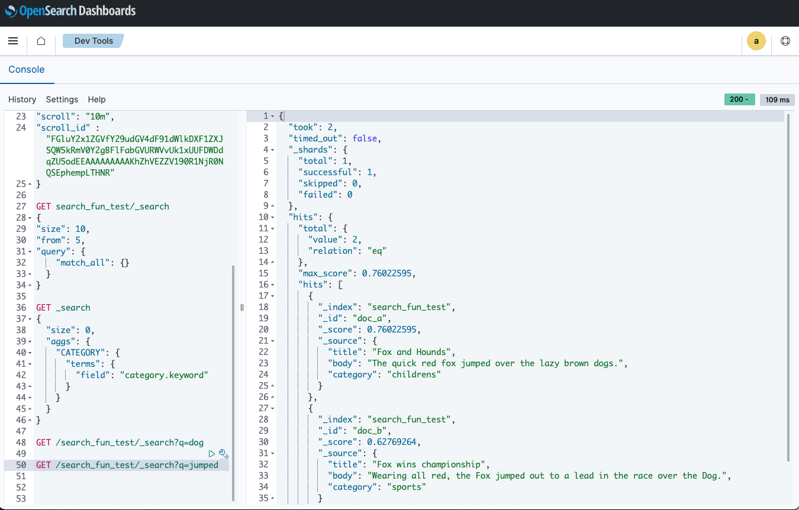
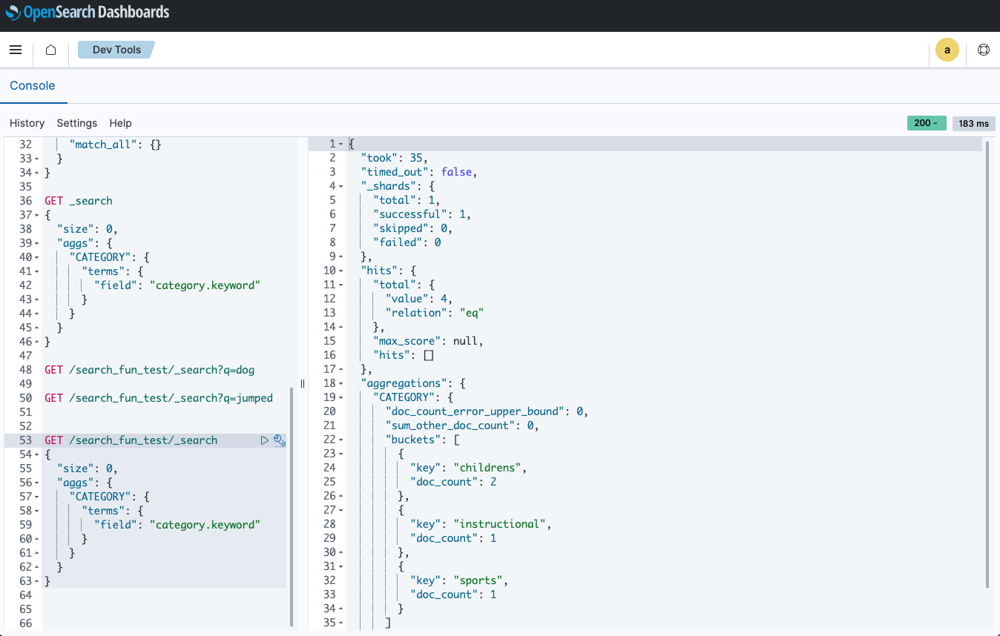
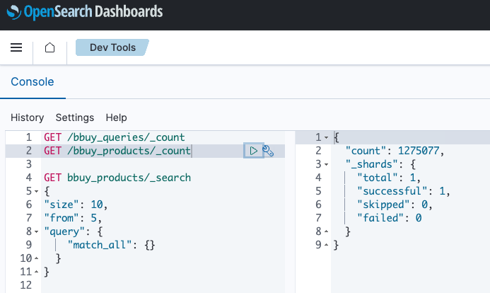
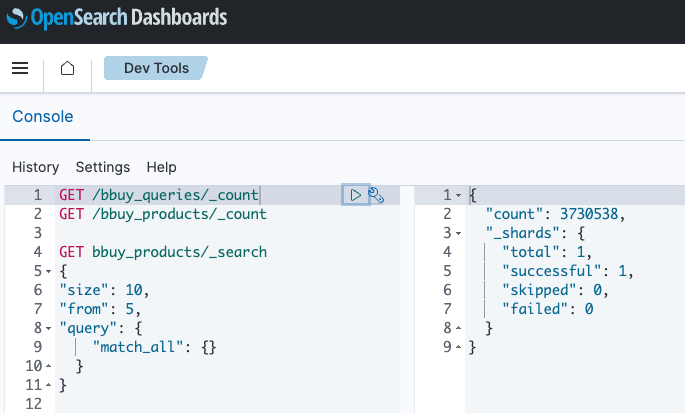
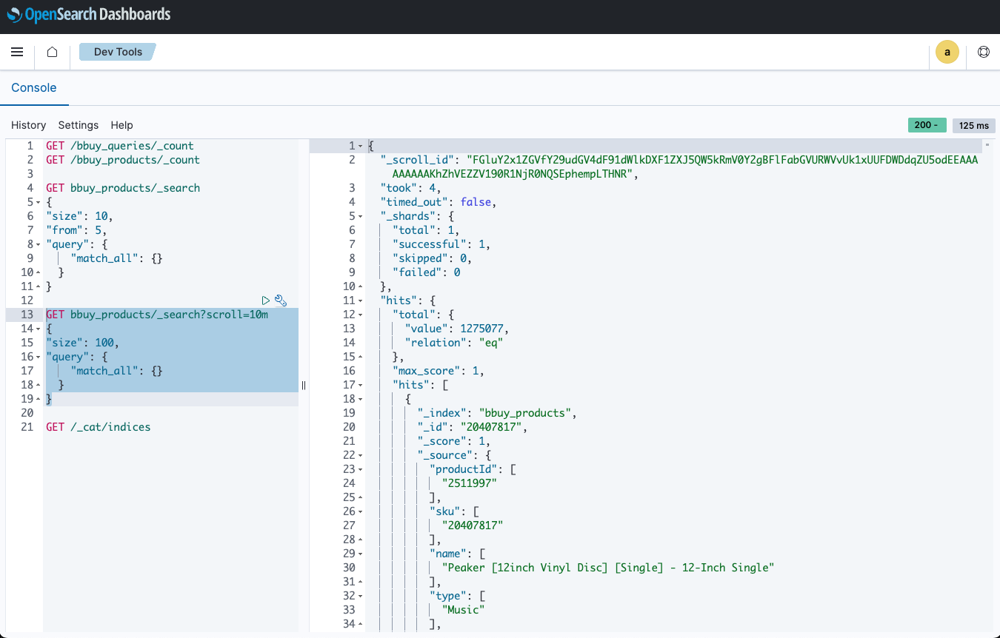
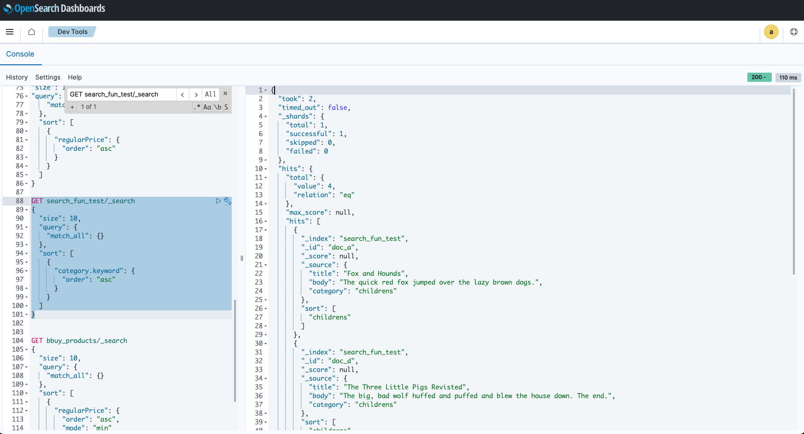
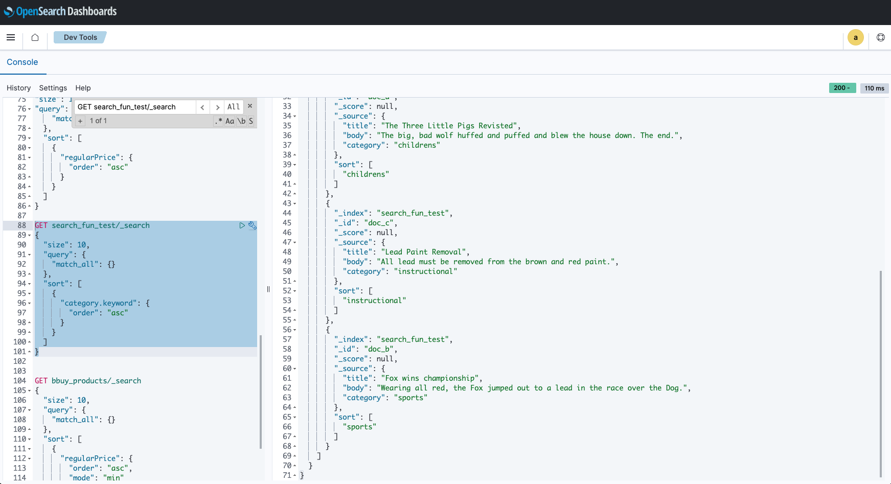

# A Quick OpenSearch Introduction

## OpenSearch DevTools

Going to your workspace and then `/app/dev_tools#/console` will bring up the dev tools dashboard with a suite of functions.

For example, my link was something like this: https://5601-GITHUB_USERNAME-PROJECT_NAME-RANDOM_CHARS.ws-us105.gitpod.io/app/dev_tools#/console

Add content to OpenSearch with this command:
```JSON
PUT /search_fun_test/_doc/doc_a
{ 
   "title": "Fox and Hounds", 
   "body": "The quick red fox jumped over the lazy brown dogs.", 
   "category": "childrens" 
}

PUT /search_fun_test/_doc/doc_b
{ 
   "title": "Fox wins championship", 
   "body": "Wearing all red, the Fox jumped out to a lead in the race over the Dog.", 
   "category": "sports" 
}

PUT /search_fun_test/_doc/doc_c
{ 
   "title": "Lead Paint Removal", 
   "body": "All lead must be removed from the brown and red paint.", 
   "category": "instructional" 
}

PUT /search_fun_test/_doc/doc_d
{    
   "title": "The Three Little Pigs Revisted", 
   "body": "The big, bad wolf huffed and puffed and blew the house down. The end.", 
   "category": "childrens" 
}
```

Select all of the items and press the ▶️ play button (to the left of the 🔧 wrench button)

To test that this worked, run `GET /search_fun_test/_doc/doc_b`
The output should look like this:
```json
{
  "_index": "search_fun_test",
  "_id": "doc_b",
  "_version": 1,
  "_seq_no": 1,
  "_primary_term": 1,
  "found": true,
  "_source": {
    "title": "Fox wins championship",
    "body": "Wearing all red, the Fox jumped out to a lead in the race over the Dog.",
    "category": "sports"
  }
}
```

To execute a search, I run: `GET /search_fun_test/_search?q=dog`
The output looks like this:
```json
{
  "took": 11,
  "timed_out": false,
  "_shards": {
    "total": 1,
    "successful": 1,
    "skipped": 0,
    "failed": 0
  },
  "hits": {
    "total": {
      "value": 1,
      "relation": "eq"
    },
    "max_score": 1.0902805,
    "hits": [
      {
        "_index": "search_fun_test",
        "_id": "doc_b",
        "_score": 1.0902805,
        "_source": {
          "title": "Fox wins championship",
          "body": "Wearing all red, the Fox jumped out to a lead in the race over the Dog.",
          "category": "sports"
        }
      }
    ]
  }
}
```
Here's a screenshot:



Here's a search for `jumped` which shows up in more documents: `GET /search_fun_test/_search?q=jumped`
The output is this:
```json
{
  "took": 2,
  "timed_out": false,
  "_shards": {
    "total": 1,
    "successful": 1,
    "skipped": 0,
    "failed": 0
  },
  "hits": {
    "total": {
      "value": 2,
      "relation": "eq"
    },
    "max_score": 0.76022595,
    "hits": [
      {
        "_index": "search_fun_test",
        "_id": "doc_a",
        "_score": 0.76022595,
        "_source": {
          "title": "Fox and Hounds",
          "body": "The quick red fox jumped over the lazy brown dogs.",
          "category": "childrens"
        }
      },
      {
        "_index": "search_fun_test",
        "_id": "doc_b",
        "_score": 0.62769264,
        "_source": {
          "title": "Fox wins championship",
          "body": "Wearing all red, the Fox jumped out to a lead in the race over the Dog.",
          "category": "sports"
        }
      }
    ]
  }
}
```
Here's a screenshot:



Adding an aggregation is done like this:
```bash
GET _search
{
  "size": 0,
  "aggs": {
    "CATEGORY": {
      "terms": {
        "field": "category.keyword"
      }
    }
  }
}
```
The output is this:
```json
{
  "took": 35,
  "timed_out": false,
  "_shards": {
    "total": 1,
    "successful": 1,
    "skipped": 0,
    "failed": 0
  },
  "hits": {
    "total": {
      "value": 4,
      "relation": "eq"
    },
    "max_score": null,
    "hits": []
  },
  "aggregations": {
    "CATEGORY": {
      "doc_count_error_upper_bound": 0,
      "sum_other_doc_count": 0,
      "buckets": [
        {
          "key": "childrens",
          "doc_count": 2
        },
        {
          "key": "instructional",
          "doc_count": 1
        },
        {
          "key": "sports",
          "doc_count": 1
        }
      ]
    }
  }
}
```
Here's a screenshot:



### 🐞 Debugging: `pyenv-virtualenv: activate must be sourced. Run 'source activate envname' instead of 'activate envname'`

I had an issue where I tried to run: `pyenv activate search_with_ml` and got this error:
```bash
pyenv-virtualenv: activate must be sourced. Run 'source activate envname' instead of 'activate envname'
```

#### List the virtual env's
To fix this, I listed the env's to find out which ones were created with this:
```bash
pyenv virtualenvs
```
This printed out:
```bash
  3.9.7/envs/search_fundamentals (created from /home/gitpod/.pyenv/versions/3.9.7)
  search_fundamentals (created from /home/gitpod/.pyenv/versions/3.9.7)
```

#### Create the virtualenv
To create the virutalenv, I ran: 
```bash
pyenv virtualenv search_with_ml
```
This printed out:
```bash
Looking in links: /tmp/tmpevpi1mws
Requirement already satisfied: setuptools in /home/gitpod/.pyenv/versions/3.9.7/envs/search_with_ml/lib/python3.9/site-packages (57.4.0)
Requirement already satisfied: pip in /home/gitpod/.pyenv/versions/3.9.7/envs/search_with_ml/lib/python3.9/site-packages (21.2.3)
```

#### Activate the virtualenv
To activate the virtualenv, I ran: 
```bash
pyenv activate search_with_ml
```

I now see this, meaning I activated the virtualenv:
```bash
(search_with_ml) gitpod /workspace/search_fundamentals_course (main) $ python --version
Python 3.9.7
```

### 🐞 Debugging: `ipython` not in the virtualenv
I tried to run the `ipython` command in my virtual environment, but got this error:
```bash
(search_with_ml) gitpod /workspace/search_fundamentals_course (main) $ ipython
pyenv: ipython: command not found

The `ipython' command exists in these Python versions:
  3.9.7/envs/search_fundamentals
  3.12.0
  search_fundamentals

Note: See 'pyenv help global' for tips on allowing both
      python2 and python3 to be found.
```

I upgraded `pip` with this:
```bash
/home/gitpod/.pyenv/versions/3.9.7/envs/search_with_ml/bin/python3.9 -m pip install --upgrade pip
```

❌ If I try to install `ipython`: `pip install ipython`
This gives this error: `ERROR: Can not perform a '--user' install. User site-packages are not visible in this virtualenv.`

✅ If I try with the `--no-user` option: `pip install --no-user ipython`
This works, and then I can access the ipython:
```bash
(search_with_ml) gitpod /workspace/search_fundamentals_course (main) $ ipython
Python 3.9.7 (default, Oct 28 2023, 21:11:00) 
Type 'copyright', 'credits' or 'license' for more information
IPython 8.16.1 -- An enhanced Interactive Python. Type '?' for help.

In [1]: 
```

This means that I am now in a Python shell. 

To reset the python shell: `%reset` and then `exit`


## Create a Connection Between OpenSearch and the Python client: 

Install the dependencies from the requirements.txt file: 
```bash
pip install --no-user  -r requirements.txt
```

Make sure the `ipython` shell is generated and active:
```bash
ipython
```
You should see something like this:
```bash
(search_with_ml) gitpod /workspace/search_fundamentals_course (main) $ ipython
Python 3.9.7 (default, Oct 28 2023, 21:11:00) 
Type 'copyright', 'credits' or 'license' for more information
IPython 8.16.1 -- An enhanced Interactive Python. Type '?' for help.

In [1]:
```

This is how we establish a connection to OpenSearch with our Python Client.
The code we want to enter into our ipython shell is this:
```python
from opensearchpy import OpenSearch
import json

# Create the client with SSL/TLS enabled, but hostname and certification verification disabled.
host = 'localhost'
port = 9200
auth = ('admin', 'admin')  # For testing only. Don't store credentials in code.

client = OpenSearch(
    hosts=[{'host': host, 'port': port}],
    http_compress=True,  # enables gzip compression for request bodies
    http_auth=auth,
    # client_cert=client_cert_path,
    # client_key=client_key_path,
    use_ssl=True,
    verify_certs=False,
    ssl_assert_hostname=False,
    ssl_show_warn=False,
)

# Do a few checks before we start indexing:
print(client.cat.health())
print(client.cat.indices())

# If you still have your documents from the Dev Tools test, we should be able to check them here:
print(client.cat.count("search_fun_test", params={"v": "true"}))
```

After entering this into our ipython shell, we should see this printed out:
```bash
1698602537 18:02:17 docker-cluster yellow 1 1 true 10 10 0 0 5 0 - 66.7%

yellow open .plugins-ml-config                        sKaAlr1bTq-fiZ5_7apJ4A 1 1     1 0   3.9kb   3.9kb
green  open .opensearch-observability                 5fw6RBe5ThONI_Rb7BAuIQ 1 0     0 0    208b    208b
green  open .kibana_92668751_admin_1                  1FxAwTDvSjqp72if01UvJw 1 0    60 0  36.4kb  36.4kb
green  open opensearch_dashboards_sample_data_flights Sg0VSY2wSm--3_GBR6w8OA 1 0 13059 0     6mb     6mb
yellow open security-auditlog-2023.10.29              cmNFKML4S9mMI-goV9m8Kw 1 1   329 0 893.2kb 893.2kb
yellow open search_fun_test                           CuHNBXtEQNaZWcfPBtoxpQ 1 1     4 0   6.8kb   6.8kb
green  open .kibana_1                                 gjylP6a-RKaNTUujx78pyA 1 0     1 0   4.2kb   4.2kb
green  open .opendistro_security                      KnLF_He0QGmYW539Jde-OQ 1 0    10 0  75.6kb  75.6kb

epoch      timestamp count
1698602537 18:02:17  4
```

The `search_fun_test` was implicitly created as an index.
To make the index explicit, I create the index with a single non-default setting by entering this into the ipython shell:
```bash
# Create an index with non-default settings.
index_name = 'search_fun_revisited'
index_body = {
  'settings': {
    'index': {
      'query':{
          'default_field': "body"
      }
    }
  }
}

response = client.indices.create(index_name, body=index_body)
print('\nCreating index:')
print(response)
```
The output of the shell looks like this:
```bash
Creating index:
{'acknowledged': True, 'shards_acknowledged': True, 'index': 'search_fun_revisited'}
```

Add the 4 documents from earlier in the ipython shell:
```bash
# Add our sample document to the index.
docs = [
    {
        "id": "doc_a",
        "title": "Fox and Hounds",
        "body": "The quick red fox jumped over the lazy brown dogs.",
        "price": "5.99",
        "in_stock": True,
        "category": "childrens"},
    {
        "id": "doc_b",
        "title": "Fox wins championship",
        "body": "Wearing all red, the Fox jumped out to a lead in the race over the Dog.",
        "price": "15.13",
        "in_stock": True,
        "category": "sports"},
    {
        "id": "doc_c",
        "title": "Lead Paint Removal",
        "body": "All lead must be removed from the brown and red paint.",
        "price": "150.21",
        "in_stock": False,
        "category": "instructional"},
    {
        "id": "doc_d",
        "title": "The Three Little Pigs Revisted",
        "price": "3.51",
        "in_stock": True,
        "body": "The big, bad wolf huffed and puffed and blew the house down. The end.",
        "category": "childrens"}
]

for doc in docs:
    doc_id = doc["id"]
    print("Indexing {}".format(doc_id))
    response = client.index(
        index=index_name,
        body=doc,
        id=doc_id,
        refresh=True
    )
    print('\n\tResponse:')
    print(response)

# Verify they are in:
print(client.cat.count(index_name, params={"v": "true"}))
```
The output looks like this: 
```bash
Indexing doc_a

        Response:
{'_index': 'search_fun_revisited', '_id': 'doc_a', '_version': 1, 'result': 'created', 'forced_refresh': True, '_shards': {'total': 2, 'successful': 1, 'failed': 0}, '_seq_no': 0, '_primary_term': 1}
Indexing doc_b

        Response:
{'_index': 'search_fun_revisited', '_id': 'doc_b', '_version': 1, 'result': 'created', 'forced_refresh': True, '_shards': {'total': 2, 'successful': 1, 'failed': 0}, '_seq_no': 1, '_primary_term': 1}
Indexing doc_c

        Response:
{'_index': 'search_fun_revisited', '_id': 'doc_c', '_version': 1, 'result': 'created', 'forced_refresh': True, '_shards': {'total': 2, 'successful': 1, 'failed': 0}, '_seq_no': 2, '_primary_term': 1}
Indexing doc_d

        Response:
{'_index': 'search_fun_revisited', '_id': 'doc_d', '_version': 1, 'result': 'created', 'forced_refresh': True, '_shards': {'total': 2, 'successful': 1, 'failed': 0}, '_seq_no': 3, '_primary_term': 1}
epoch      timestamp count
1698602725 18:05:25  4
```

### 🐞 Debugging: `pip list` shows up as empty when using the `pyenv` setup
I wanted to validate the python packages/shims in the workspace, but everytime I ran `pip list`, I got an empty string returned. Yet, I was able to run `ipython` because I had installed it as part of the requirements. It was quite strange.

So I started checking the working directories of the packages, such as `which python` which showed: `/home/gitpod/.pyenv/shims/python`

I then ran `pyenv` which told me about the python environment details I had set up and some useful pyenv commands. I noticed there was one for shims, which said "shims     List existing pyenv shims"

So I ran `pyenv shims` and this returned all of the packages:
```bash
/home/gitpod/.pyenv/shims/2to3
/home/gitpod/.pyenv/shims/2to3-3.12
/home/gitpod/.pyenv/shims/2to3-3.9
/home/gitpod/.pyenv/shims/activate
/home/gitpod/.pyenv/shims/activate.csh
/home/gitpod/.pyenv/shims/activate.fish
/home/gitpod/.pyenv/shims/Activate.ps1
/home/gitpod/.pyenv/shims/autopep8
/home/gitpod/.pyenv/shims/bandit
/home/gitpod/.pyenv/shims/bandit-baseline
/home/gitpod/.pyenv/shims/bandit-config-generator
/home/gitpod/.pyenv/shims/convert-caffe2-to-onnx
/home/gitpod/.pyenv/shims/convert-onnx-to-caffe2
/home/gitpod/.pyenv/shims/dmypy
/home/gitpod/.pyenv/shims/docutils
/home/gitpod/.pyenv/shims/f2py
/home/gitpod/.pyenv/shims/flake8
/home/gitpod/.pyenv/shims/flask
/home/gitpod/.pyenv/shims/fonttools
/home/gitpod/.pyenv/shims/get_gprof
/home/gitpod/.pyenv/shims/get_objgraph
/home/gitpod/.pyenv/shims/huggingface-cli
/home/gitpod/.pyenv/shims/idle
/home/gitpod/.pyenv/shims/idle3
/home/gitpod/.pyenv/shims/idle3.12
/home/gitpod/.pyenv/shims/idle3.9
/home/gitpod/.pyenv/shims/ipython
/home/gitpod/.pyenv/shims/ipython3
/home/gitpod/.pyenv/shims/isort
/home/gitpod/.pyenv/shims/isort-identify-imports
/home/gitpod/.pyenv/shims/isympy
/home/gitpod/.pyenv/shims/jlpm
/home/gitpod/.pyenv/shims/jsonpointer
/home/gitpod/.pyenv/shims/jsonschema
/home/gitpod/.pyenv/shims/jupyter
/home/gitpod/.pyenv/shims/jupyter-dejavu
/home/gitpod/.pyenv/shims/jupyter-events
/home/gitpod/.pyenv/shims/jupyter-execute
/home/gitpod/.pyenv/shims/jupyter-kernel
/home/gitpod/.pyenv/shims/jupyter-kernelspec
/home/gitpod/.pyenv/shims/jupyter-lab
/home/gitpod/.pyenv/shims/jupyter-labextension
/home/gitpod/.pyenv/shims/jupyter-labhub
/home/gitpod/.pyenv/shims/jupyter-migrate
/home/gitpod/.pyenv/shims/jupyter-nbconvert
/home/gitpod/.pyenv/shims/jupyter-notebook
/home/gitpod/.pyenv/shims/jupyter-run
/home/gitpod/.pyenv/shims/jupyter-server
/home/gitpod/.pyenv/shims/jupyter-troubleshoot
/home/gitpod/.pyenv/shims/jupyter-trust
/home/gitpod/.pyenv/shims/kaggle
/home/gitpod/.pyenv/shims/keyring
/home/gitpod/.pyenv/shims/markdown-it
/home/gitpod/.pyenv/shims/mypy
/home/gitpod/.pyenv/shims/mypyc
/home/gitpod/.pyenv/shims/nltk
/home/gitpod/.pyenv/shims/normalizer
/home/gitpod/.pyenv/shims/numba
/home/gitpod/.pyenv/shims/pbr
/home/gitpod/.pyenv/shims/pep8
/home/gitpod/.pyenv/shims/pip
/home/gitpod/.pyenv/shims/pip3
/home/gitpod/.pyenv/shims/pip3.11
/home/gitpod/.pyenv/shims/pip3.12
/home/gitpod/.pyenv/shims/pip3.9
/home/gitpod/.pyenv/shims/pipenv
/home/gitpod/.pyenv/shims/pipenv-resolver
/home/gitpod/.pyenv/shims/pkginfo
/home/gitpod/.pyenv/shims/pybabel
/home/gitpod/.pyenv/shims/pybind11-config
/home/gitpod/.pyenv/shims/__pycache__
/home/gitpod/.pyenv/shims/pycodestyle
/home/gitpod/.pyenv/shims/pydoc
/home/gitpod/.pyenv/shims/pydoc3
/home/gitpod/.pyenv/shims/pydoc3.12
/home/gitpod/.pyenv/shims/pydoc3.9
/home/gitpod/.pyenv/shims/pydocstyle
/home/gitpod/.pyenv/shims/pyflakes
/home/gitpod/.pyenv/shims/pyftmerge
/home/gitpod/.pyenv/shims/pyftsubset
/home/gitpod/.pyenv/shims/pygmentize
/home/gitpod/.pyenv/shims/pyjson5
/home/gitpod/.pyenv/shims/pylama
/home/gitpod/.pyenv/shims/pylint
/home/gitpod/.pyenv/shims/pylint-config
/home/gitpod/.pyenv/shims/pyreverse
/home/gitpod/.pyenv/shims/python
/home/gitpod/.pyenv/shims/python3
/home/gitpod/.pyenv/shims/python3.12
/home/gitpod/.pyenv/shims/python3.12-config
/home/gitpod/.pyenv/shims/python3.12-gdb.py
/home/gitpod/.pyenv/shims/python3.9
/home/gitpod/.pyenv/shims/python3.9-config
/home/gitpod/.pyenv/shims/python3.9-gdb.py
/home/gitpod/.pyenv/shims/python3-config
/home/gitpod/.pyenv/shims/python-config
/home/gitpod/.pyenv/shims/rst2html4.py
/home/gitpod/.pyenv/shims/rst2html5.py
/home/gitpod/.pyenv/shims/rst2html.py
/home/gitpod/.pyenv/shims/rst2latex.py
/home/gitpod/.pyenv/shims/rst2man.py
/home/gitpod/.pyenv/shims/rst2odt_prepstyles.py
/home/gitpod/.pyenv/shims/rst2odt.py
/home/gitpod/.pyenv/shims/rst2pseudoxml.py
/home/gitpod/.pyenv/shims/rst2s5.py
/home/gitpod/.pyenv/shims/rst2xetex.py
/home/gitpod/.pyenv/shims/rst2xml.py
/home/gitpod/.pyenv/shims/rstpep2html.py
/home/gitpod/.pyenv/shims/send2trash
/home/gitpod/.pyenv/shims/slugify
/home/gitpod/.pyenv/shims/stubgen
/home/gitpod/.pyenv/shims/stubtest
/home/gitpod/.pyenv/shims/symilar
/home/gitpod/.pyenv/shims/torchrun
/home/gitpod/.pyenv/shims/tqdm
/home/gitpod/.pyenv/shims/transformers-cli
/home/gitpod/.pyenv/shims/ttx
/home/gitpod/.pyenv/shims/twine
/home/gitpod/.pyenv/shims/undill
/home/gitpod/.pyenv/shims/virtualenv
/home/gitpod/.pyenv/shims/wheel
/home/gitpod/.pyenv/shims/wsdump
```


## Improving Indexing Performance with Bulk Indexing
Passing 1 doc at a time to a search engine is too slow. OpenSearch's Python client supports bulk indexing with the `bulk` method, taking an array of docs

In the python shell, run the following commands one after the other and enter (or check out the [full script](https://github.com/gsingers/search_fundamentals_course/blob/main/opensearch/opensearch_bulk_index.py)):

### METHOD #1 OF 2: PIECE BY PIECE
Dependencies:
```bash
from opensearchpy.helpers import bulk
```

Connection boilerplate to create client
```bash
from opensearchpy import OpenSearch
from opensearchpy.helpers import bulk
# connection boilerplate to create client
```

Boilerplate for client:
```bash
index_name = 'search_fun_bulk'
index_body = {
    'settings': {
        'index': {
            'query': {
                'default_field': "body"
            }
        }
    }
}

client.indices.create(index_name, body=index_body)
```

Add sample doc to index:
```bash
docs = [
    {
        "id": "doc_a",
        '_index': index_name,
        "title": "Fox and Hounds",
        "body": "The quick red fox jumped over the lazy brown dogs.",
        "price": "5.99",
        "in_stock": True,
        "category": "childrens"},
    {
        "id": "doc_b",
        '_index': index_name,
        "title": "Fox wins championship",
        "body": "Wearing all red, the Fox jumped out to a lead in the race over the Dog.",
        "price": "15.13",
        "in_stock": True,
        "category": "sports"},
    {
        "id": "doc_c",
        '_index': index_name,
        "title": "Lead Paint Removal",
        "body": "All lead must be removed from the brown and red paint.",
        "price": "150.21",
        "in_stock": False,
        "category": "instructional"},
    {
        "id": "doc_d",
        '_index': index_name,
        "title": "The Three Little Pigs Revisted",
        "price": "3.51",
        "in_stock": True,
        "body": "The big, bad wolf huffed and puffed and blew the house down. The end.",
        "category": "childrens"}
]

bulk(client, docs)

print(client.cat.count(index_name, params={"v": "true"}))
```

### METHOD #2 OF 2: THE FULL SCRIPT:
```bash
from opensearchpy import OpenSearch
from opensearchpy.helpers import bulk


host = 'localhost'
port = 9200
auth = ('admin', 'admin')  # For testing only. Don't store credentials in code.

# Create the client with SSL/TLS enabled, but hostname and certificate verification disabled.
client = OpenSearch(
    hosts=[{'host': host, 'port': port}],
    http_compress=True,  # enables gzip compression for request bodies
    http_auth=auth,
    # client_cert = client_cert_path,
    # client_key = client_key_path,
    use_ssl=True,
    verify_certs=False,
    ssl_assert_hostname=False,
    ssl_show_warn=False,
)


index_name = 'search_fun_bulk'
index_body = {
    'settings': {
        'index': {
            'query': {
                'default_field': "body"
            }
        }
    }
}

client.indices.create(index_name, body=index_body)


# Add our sample document to the index.
docs = [
    {
        "id": "doc_a",
        '_index': index_name,
        "title": "Fox and Hounds",
        "body": "The quick red fox jumped over the lazy brown dogs.",
        "price": "5.99",
        "in_stock": True,
        "category": "childrens"},
    {
        "id": "doc_b",
        '_index': index_name,
        "title": "Fox wins championship",
        "body": "Wearing all red, the Fox jumped out to a lead in the race over the Dog.",
        "price": "15.13",
        "in_stock": True,
        "category": "sports"},
    {
        "id": "doc_c",
        '_index': index_name,
        "title": "Lead Paint Removal",
        "body": "All lead must be removed from the brown and red paint.",
        "price": "150.21",
        "in_stock": False,
        "category": "instructional"},
    {
        "id": "doc_d",
        '_index': index_name,
        "title": "The Three Little Pigs Revisted",
        "price": "3.51",
        "in_stock": True,
        "body": "The big, bad wolf huffed and puffed and blew the house down. The end.",
        "category": "childrens"}
]

bulk(client, docs)

print(client.cat.count(index_name, params={"v": "true"}))
```

So did it work? 👀 Here are some codesnippets for debugging/troubleshooting I used in the ipython shell:

### Check bulk operations response:
```bash
response = bulk(client, docs)
print(response)
```

The tuple response of `4, []` meant that the 4 docs were indexed successfully, and no errors which is what the empty array [] means:
```bash
(4, [])
```

### Refresh the index and check the document count:
```bash
client.indices.refresh(index_name)
print(client.cat.count(index_name, params={"v": "true"}))
```

The output showed that there are 8, meaning the docs were added to the previous ones:
```bash
epoch      timestamp count
1698603205 18:13:25  8
```

### How to see the documents (records)

Breaking down Elasticsearch and Kibana:
- **Elasticsearch** typically runs on port `9200``. It's the core search and analytics engine.
- **Kibana** is a visualization layer that runs on top of Elasticsearch, often accessible on port `5601``. It provides a user interface for querying Elasticsearch and visualizing data.

I went to my list of Ports and saw this:

5601 https://5601-brianhhough-searchfunda-h3y8k42emg8.ws-us105.gitpod.io/app/home
9200 https://9200-brianhhough-searchfunda-h3y8k42emg8.ws-us105.gitpod.io/

In my ipython shell, I need to install `elasticsearch` which I did with `pip install elasticsearch`

Then:
```bash
from elasticsearch import Elasticsearch

# Use the provided Elasticsearch instance URL
es_host = "https://9200-brianhhough-searchfunda-h3y8k42emg8.ws-us105.gitpod.io"
client = Elasticsearch(es_host)

# Get a list of all indices
all_indices = client.cat.indices(format='json')

# Print the names of all indices
for index in all_indices:
    print(index['index'])
```

OpenSearch's default mapping is found by running this:
```bash
    print(client.indices.get_mapping(index_name))
``` 
The output looks like thsi:
```bash
{'search_fun_bulk': {'mappings': {'properties': {'body': {'type': 'text', 'fields': {'keyword': {'type': 'keyword', 'ignore_above': 256}}}, 'category': {'type': 'text', 'fields': {'keyword': {'type': 'keyword', 'ignore_above': 256}}}, 'id': {'type': 'text', 'fields': {'keyword': {'type': 'keyword', 'ignore_above': 256}}}, 'in_stock': {'type': 'boolean'}, 'price': {'type': 'text', 'fields': {'keyword': {'type': 'keyword', 'ignore_above': 256}}}, 'title': {'type': 'text', 'fields': {'keyword': {'type': 'keyword', 'ignore_above': 256}}}}}}}
```

Or get a specific index:
```bash
print(client.indices.get_mapping('search_fun_revisited'))
```

```bash
{'search_fun_revisited': {'mappings': {'properties': {'body': {'type': 'text', 'fields': {'keyword': {'type': 'keyword', 'ignore_above': 256}}}, 'category': {'type': 'text', 'fields': {'keyword': {'type': 'keyword', 'ignore_above': 256}}}, 'id': {'type': 'text', 'fields': {'keyword': {'type': 'keyword', 'ignore_above': 256}}}, 'in_stock': {'type': 'boolean'}, 'price': {'type': 'text', 'fields': {'keyword': {'type': 'keyword', 'ignore_above': 256}}}, 'title': {'type': 'text', 'fields': {'keyword': {'type': 'keyword', 'ignore_above': 256}}}}}}}
```

## Mapping data for smarter search
```bash
index_name = 'search_fun_revisited_custom_mappings'
index_body = {
    'settings': {
        'index': {
            'query': {
                'default_field': "body"
            }
        }
    },
    "mappings": {
        "properties": {
            "title": {"type": "text", "analyzer": "english"},
            "body": {"type": "text", "analyzer": "english"},
            "in_stock": {"type": "boolean"},
            "category": {"type": "keyword", "ignore_above": "256"},
            "price": {"type": "float"}
        }
    }
}

client.indices.create(index_name, body=index_body)

for doc in docs:
    doc_id = doc["id"]
    print("Indexing {}".format(doc_id))
    response = client.index(
        index=index_name,
        body=doc,
        id=doc_id,
        refresh=True
    )
    print('\n\tResponse:')
    print(response)
```
The output is with the `_index` meta field, telling OpenSearch where to index the docs to once received from the client:
```bash
Indexing doc_a

        Response:
{'_index': 'search_fun_revisited_custom_mappings', '_id': 'doc_a', '_version': 1, 'result': 'created', 'forced_refresh': True, '_shards': {'total': 2, 'successful': 1, 'failed': 0}, '_seq_no': 0, '_primary_term': 1}
Indexing doc_b

        Response:
{'_index': 'search_fun_revisited_custom_mappings', '_id': 'doc_b', '_version': 1, 'result': 'created', 'forced_refresh': True, '_shards': {'total': 2, 'successful': 1, 'failed': 0}, '_seq_no': 1, '_primary_term': 1}
Indexing doc_c

        Response:
{'_index': 'search_fun_revisited_custom_mappings', '_id': 'doc_c', '_version': 1, 'result': 'created', 'forced_refresh': True, '_shards': {'total': 2, 'successful': 1, 'failed': 0}, '_seq_no': 2, '_primary_term': 1}
Indexing doc_d

        Response:
{'_index': 'search_fun_revisited_custom_mappings', '_id': 'doc_d', '_version': 1, 'result': 'created', 'forced_refresh': True, '_shards': {'total': 2, 'successful': 1, 'failed': 0}, '_seq_no': 3, '_primary_term': 1}
```

This created a new index, with updated mappings. To validate the new English stemming analyzer, I test with these two queries:

### Standard Analyzer
`GET search_fun_revisited/_search?q=body:dogs`

The output is a single item in the `search_fun_revisited` index:
```json
{
  "took": 10,
  "timed_out": false,
  "_shards": {
    "total": 1,
    "successful": 1,
    "skipped": 0,
    "failed": 0
  },
  "hits": {
    "total": {
      "value": 1,
      "relation": "eq"
    },
    "max_score": 1.3204864,
    "hits": [
      {
        "_index": "search_fun_revisited",
        "_id": "doc_a",
        "_score": 1.3204864,
        "_source": {
          "id": "doc_a",
          "title": "Fox and Hounds",
          "body": "The quick red fox jumped over the lazy brown dogs.",
          "price": "5.99",
          "in_stock": true,
          "category": "childrens"
        }
      }
    ]
  }
}
```


### English Analyzer
`GET search_fun_revisited_custom_mappings/_search?q=body:dogs`

The output is a single item in the `search_fun_revisited_custom_mappings` index:
```json
{
  "took": 2,
  "timed_out": false,
  "_shards": {
    "total": 1,
    "successful": 1,
    "skipped": 0,
    "failed": 0
  },
  "hits": {
    "total": {
      "value": 2,
      "relation": "eq"
    },
    "max_score": 0.71833557,
    "hits": [
      {
        "_index": "search_fun_revisited_custom_mappings",
        "_id": "doc_a",
        "_score": 0.71833557,
        "_source": {
          "id": "doc_a",
          "title": "Fox and Hounds",
          "body": "The quick red fox jumped over the lazy brown dogs.",
          "price": "5.99",
          "in_stock": true,
          "category": "childrens"
        }
      },
      {
        "_index": "search_fun_revisited_custom_mappings",
        "_id": "doc_b",
        "_score": 0.6548753,
        "_source": {
          "id": "doc_b",
          "title": "Fox wins championship",
          "body": "Wearing all red, the Fox jumped out to a lead in the race over the Dog.",
          "price": "15.13",
          "in_stock": true,
          "category": "sports"
        }
      }
    ]
  }
}
```


## Querying

### Word Query
To query, I run this in the python shell:
```bash
q = 'dogs'
index_name = 'search_fun_revisited_custom_mappings'
query = {
  'size': 5,
  'query': {
    'multi_match': {
      'query': q,
      'fields': ['title^2', 'body']
    }
  }
}

client.search(
    body = query,
    index = index_name
)
```
The output looks something like this:
```bash
Out[18]: 
{'took': 8,
 'timed_out': False,
 '_shards': {'total': 1, 'successful': 1, 'skipped': 0, 'failed': 0},
 'hits': {'total': {'value': 2, 'relation': 'eq'},
  'max_score': 0.71833557,
  'hits': [{'_index': 'search_fun_revisited_custom_mappings',
    '_id': 'doc_a',
    '_score': 0.71833557,
    '_source': {'id': 'doc_a',
     'title': 'Fox and Hounds',
     'body': 'The quick red fox jumped over the lazy brown dogs.',
     'price': '5.99',
     'in_stock': True,
     'category': 'childrens'}},
   {'_index': 'search_fun_revisited_custom_mappings',
    '_id': 'doc_b',
    '_score': 0.6548753,
    '_source': {'id': 'doc_b',
     'title': 'Fox wins championship',
     'body': 'Wearing all red, the Fox jumped out to a lead in the race over the Dog.',
     'price': '15.13',
     'in_stock': True,
     'category': 'sports'}}]}}
```

This method uses `multi_match` which allows OS to query across many fields (i.e. title, body) and the `title` is 2x more important than `body` because of the `^2` multiplier.


### Phrase Query
```bash
q = 'fox dog'
query = {
  'size': 5,
  'query': {
    'match_phrase': {
      'body': {"query": q}
    }
  }
}

client.search(
    body = query,
    index = index_name
)
```
The output was:
```bash
Out[19]: 
{'took': 10,
 'timed_out': False,
 '_shards': {'total': 1, 'successful': 1, 'skipped': 0, 'failed': 0},
 'hits': {'total': {'value': 0, 'relation': 'eq'},
  'max_score': None,
  'hits': []}}
```

There were NO results?! Why...? We aren't accounting for tokens `fox` and `dog` occuring next to each other. By capturing positional info, OS and Lucene can match phrase queries.

### Sloppy Phrase Query
To navigate this, we can use a boolean query (or advanced variant like `dis_max`) and look for docs that have both terms -- similar to operators AND or OR the two terms together. This query is saying - find where "fox" and "dog" occur within 10 positions of each other. 

This is more expenisve than a boolean, but has the benefit that the closer the terms in the phrase are to each other, the higher they score.

```bash
q = 'fox dog'
query = {
  'size': 5,
  'query': {
    'match_phrase': {
      'body': {"query": q, "slop":10}
    }
  }
}

client.search(
    body = query,
    index = index_name
)
```

This output returned 2 items:
```bash
Out[20]: 
{'took': 4,
 'timed_out': False,
 '_shards': {'total': 1, 'successful': 1, 'skipped': 0, 'failed': 0},
 'hits': {'total': {'value': 2, 'relation': 'eq'},
  'max_score': 0.39418244,
  'hits': [{'_index': 'search_fun_revisited_custom_mappings',
    '_id': 'doc_a',
    '_score': 0.39418244,
    '_source': {'id': 'doc_a',
     'title': 'Fox and Hounds',
     'body': 'The quick red fox jumped over the lazy brown dogs.',
     'price': '5.99',
     'in_stock': True,
     'category': 'childrens'}},
   {'_index': 'search_fun_revisited_custom_mappings',
    '_id': 'doc_b',
    '_score': 0.19532394,
    '_source': {'id': 'doc_b',
     'title': 'Fox wins championship',
     'body': 'Wearing all red, the Fox jumped out to a lead in the race over the Dog.',
     'price': '15.13',
     'in_stock': True,
     'category': 'sports'}}]}}
```

### Filter Query
Non-scoring queries that reduce result set by termining what docs match the filter query, such as "search within a search" (known as faceting).


### Function Query
Queries using the values within a field as a scoring mechanism, such as boosting docs based on external value like price, inventory, or popularity. 

### Example:
Find all docs where category is `childrens` and boost by the price:
```bash
# try a match all query with a filter and a price factor
query = {
    'size': 5,
    'query': {
        "function_score": {
            "query": {
                "bool": {
                    "must": [
                        {"match_all": {}}
                    ],
                    "filter": [
                        {"term": {"category": "childrens"}}
                    ]
                }
            },
            "field_value_factor": {
                "field": "price",
                "missing": 1
            }
        }
    }
}

client.search(
    body=query,
    index=index_name
)
```
The output was this:
```bash
Out[21]: 
{'took': 28,
 'timed_out': False,
 '_shards': {'total': 1, 'successful': 1, 'skipped': 0, 'failed': 0},
 'hits': {'total': {'value': 2, 'relation': 'eq'},
  'max_score': 5.99,
  'hits': [{'_index': 'search_fun_revisited_custom_mappings',
    '_id': 'doc_a',
    '_score': 5.99,
    '_source': {'id': 'doc_a',
     'title': 'Fox and Hounds',
     'body': 'The quick red fox jumped over the lazy brown dogs.',
     'price': '5.99',
     'in_stock': True,
     'category': 'childrens'}},
   {'_index': 'search_fun_revisited_custom_mappings',
    '_id': 'doc_d',
    '_score': 3.51,
    '_source': {'id': 'doc_d',
     'title': 'The Three Little Pigs Revisted',
     'price': '3.51',
     'in_stock': True,
     'body': 'The big, bad wolf huffed and puffed and blew the house down. The end.',
     'category': 'childrens'}}]}}
```

^ The score is the price. The `match_all` and filter query = non-scoring queries. Very common pattern in search apps and often have very positive performance implications.


## Paging and Scrolling through Results

To use the `bbuy_products` or `bbuy_queries` datasets, needed to follow the instructions on the [README](../README.md) for the dataset located here: 

To verify the datasets are all in workspace, run the [Data Counter Script](../count-tracker.sh) with `./count-tracker.sh`
The output should show this (note: the queries ran 2x b/c they don't have unique indexes, but this is ok):
```bash
Queries:
1698730077 05:27:57 3730538
Products:
1698730077 05:27:57 1275077
```

I also validated this in the OpenSearch console:
```bash
GET bbuy_products/_search
```


```bash
GET bbuy_queries/_search
```


Start with a simple query:
```bash
GET bbuy_products/_search
{
"size": 10,
"from": 5,
"query": {
    "match_all": {}
  }
}
```

To add pagination, I will write a query like this:
```bash
GET bbuy_products/_search?scroll=10m
{
"size": 100,
"query": {
    "match_all": {}
  }
}
```

I get an output that looks like this:


I take that `scroll_id` returned, and then use that to get the next 100 results by switching endpoints to `_search/scroll` like this:

```json
GET _search/scroll
{
"scroll": "10m",
"scroll_id" : "FGluY2x1ZGVfY29udGV4dF91dWlkDXF1ZXJ5QW5kRmV0Y2gBFlFabGVURWVvUk1xUUFDWDdqZU5odEEAAAAAAAAAKhZhVEZZV190R1NjR0NQSEphempLTHNR"
}
```

I get an output that looks like this:


## Sorting

Examples:
- Sort-Search by Price (instead of relevance)
- Sort by Last Updated Time

This is done with the `sort` payload.

I am trying to search by the `category` keyword: 
```bash
GET search_fun_test/_search
{
  "size": 10,
  "query": {
    "match_all": {}
  },
  "sort": [
    {
      "category.keyword": {
        "order": "asc"
      }
    }
  ]
}
```

The results now are sorted by "childrens", then "instructional", then "sports" last.




Example of sorting by price (this doesn't work yet, just for example purposes)
```bash
GET bb_products/_search
{
"size": 10,
"query": {
    "match_all": {}
  },
  "sort": [
    {
      "price": {
        "order": "asc"
      }
    }
  ]
}
```

## Aggregations:

### Basic Aggregation on `category`
To count the occurrences of each unique value in the category field. This "aggregates" the unique terms in `category`
```bash
query = {
    'size': 0,
    'query': {
        "match_all": {}
    },
    'aggs': {
        "category_counts": {
            "terms": {
                "field": "category.keyword",
                "size": 10,
                "missing": "N/A",
                "min_doc_count": 0
            }
        }
    }
}

response = client.search(
    body=query,
    index="search_fun_test"
)
print('\nSearch results:')
print(json.dumps(response, indent=4))

```

This logged this output:
```json
Search results:
{
    "took": 5,
    "timed_out": false,
    "_shards": {
        "total": 1,
        "successful": 1,
        "skipped": 0,
        "failed": 0
    },
    "hits": {
        "total": {
            "value": 4,
            "relation": "eq"
        },
        "max_score": null,
        "hits": []
    },
    "aggregations": {
        "category_counts": {
            "doc_count_error_upper_bound": 0,
            "sum_other_doc_count": 0,
            "buckets": [
                {
                    "key": "childrens",
                    "doc_count": 2
                },
                {
                    "key": "instructional",
                    "doc_count": 1
                },
                {
                    "key": "sports",
                    "doc_count": 1
                },
                {
                    "key": "N/A",
                    "doc_count": 0
                }
            ]
        }
    }
}
```

### Range Aggregation on a Hypothetical `price` Field
This query creates buckets for different price ranges to see how many items fall into each price category.

This would look something like this:
```bash
query = {
    'size': 0,
    'query': {
        "match_all": {}
    },
    'aggs': {
        "price_ranges": {
            "range": {
                "field": "price",
                "ranges": [
                    {"to": 5},
                    {"from": 5, "to": 20},
                    {"from": 20}
                ]
            }
        }
    }
}

response = client.search(
    body=query,
    index="search_fun_test"
)
print('\nSearch results:')
print(json.dumps(response, indent=4))
```

Some helpful reminders:
- Use `terms` aggregations for categorical data.
- Use `range` aggregations for continuous data like prices or dates.
- Always refer to the correct field type (like `.keyword` for non-analyzed string fields).
- Adjust the `size`, `from`, and `to` parameters to fit your data and requirements.