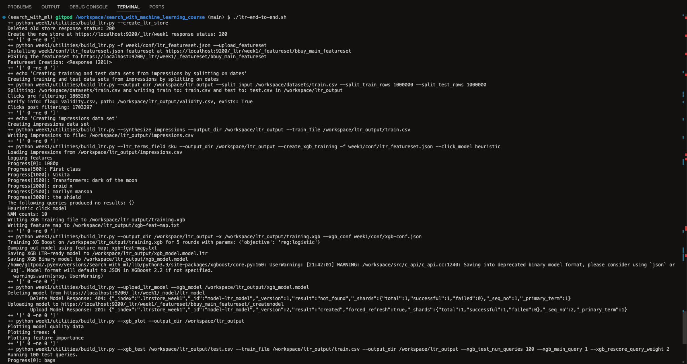
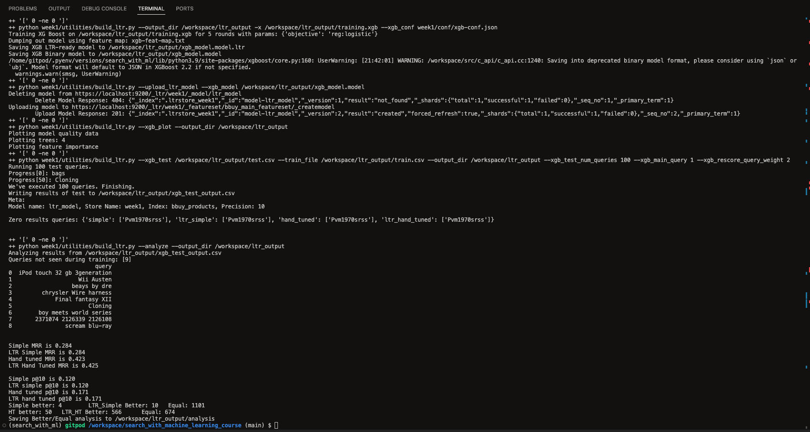
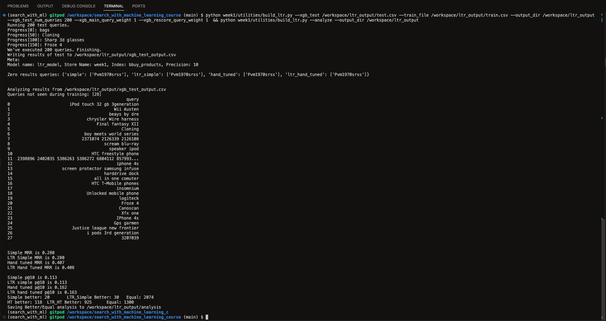
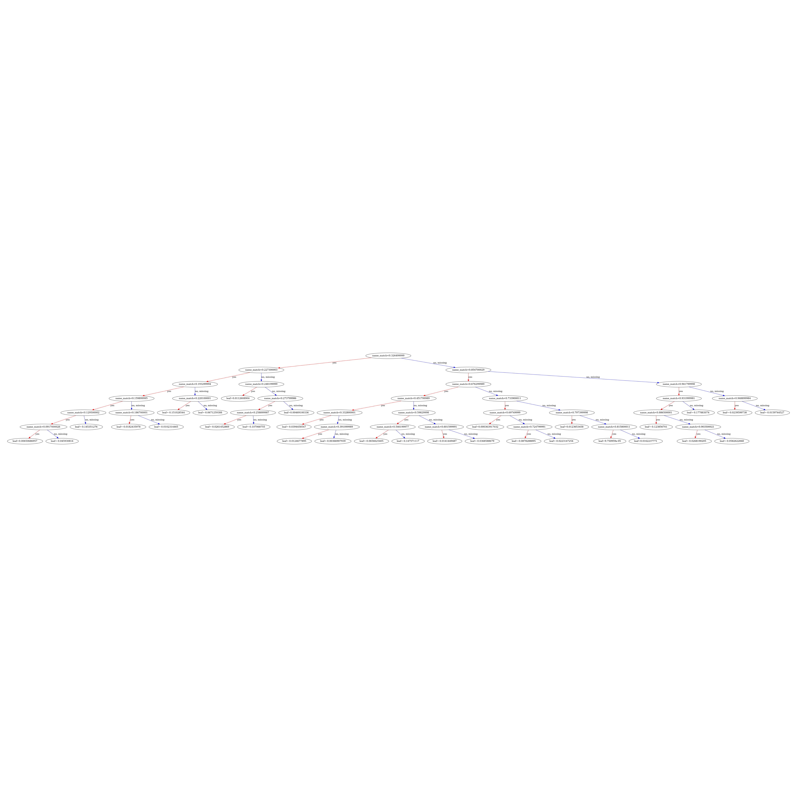
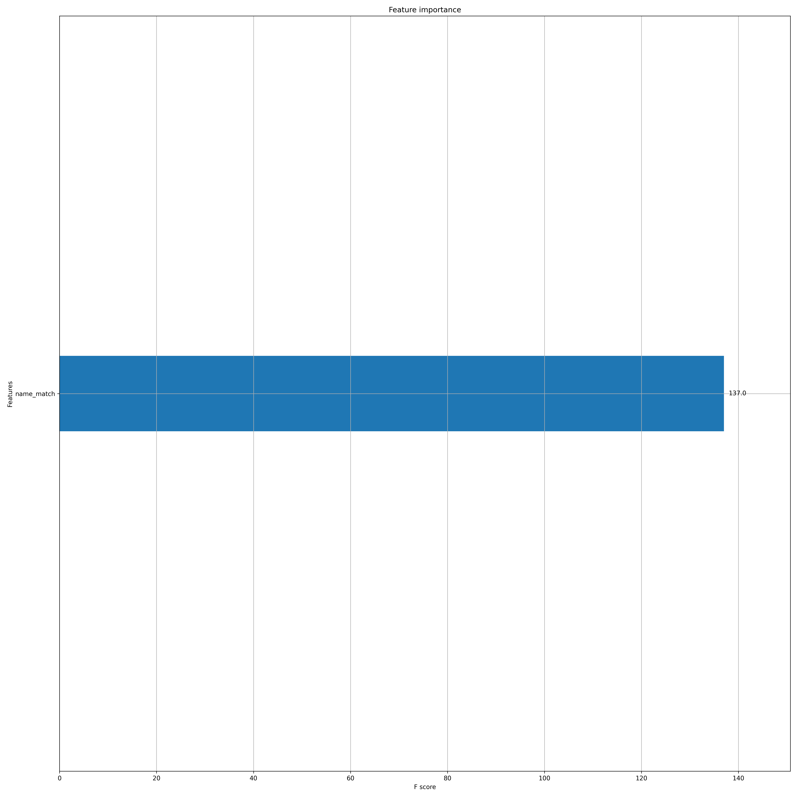
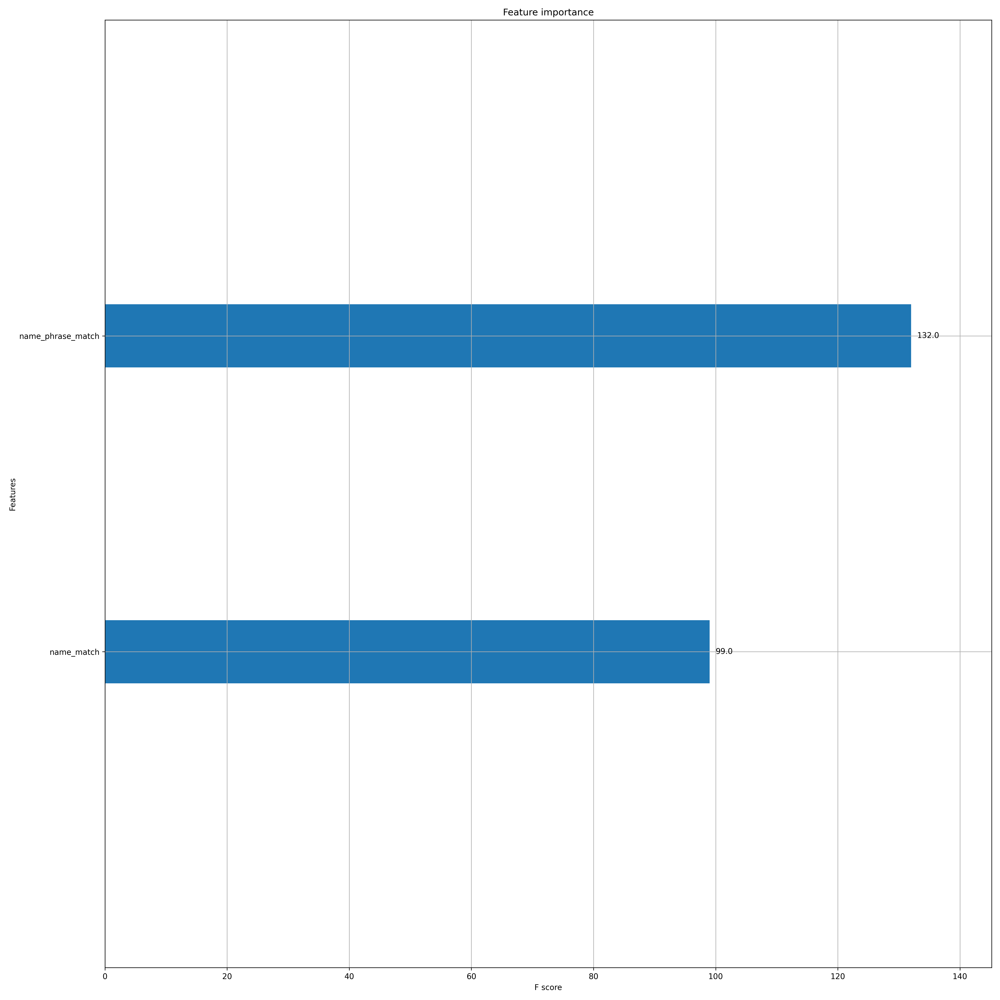
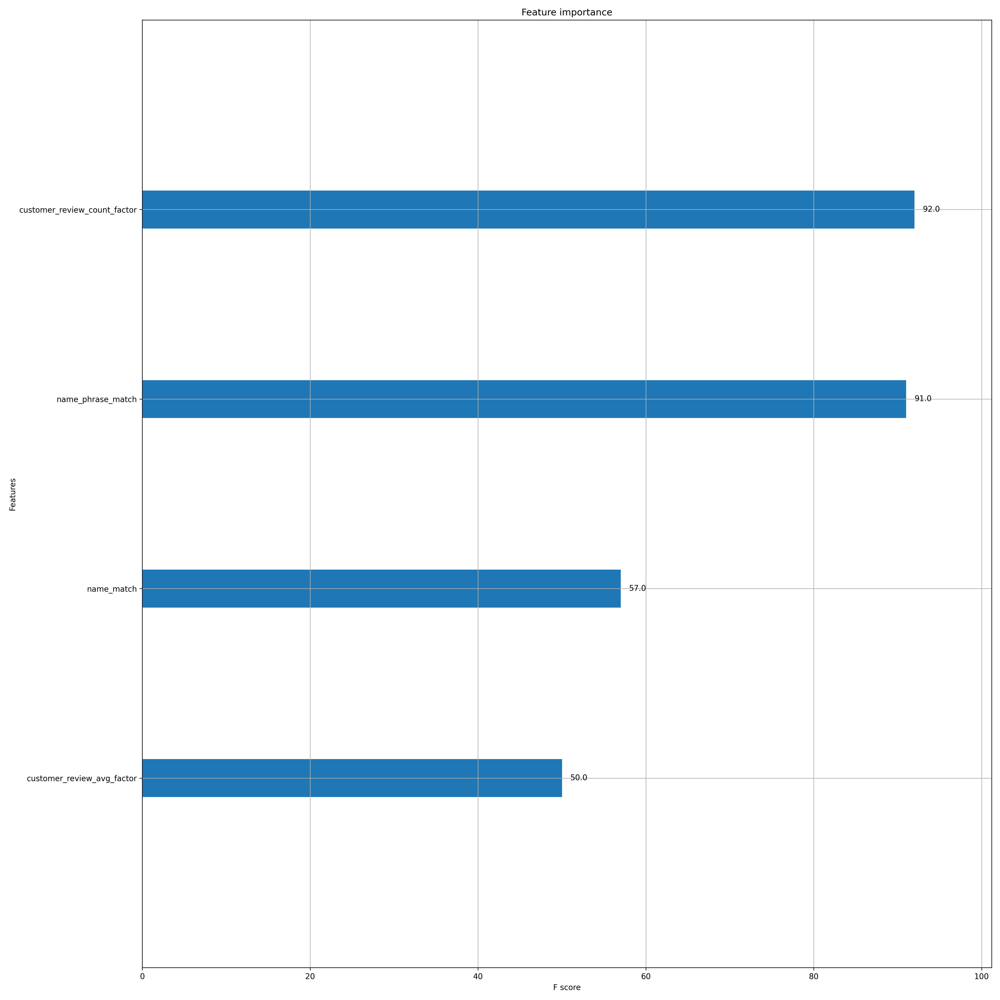
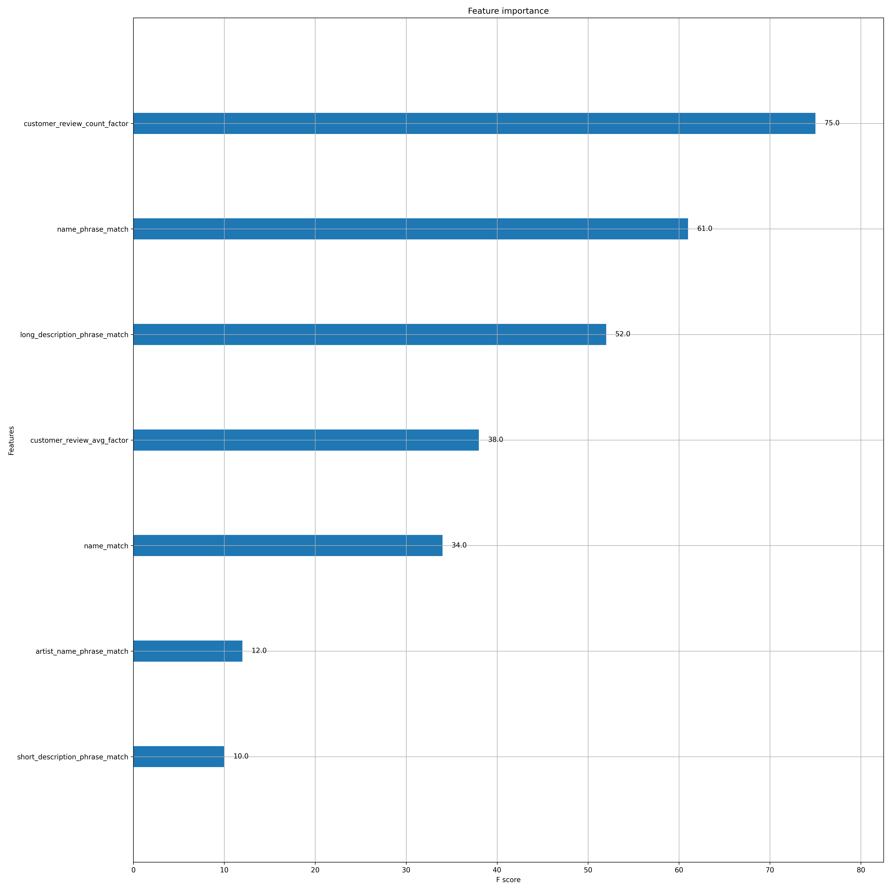
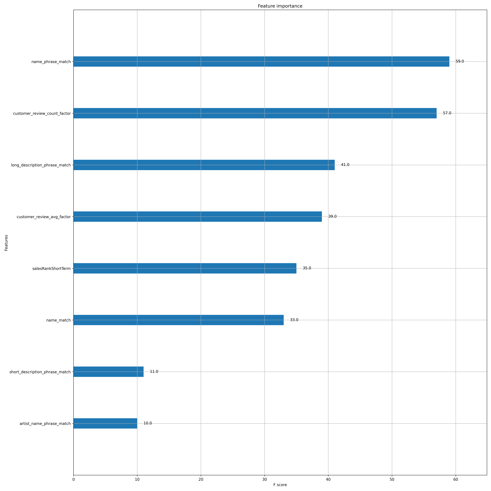

# Project: Learn to Rank
A Learning to Rank (LTR) system that integrates with OpenSearch (an open-source search engine).

# Level 1: Implementing End to End LTR for a Dataset

1. Set up the python virtual environment:
```bash
pyenv activate search_with_ml
```

2. Run the `ltr-end-to-end-sh` bash script inside the virtual environment:
```bash
./ltr-end-to-end.sh
```

Output:
```bash
++ python week1/utilities/build_ltr.py --create_ltr_store
Deleted old store response status: 200
Create the new store at https://localhost:9200/_ltr/week1 response status: 200
++ '[' 0 -ne 0 ']'
++ python week1/utilities/build_ltr.py -f week1/conf/ltr_featureset.json --upload_featureset
Installing week1/conf/ltr_featureset.json featureset at https://localhost:9200/_ltr/week1/_featureset/bbuy_main_featureset
POSTing the featureset to https://localhost:9200/_ltr/week1/_featureset/bbuy_main_featureset
Featureset Creation: <Response [201]>
++ '[' 0 -ne 0 ']'
++ echo 'Creating training and test data sets from impressions by splitting on dates'
Creating training and test data sets from impressions by splitting on dates
++ python week1/utilities/build_ltr.py --output_dir /workspace/ltr_output --split_input /workspace/datasets/train.csv --split_train_rows 1000000 --split_test_rows 1000000
Splitting: /workspace/datasets/train.csv and writing train to: train.csv and test to: test.csv in /workspace/ltr_output
Clicks pre filtering: 1865269
Verify info: flag: validity.csv, path: /workspace/ltr_output/validity.csv, exists: True
Clicks post filtering: 1703297
++ '[' 0 -ne 0 ']'
++ echo 'Creating impressions data set'
Creating impressions data set
++ python week1/utilities/build_ltr.py --synthesize_impressions --output_dir /workspace/ltr_output --train_file /workspace/ltr_output/train.csv
Writing impressions to file: /workspace/ltr_output/impressions.csv
++ '[' 0 -ne 0 ']'
++ python week1/utilities/build_ltr.py --ltr_terms_field sku --output_dir /workspace/ltr_output --create_xgb_training -f week1/conf/ltr_featureset.json --click_model heuristic
Loading impressions from /workspace/ltr_output/impressions.csv
Logging features
Progress[0]: 1080p
Progress[500]: First class
Progress[1000]: Nikita
Progress[1500]: Transformers: dark of the moon
Progress[2000]: droid x
Progress[2500]: marilyn manson
Progress[3000]: the shield
The following queries produced no results: {}
Heuristic click model
NAN counts: 10
Writing XGB Training file to /workspace/ltr_output/training.xgb
Writing feature map to /workspace/ltr_output/xgb-feat-map.txt
++ '[' 0 -ne 0 ']'
++ python week1/utilities/build_ltr.py --output_dir /workspace/ltr_output -x /workspace/ltr_output/training.xgb --xgb_conf week1/conf/xgb-conf.json
Training XG Boost on /workspace/ltr_output/training.xgb for 5 rounds with params: {'objective': 'reg:logistic'}
Dumping out model using feature map: xgb-feat-map.txt
Saving XGB LTR-ready model to /workspace/ltr_output/xgb_model.model.ltr
Saving XGB Binary model to /workspace/ltr_output/xgb_model.model
/home/gitpod/.pyenv/versions/search_with_ml/lib/python3.9/site-packages/xgboost/core.py:160: UserWarning: [21:42:01] WARNING: /workspace/src/c_api/c_api.cc:1240: Saving into deprecated binary model format, please consider using `json` or `ubj`. Model format will default to JSON in XGBoost 2.2 if not specified.
  warnings.warn(smsg, UserWarning)
++ '[' 0 -ne 0 ']'
++ python week1/utilities/build_ltr.py --upload_ltr_model --xgb_model /workspace/ltr_output/xgb_model.model
Deleting model from https://localhost:9200/_ltr/week1/_model/ltr_model
        Delete Model Response: 404: {"_index":".ltrstore_week1","_id":"model-ltr_model","_version":1,"result":"not_found","_shards":{"total":1,"successful":1,"failed":0},"_seq_no":1,"_primary_term":1}
Uploading model to https://localhost:9200/_ltr/week1/_featureset/bbuy_main_featureset/_createmodel
        Upload Model Response: 201: {"_index":".ltrstore_week1","_id":"model-ltr_model","_version":2,"result":"created","forced_refresh":true,"_shards":{"total":1,"successful":1,"failed":0},"_seq_no":2,"_primary_term":1}
++ '[' 0 -ne 0 ']'
++ python week1/utilities/build_ltr.py --xgb_plot --output_dir /workspace/ltr_output
Plotting model quality data
Plotting trees: 4
Plotting feature importance
++ '[' 0 -ne 0 ']'
++ python week1/utilities/build_ltr.py --xgb_test /workspace/ltr_output/test.csv --train_file /workspace/ltr_output/train.csv --output_dir /workspace/ltr_output --xgb_test_num_queries 100 --xgb_main_query 1 --xgb_rescore_query_weight 2
Running 100 test queries.
Progress[0]: bags
Progress[50]: Cloning
We've executed 100 queries. Finishing.
Writing results of test to /workspace/ltr_output/xgb_test_output.csv
Meta:
Model name: ltr_model, Store Name: week1, Index: bbuy_products, Precision: 10 

Zero results queries: {'simple': ['Pvm1970srss'], 'ltr_simple': ['Pvm1970srss'], 'hand_tuned': ['Pvm1970srss'], 'ltr_hand_tuned': ['Pvm1970srss']}


++ '[' 0 -ne 0 ']'
++ python week1/utilities/build_ltr.py --analyze --output_dir /workspace/ltr_output
Analyzing results from /workspace/ltr_output/xgb_test_output.csv
Queries not seen during training: [9]
                          query
0  iPod touch 32 gb 3generation
1                    Wii Austen
2                  beays by dre
3         chrysler Wire harness
4             Final fantasy XII
5                       Cloning
6        boy meets world series
7       2371074 2126339 2126108
8                scream blu-ray


Simple MRR is 0.284
LTR Simple MRR is 0.284
Hand tuned MRR is 0.423
LTR Hand Tuned MRR is 0.425

Simple p@10 is 0.120
LTR simple p@10 is 0.120
Hand tuned p@10 is 0.171
LTR hand tuned p@10 is 0.171
Simple better: 4        LTR_Simple Better: 10   Equal: 1101
HT better: 50   LTR_HT Better: 566      Equal: 674
Saving Better/Equal analysis to /workspace/ltr_output/analysis
```

The output looks like this:




## Analyze how weights affect outcomes:

Run the command:
```bash
python week1/utilities/build_ltr.py --xgb_test /workspace/ltr_output/test.csv --train_file /workspace/ltr_output/train.csv --output_dir /workspace/ltr_output --xgb_test_num_queries 200 --xgb_main_query_weight 1 --xgb_rescore_query_weight 1  && python week1/utilities/build_ltr.py --analyze --output_dir /workspace/ltr_output 
```

The output is:
```bash
Running 200 test queries.
Progress[0]: bags
Progress[50]: Cloning
Progress[100]: Sharp 3d glasses
Progress[150]: Froze 4
We've executed 200 queries. Finishing.
Writing results of test to /workspace/ltr_output/xgb_test_output.csv
Meta:
Model name: ltr_model, Store Name: week1, Index: bbuy_products, Precision: 10 

Zero results queries: {'simple': ['Pvm1970srss'], 'ltr_simple': ['Pvm1970srss'], 'hand_tuned': ['Pvm1970srss'], 'ltr_hand_tuned': ['Pvm1970srss']}


Analyzing results from /workspace/ltr_output/xgb_test_output.csv
Queries not seen during training: [28]
                                                query
0                        iPod touch 32 gb 3generation
1                                          Wii Austen
2                                        beays by dre
3                               chrysler Wire harness
4                                   Final fantasy XII
5                                             Cloning
6                              boy meets world series
7                             2371074 2126339 2126108
8                                      scream blu-ray
9                                        speaker ipod
10                                HTC freestyle phone
11  2398896 2402035 5386263 5386272 6804112 857993...
12                                          iphone 4s
13                    screen protector samsung infuse
14                                     harddrive dock
15                                 all in one comuter
16                                HTC T-Mobile phones
17                                          insomnium
18                              Unlocked mobile phone
19                                           logiteck
20                                            Froze 4
21                                           Canoscan
22                                            Xfx one
23                                          IPhone 4s
24                                         Gps garmen
25                        Justice league new frontier
26                              i pods 3rd generation
27                                            3207039


Simple MRR is 0.280
LTR Simple MRR is 0.280
Hand tuned MRR is 0.407
LTR Hand Tuned MRR is 0.408

Simple p@10 is 0.113
LTR simple p@10 is 0.113
Hand tuned p@10 is 0.162
LTR hand tuned p@10 is 0.163
Simple better: 20       LTR_Simple Better: 30   Equal: 2074
HT better: 118  LTR_HT Better: 925      Equal: 1300
Saving Better/Equal analysis to /workspace/ltr_output/analysis
```

The output looks like this with 200 queries as the input:



## 🐞 Debugging: Running the `./student_ltr` script returns this error: `ValueError: All arrays must be of the same length`

I encountered this strange and perplexing error in a situtation where I had 2x the number of queries indexed than I was supposed to, probably from running the `index-data.sh` script 2x. It is misleading because of the nohup output when it's finished executing, but it's not finished executing, it's simply finished logging outputs in the terminal.

Ensure that the outputs of the products and queries match this output from running: `./counter-tracker.sh`
```bash
Queries:
1699823513 21:11:53 1865269
Products:
1699823513 21:11:53 1275077
```

#### Possible issues: 
- If this isn't correct, meaning Queries != 1865269 and Products != 1275077, then there is probably an issue when using OpenSearch. 
- There could be an issue completely with the index in OpenSearch. In this case, you probably need to 

If either of these two cases are true, then this could cause issues like the below when running: `./student_ltr` to get this error `ValueError: All arrays must be of the same length`:

Output:
```bash
...
t': [], 'should': [{'match': {'name': {'query': 'Security camera', 'fuzziness': '1', 'prefix_length': 2, 'boost': 0.01}}}, {'match_phrase': {'name.hyphens': {'query': 'Security camera', 'slop': 1, 'boost': 50}}}, {'multi_match': {'query': 'Security camera', 'type': 'phrase', 'slop': '6', 'minimum_should_match': '2<75%', 'fields': ['name^10', 'name.hyphens^10', 'shortDescription^5', 'longDescription^5', 'department^0.5', 'sku', 'manufacturer', 'features', 'categoryPath']}}, {'terms': {'sku': ['Security', 'camera'], 'boost': 50.0}}, {'match': {'name.hyphens': {'query': 'Security camera', 'operator': 'OR', 'minimum_should_match': '2<75%'}}}, {'query_string': {'query': '1403152^0.009  9511986^0.009  9258821^0.057  2753202^0.066  9512137^0.094  9469746^0.019  2753211^0.028  9506652^0.038  9051072^0.009  9176394^0.057  9027233^0.009  3035098^0.019  8840953^0.028  1230889^0.028  9944139^0.019  1252459^0.019  1230825^0.009  1492858^0.047  1403189^0.047  1230961^0.057  1252371^0.019  1049245^0.009  9512306^0.038  3035113^0.009  1403161^0.028  1415148^0.047  9084439^0.009  9176358^0.009  9772225^0.009  9910433^0.009  1216989^0.009  9512048^0.019  9258992^0.009  1230752^0.019  9955162^0.009  2612464^0.038  9931154^0.009  3199084^0.009  9910373^0.009  2122324^0.009  ', 'fields': ['_id']}}], 'minimum_should_match': 1, 'filter': None}}, 'boost_mode': 'multiply', 'score_mode': 'sum', 'functions': [{'filter': {'exists': {'field': 'salesRankShortTerm'}}, 'gauss': {'salesRankShortTerm': {'origin': '1.0', 'scale': '100'}}}, {'filter': {'exists': {'field': 'salesRankMediumTerm'}}, 'gauss': {'salesRankMediumTerm': {'origin': '1.0', 'scale': '1000'}}}, {'filter': {'exists': {'field': 'salesRankLongTerm'}}, 'gauss': {'salesRankLongTerm': {'origin': '1.0', 'scale': '1000'}}}, {'script_score': {'script': '0.0001'}}]}}, '_source': ['sku', 'name']}
RequestError(400, 'search_phase_execution_exception', 'field [salesRankShortTerm] is of type [org.opensearch.index.mapper.TextFieldMapper$TextFieldType@2c9e606b], but only numeric types are supported.') {'size': 500, 'sort': [{'_score': {'order': 'desc'}}], 'query': {'function_score': {'query': {'bool': {'must': [], 'should': [{'match': {'name': {'query': 'Security camera', 'fuzziness': '1', 'prefix_length': 2, 'boost': 0.01}}}, {'match_phrase': {'name.hyphens': {'query': 'Security camera', 'slop': 1, 'boost': 50}}}, {'multi_match': {'query': 'Security camera', 'type': 'phrase', 'slop': '6', 'minimum_should_match': '2<75%', 'fields': ['name^10', 'name.hyphens^10', 'shortDescription^5', 'longDescription^5', 'department^0.5', 'sku', 'manufacturer', 'features', 'categoryPath']}}, {'terms': {'sku': ['Security', 'camera'], 'boost': 50.0}}, {'match': {'name.hyphens': {'query': 'Security camera', 'operator': 'OR', 'minimum_should_match': '2<75%'}}}, {'query_string': {'query': '1403152^0.009  9511986^0.009  9258821^0.057  2753202^0.066  9512137^0.094  9469746^0.019  2753211^0.028  9506652^0.038  9051072^0.009  9176394^0.057  9027233^0.009  3035098^0.019  8840953^0.028  1230889^0.028  9944139^0.019  1252459^0.019  1230825^0.009  1492858^0.047  1403189^0.047  1230961^0.057  1252371^0.019  1049245^0.009  9512306^0.038  3035113^0.009  1403161^0.028  1415148^0.047  9084439^0.009  9176358^0.009  9772225^0.009  9910433^0.009  1216989^0.009  9512048^0.019  9258992^0.009  1230752^0.019  9955162^0.009  2612464^0.038  9931154^0.009  3199084^0.009  9910373^0.009  2122324^0.009  ', 'fields': ['_id']}}], 'minimum_should_match': 1, 'filter': None}}, 'boost_mode': 'multiply', 'score_mode': 'sum', 'functions': [{'filter': {'exists': {'field': 'salesRankShortTerm'}}, 'gauss': {'salesRankShortTerm': {'origin': '1.0', 'scale': '100'}}}, {'filter': {'exists': {'field': 'salesRankMediumTerm'}}, 'gauss': {'salesRankMediumTerm': {'origin': '1.0', 'scale': '1000'}}}, {'filter': {'exists': {'field': 'salesRankLongTerm'}}, 'gauss': {'salesRankLongTerm': {'origin': '1.0', 'scale': '1000'}}}, {'script_score': {'script': '0.0001'}}]}}, '_source': ['sku', 'name'], 'rescore': {'window_size': 500, 'query': {'rescore_query': {'sltr': {'params': {'keywords': 'Security camera', 'click_prior_query': '1403152^0.009  9511986^0.009  9258821^0.057  2753202^0.066  9512137^0.094  9469746^0.019  2753211^0.028  9506652^0.038  9051072^0.009  9176394^0.057  9027233^0.009  3035098^0.019  8840953^0.028  1230889^0.028  9944139^0.019  1252459^0.019  1230825^0.009  1492858^0.047  1403189^0.047  1230961^0.057  1252371^0.019  1049245^0.009  9512306^0.038  3035113^0.009  1403161^0.028  1415148^0.047  9084439^0.009  9176358^0.009  9772225^0.009  9910433^0.009  1216989^0.009  9512048^0.019  9258992^0.009  1230752^0.019  9955162^0.009  2612464^0.038  9931154^0.009  3199084^0.009  9910373^0.009  2122324^0.009  ', 'skus': ['Security', 'camera']}, 'model': 'ltr_model', 'store': 'week1'}}, 'score_mode': 'total', 'query_weight': 1.0, 'rescore_query_weight': '2'}}}
We've executed 200 queries. Finishing.
Writing results of test to /workspace/ltr_output/xgb_test_output.csv
Traceback (most recent call last):
  File "/workspace/search_with_machine_learning_course/week1/utilities/build_ltr.py", line 375, in <module>
    no_results_df = pd.DataFrame(no_results)
  File "/home/gitpod/.pyenv/versions/search_with_ml/lib/python3.9/site-packages/pandas/core/frame.py", line 733, in __init__
    mgr = dict_to_mgr(data, index, columns, dtype=dtype, copy=copy, typ=manager)
  File "/home/gitpod/.pyenv/versions/search_with_ml/lib/python3.9/site-packages/pandas/core/internals/construction.py", line 503, in dict_to_mgr
    return arrays_to_mgr(arrays, columns, index, dtype=dtype, typ=typ, consolidate=copy)
  File "/home/gitpod/.pyenv/versions/search_with_ml/lib/python3.9/site-packages/pandas/core/internals/construction.py", line 114, in arrays_to_mgr
    index = _extract_index(arrays)
  File "/home/gitpod/.pyenv/versions/search_with_ml/lib/python3.9/site-packages/pandas/core/internals/construction.py", line 677, in _extract_index
    raise ValueError("All arrays must be of the same length")
ValueError: All arrays must be of the same length
```

## Review the Model Tree Diagram created from matplotlablib:

The `model_tree.png` that gets generated lives in this directory: `/workspace/ltr_output/ltr_model_tree.png`

To copy it to my `/workspace/search_with_machine_learning_course/week1/assets` directory, I ran this Linux command using the copy protocol: `cp` since this is the same machine (if it was different machines, `scp` would be the way to go):
```bash
cp /workspace/ltr_output/ltr_model_tree.png /workspace/search_with_machine_learning_course/week1/assets/
```

The rendering of the XGBoost LTR model:


## Testing: BLTR

### ✅ Run on 100 queries (from above) - the original example:
```bash
./ltr-end-to-end-sh
```
Output:
```bash
Simple MRR is 0.284
LTR Simple MRR is 0.284
Hand tuned MRR is 0.423
LTR Hand Tuned MRR is 0.425

Simple p@10 is 0.120
LTR simple p@10 is 0.120
Hand tuned p@10 is 0.171
LTR hand tuned p@10 is 0.171
Simple better: 4        LTR_Simple Better: 10   Equal: 1101
HT better: 50   LTR_HT Better: 566      Equal: 674
```

### ✅ Run on 200 queries with xgb_main_query_weight: 1 and xgb_rescore_query_weight: 1
There are named parameters:
- `--xgb_main_query_weight`: XGBoost query weight
- `--xgb_rescore_query_weight`: Rescore query weight

```bash
python week1/utilities/build_ltr.py --xgb_test /workspace/ltr_output/test.csv --train_file /workspace/ltr_output/train.csv --output_dir /workspace/ltr_output --xgb_test_num_queries 200 --xgb_main_query_weight 1 --xgb_rescore_query_weight 1  && python week1/utilities/build_ltr.py --analyze --output_dir /workspace/ltr_output
```
Output:
```bash
Simple MRR is 0.280
LTR Simple MRR is 0.280
Hand tuned MRR is 0.407
LTR Hand Tuned MRR is 0.407

Simple p@10 is 0.113
LTR simple p@10 is 0.113
Hand tuned p@10 is 0.162
LTR hand tuned p@10 is 0.163
Simple better: 17       LTR_Simple Better: 24   Equal: 2083
HT better: 105  LTR_HT Better: 877      Equal: 1361
```

### ✅ Hold main stready, use big LTR score
Run on 200 queries with xgb_main_query_weight: 1 and xgb_rescore_query_weight: 1000
```bash
python week1/utilities/build_ltr.py --xgb_test /workspace/ltr_output/test.csv --train_file /workspace/ltr_output/train.csv --output_dir /workspace/ltr_output --xgb_test_num_queries 200 --xgb_main_query_weight 1 --xgb_rescore_query_weight 1000 && python week1/utilities/build_ltr.py --analyze --output_dir /workspace/ltr_output
```
Output:
```bash
Simple MRR is 0.280
LTR Simple MRR is 0.276
Hand tuned MRR is 0.407
LTR Hand Tuned MRR is 0.432

Simple p@10 is 0.113
LTR simple p@10 is 0.116
Hand tuned p@10 is 0.162
LTR hand tuned p@10 is 0.169
Simple better: 34       LTR_Simple Better: 261  Equal: 1829
HT better: 540  LTR_HT Better: 1177     Equal: 626
```


### ✅ Big main, small LTR
Run on 200 queries with xgb_main_query_weight: 1000 and xgb_rescore_query_weight: 1
```bash
python week1/utilities/build_ltr.py --xgb_test /workspace/ltr_output/test.csv --train_file /workspace/ltr_output/train.csv --output_dir /workspace/ltr_output --xgb_test_num_queries 200 --xgb_main_query_weight 1000 --xgb_rescore_query_weight 1 && python week1/utilities/build_ltr.py --analyze --output_dir /workspace/ltr_output
```
Output:
```bash
Simple MRR is 0.280
LTR Simple MRR is 0.280
Hand tuned MRR is 0.407
LTR Hand Tuned MRR is 0.407

Simple p@10 is 0.113
LTR simple p@10 is 0.113
Hand tuned p@10 is 0.162
LTR hand tuned p@10 is 0.162
Simple better: 0        LTR_Simple Better: 2    Equal: 2122
HT better: 33   LTR_HT Better: 209      Equal: 2101
```

### ✅ No main, default LTR: 
Run on 200 queries with xgb_main_query_weight: 0 and xgb_rescore_query_weight: 1
```bash
python week1/utilities/build_ltr.py --xgb_test /workspace/ltr_output/test.csv --train_file /workspace/ltr_output/train.csv --output_dir /workspace/ltr_output --xgb_test_num_queries 200 --xgb_main_query_weight 0 --xgb_rescore_query_weight 1 && python week1/utilities/build_ltr.py --analyze --output_dir /workspace/ltr_output
```
Output:
```bash
Simple MRR is 0.280
LTR Simple MRR is 0.125
Hand tuned MRR is 0.407
LTR Hand Tuned MRR is 0.129

Simple p@10 is 0.113
LTR simple p@10 is 0.044
Hand tuned p@10 is 0.162
LTR hand tuned p@10 is 0.044
Simple better: 1188     LTR_Simple Better: 917  Equal: 19
HT better: 1432 LTR_HT Better: 890      Equal: 21
```

^ The last one is quite terrible! How do we know this to be true?:
- The `LTR Simple MRR` dropped from 0.280 to 0.125 when the main query was set to 0. 
  - This signals that without the influence of the original search scoring, the LTR model performs poorly.
- The `LTR Hand Tuned MRR` dropped from 0.407 to 0.129.
  - This signals that the LTR model cannot match the performance of the hand-tuned system when it's only the factor in scoring.
- The `LTR simple p@10` dropped from 0.044 to 0.162
  - This signals a drop in percision of the top 10 results when relying solely on the LTR model.
- The `Simple better` is 1188 and the `LTR_Simple Better` is 917
  - This signals the baseline system without LTR performed better than the LTR system in a significant number of cases
- The `HT better` count is 1432 and `LTR_HT Better` is 890
  - This signals the hand-tuned system without LTR was superior to the LTR system in even more instances
- The `Equal` counts for simple, 19, and hand-tuned comparisons, 21, are very low
  - This signals there are hardly any queries where LTR model's performance was on par with the other methods.

^ This indicates a need for a combination of LTR and original query scoring to achieve the optimal search result rankings.

### Run the end-to-end script:

With the main query weight set to 0, relying entirely on the LTR model to score and rank the search results:
```bash
./ltr-end-to-end.sh -m 0 
```
The output is:
```bash
Simple MRR is 0.284
LTR Simple MRR is 0.130
Hand tuned MRR is 0.423
LTR Hand Tuned MRR is 0.134

Simple p@10 is 0.120
LTR simple p@10 is 0.048
Hand tuned p@10 is 0.171
LTR hand tuned p@10 is 0.050
Simple better: 659      LTR_Simple Better: 449  Equal: 7
HT better: 775  LTR_HT Better: 508      Equal: 7
```

^ The performance hasn't improved significantly (compared to the previous test)! How do we recognize this?:
- The `LTR Simple MRR` slightly increased from 0.125 to 0.130 when the main query weight was set to 0.
  - This suggests a minor improvement, but the LTR model alone still underperforms compared to the original search scoring.
- The `LTR Hand Tuned MRR` increased from 0.129 to 0.134.
  - This indicates a small improvement but confirms that the LTR model is still far from matching the performance of the hand-tuned system on its own.
- The `LTR simple p@10` increased from 0.044 to 0.048.
  - This shows a slight improvement in the precision of the top 10 results with the LTR model but is still substantially lower than the baseline, indicating poor performance.
- The `Simple better` count decreased to 659 from 1188, and the `LTR_Simple Better` count increased to 449 from 917.
  - This change shows the LTR model performed better than in the previous run but still indicates that the baseline system without LTR is superior in many cases.
- The `HT better` count decreased to 775 from 1432 and `LTR_HT Better` increased to 508 from 890
  - Although the LTR system has improved compared to the last test, the hand-tuned system without LTR remains more effective overall.
- The `Equal` counts remain very low at 7 for both the simple and hand-tuned systems
  - This reinforces the finding that the LTR model rarely matches the effectiveness of the other methods.

^ These points demonstrate that while there are slight gains, the LTR model without the support of the original query scoring is inadequate. The continued low performance emphasizes the need for integrating LTR with the original search algorithm to achieve optimal rankings.


# Level 2: Exploring Features and Click Models

## Click Models
When to and when not to use implicit judgments (aka click models) in LTR for training as a means to determine judgments.

Common practice to quantize scores (aka to bucket them). Unlike the step function which also buckets scores, quantization can make the buckets even in size, which tends to yield more balanced training sets.

Quantization via the quantiles option in click_models


```bash
./ltr-end-to-end.sh -m 0 -c quantiles
```

The output is:
```bash
Simple MRR is 0.284
LTR Simple MRR is 0.091
Hand tuned MRR is 0.423
LTR Hand Tuned MRR is 0.092

Simple p@10 is 0.120
LTR simple p@10 is 0.027
Hand tuned p@10 is 0.171
LTR hand tuned p@10 is 0.029
Simple better: 749      LTR_Simple Better: 359  Equal: 7
HT better: 903  LTR_HT Better: 377      Equal: 10
Saving Better/Equal analysis to /workspace/ltr_output/analysis
```

^ The application of quantization led to lower performance metrics for the LTR model across the board. This means that the LTR model, in its quantized form, is less effective at ranking the correct results compared to the previous runs without quantization.

## Features

### Original `ltr_featureset.json`
Feature using query-field matching (i.e. name_match) in the `week1/conf/ltr_featureset.json`:
```json
{
  "featureset": {
    "features": [
      {
        "name": "name_match",
        "params": [
          "keywords"
        ],
        "template_language": "mustache",
        "template": {
          "match": {
            "name": "{{keywords}}"
          }
        }
      }
    ]
  }
}
```

The quantization output from `./ltr-end-to-end.sh -m 0 -c quantiles` is (copied again from above):
```bash
Simple MRR is 0.284
LTR Simple MRR is 0.091
Hand tuned MRR is 0.423
LTR Hand Tuned MRR is 0.092

Simple p@10 is 0.120
LTR simple p@10 is 0.027
Hand tuned p@10 is 0.171
LTR hand tuned p@10 is 0.029
Simple better: 749      LTR_Simple Better: 359  Equal: 7
HT better: 903  LTR_HT Better: 377      Equal: 10
Saving Better/Equal analysis to /workspace/ltr_output/analysis
```

This is how the model treats `name_match`:





### Updated `ltr_featureset.json` with `name_phrase_match`:
```json
{
  "featureset": {
    "features": [
      {
        "name": "name_match",
        "params": [
          "keywords"
        ],
        "template_language": "mustache",
        "template": {
          "match": {
            "name": "{{keywords}}"
          }
        }
      },
      {
        "name": "name_phrase_match",
        "params": [
          "keywords"
        ],
        "template_language": "mustache",
        "template": {
          "match_phrase": {
            "name": {
              "query": "{{keywords}}",
              "slop": 6
            }
          }
        }
      }
    ]
  }
}
```

The quantization output from `./ltr-end-to-end.sh -m 0 -c quantiles` is:
```bash
Simple MRR is 0.284
LTR Simple MRR is 0.197
Hand tuned MRR is 0.423
LTR Hand Tuned MRR is 0.200

Simple p@10 is 0.120
LTR simple p@10 is 0.090
Hand tuned p@10 is 0.171
LTR hand tuned p@10 is 0.088
Simple better: 648      LTR_Simple Better: 442  Equal: 25
HT better: 730  LTR_HT Better: 551      Equal: 9
```

This is how the model treats `name_match`:




#### Analysis from adding `name_phrase_match`:
**Before name_phrase_match was added:**
LTR Simple MRR: 0.091
LTR Hand Tuned MRR: 0.092
LTR simple p@10: 0.027
LTR hand tuned p@10: 0.029
^ These metrics were quite low, indicating that the model wasn't performing very well.

**After name_phrase_match was added:**
LTR Simple MRR: Increased to 0.197 from 0.091
LTR Hand Tuned MRR: Increased to 0.200 from 0.092
LTR simple p@10: Increased to 0.090 from 0.027
LTR hand tuned p@10: Increased to 0.088 from 0.029
^ Both MRR and p@10 values for the LTR model saw improvements with the addition of the name_phrase_match feature. This indicates that the LTR model is now doing a better job at ranking relevant documents higher.

### Updated `ltr_featureset.json` with `customer_review_average_factor` & `customer_review_count_factor`:

```json
{
  "featureset": {
    "features": [
      {
        "name": "name_match",
        "params": [
          "keywords"
        ],
        "template_language": "mustache",
        "template": {
          "match": {
            "name": "{{keywords}}"
          }
        }
      },
      {
        "name": "name_phrase_match",
        "params": [
          "keywords"
        ],
        "template_language": "mustache",
        "template": {
          "match_phrase": {
            "name": {
              "query": "{{keywords}}",
              "slop": 6
            }
          }
        }
      },
      {
        "name": "customer_review_avg_factor",
        "template_language": "mustache",
        "template": {
          "function_score": {
            "functions": [{
                "field_value_factor": {
                    "field": "customerReviewAverage",
                    "missing": 0
                }
            }],
            "query": {
                "match_all": {}
            }
          }
        }
      },
      {
        "name": "customer_review_count_factor",
        "template_language": "mustache",
        "template": {
          "function_score": {
            "functions": [{
                "field_value_factor": {
                    "field": "customerReviewCount",
                    "missing": 0
                }
            }],
            "query": {
                "match_all": {}
            }
          }
        }
      }
    ]
  }
}
```

The quantization output from `./ltr-end-to-end.sh -m 0 -c quantiles` is:
```bash
Simple MRR is 0.284
LTR Simple MRR is 0.425
Hand tuned MRR is 0.423
LTR Hand Tuned MRR is 0.380

Simple p@10 is 0.120
LTR simple p@10 is 0.135
Hand tuned p@10 is 0.171
LTR hand tuned p@10 is 0.133
Simple better: 535      LTR_Simple Better: 572  Equal: 8
HT better: 679  LTR_HT Better: 598      Equal: 13
```

This is how the model treats `customer_review_average_factor` & `customer_review_count_factor`:




#### Analysis from adding `customer_review_average_factor` & `customer_review_count_factor`:
**Before `customer_review_average_factor` & `customer_review_count_factor` were added:**
LTR Simple MRR: 0.197
LTR Hand Tuned MRR: 0.200
LTR simple p@10: 0.090
LTR hand tuned p@10: 0.088
^ These metrics were quite low, indicating that the model wasn't performing very well. Better than without `name_phrase_match`, but not substantial.

**After `customer_review_average_factor` & `customer_review_count_factor` were added:**
LTR Simple MRR: Increased to 0.425 from 0.197
LTR Hand Tuned MRR: Increased to 0.380 from 0.200
LTR simple p@10: Increased to 0.135 from 0.090
LTR hand tuned p@10: Increased to 0.133 from 0.088
^ Both MRR and p@10 values for the LTR model saw substantial improvements with the addition of the `customer_review_average_factor` & `customer_review_count_factor` features. This indicates that the LTR model is now doing a better job at ranking relevant documents higher. This indicates that customer reviews, both in terms of quantity and average score, are strong indicators of relevance in this search context. 


### Updated `ltr_featureset.json` with `artistName`, `shortDescription`, `longDescription`:

```json
{
  "featureset": {
    "features": [
      {
        "name": "name_match",
        "params": [
          "keywords"
        ],
        "template_language": "mustache",
        "template": {
          "match": {
            "name": "{{keywords}}"
          }
        }
      },
      {
        "name": "name_phrase_match",
        "params": [
          "keywords"
        ],
        "template_language": "mustache",
        "template": {
          "match_phrase": {
            "name": {
              "query": "{{keywords}}",
              "slop": 6
            }
          }
        }
      },
      {
        "name": "customer_review_avg_factor",
        "template_language": "mustache",
        "template": {
          "function_score": {
            "functions": [{
                "field_value_factor": {
                    "field": "customerReviewAverage",
                    "missing": 0
                }
            }],
            "query": {
                "match_all": {}
            }
          }
        }
      },
      {
        "name": "customer_review_count_factor",
        "template_language": "mustache",
        "template": {
          "function_score": {
            "functions": [{
                "field_value_factor": {
                    "field": "customerReviewCount",
                    "missing": 0
                }
            }],
            "query": {
                "match_all": {}
            }
          }
        }
      },
      {
        "name": "artist_name_phrase_match",
        "params": [
          "keywords"
        ],
        "template_language": "mustache",
        "template": {
          "match_phrase": {
            "artistName": {
              "query": "{{keywords}}",
              "slop": 6
            }
          }
        }
      },
      {
        "name": "short_description_phrase_match",
        "params": [
          "keywords"
        ],
        "template_language": "mustache",
        "template": {
          "match_phrase": {
            "shortDescription": {
              "query": "{{keywords}}",
              "slop": 6
            }
          }
        }
      },
      {
        "name": "long_description_phrase_match",
        "params": [
          "keywords"
        ],
        "template_language": "mustache",
        "template": {
          "match_phrase": {
            "longDescription": {
              "query": "{{keywords}}",
              "slop": 6
            }
          }
        }
      }
    ]
  }
}
```

The quantization output from `./ltr-end-to-end.sh -m 0 -c quantiles` is:
```bash
Simple MRR is 0.284
LTR Simple MRR is 0.439
Hand tuned MRR is 0.423
LTR Hand Tuned MRR is 0.415

Simple p@10 is 0.120
LTR simple p@10 is 0.158
Hand tuned p@10 is 0.171
LTR hand tuned p@10 is 0.165
Simple better: 456      LTR_Simple Better: 649  Equal: 10
HT better: 620  LTR_HT Better: 663      Equal: 7
```

This is how the model treats `artistName`, `shortDescription`, `longDescription`:




#### Analysis from adding `artistName`, `shortDescription`, `longDescription`:
**Before `artistName`, `shortDescription`, `longDescription` were added:**
LTR Simple MRR: 0.425
LTR Hand Tuned MRR: 0.380
LTR simple p@10: 0.135
LTR hand tuned p@10: 0.133
^ These metrics were significantly higher when `customer_review_average_factor` & `customer_review_count_factor` were added in addition to `name_phrase_match`.

**After `artistName`, `shortDescription`, `longDescription` were added:**
LTR Simple MRR: Increased to 0.439 from 0.425
LTR Hand Tuned MRR: Increased to 0.415 from 0.380
LTR simple p@10: Increased to 0.158 from 0.135
LTR hand tuned p@10: Increased to 0.165 from 0.133
^ Both MRR and p@10 values for the LTR model saw slight improvements with the addition of the `artistName`, `shortDescription`, `longDescription` features. This indicates that the LTR model is now doing a better job at ranking relevant documents higher, although, these parameters were not as significant as the customer reviews values, specifically `customer_review_count_factor`. This indicates that customer reviews, both in terms of quantity and average score, are strong indicators of relevance in this search context. In this new ranking, the `long_description_phrase_match` feature is the 3rd most significant factor for ranking.

### Updated `ltr_featureset.json` with `salesRankShortTerm`:

```json
{
  "featureset": {
    "features": [
      {
        "name": "name_match",
        "params": [
          "keywords"
        ],
        "template_language": "mustache",
        "template": {
          "match": {
            "name": "{{keywords}}"
          }
        }
      },
      {
        "name": "name_phrase_match",
        "params": [
          "keywords"
        ],
        "template_language": "mustache",
        "template": {
          "match_phrase": {
            "name": {
              "query": "{{keywords}}",
              "slop": 6
            }
          }
        }
      },
      {
        "name": "customer_review_avg_factor",
        "template_language": "mustache",
        "template": {
          "function_score": {
            "functions": [{
                "field_value_factor": {
                    "field": "customerReviewAverage",
                    "missing": 0
                }
            }],
            "query": {
                "match_all": {}
            }
          }
        }
      },
      {
        "name": "customer_review_count_factor",
        "template_language": "mustache",
        "template": {
          "function_score": {
            "functions": [{
                "field_value_factor": {
                    "field": "customerReviewCount",
                    "missing": 0
                }
            }],
            "query": {
                "match_all": {}
            }
          }
        }
      },
      {
        "name": "artist_name_phrase_match",
        "params": [
          "keywords"
        ],
        "template_language": "mustache",
        "template": {
          "match_phrase": {
            "artistName": {
              "query": "{{keywords}}",
              "slop": 6
            }
          }
        }
      },
      {
        "name": "short_description_phrase_match",
        "params": [
          "keywords"
        ],
        "template_language": "mustache",
        "template": {
          "match_phrase": {
            "shortDescription": {
              "query": "{{keywords}}",
              "slop": 6
            }
          }
        }
      },
      {
        "name": "long_description_phrase_match",
        "params": [
          "keywords"
        ],
        "template_language": "mustache",
        "template": {
          "match_phrase": {
            "longDescription": {
              "query": "{{keywords}}",
              "slop": 6
            }
          }
        }
      },
      {
        "name": "salesRankShortTerm",
        "template_language": "mustache",
        "template": {
          "function_score": {
            "functions": [
              {
                "filter": {
                  "exists": {
                    "field": "salesRankShortTerm"
                  }
                },
                "gauss": {
                  "salesRankShortTerm": {
                    "origin": "1.0",
                    "offset": "100",
                    "scale": "10000",
                    "decay": "0.1"
                  }
                }
              },
              {
                "filter": {
                  "bool": {
                    "must_not": {
                      "exists": {
                        "field": "salesRankShortTerm"
                      }
                    }
                  }
                },
                "script_score": {
                  "script": "if (doc['salesRankShortTerm'] == null || doc['salesRankShortTerm'].size() == 0  ){return 0.0}"
                }
              }
            ],
            "query": {
              "match_all": {}
            }
          }
        }
      }
    ]
  }
}
```

The quantization output from `./ltr-end-to-end.sh -m 0 -c quantiles` is:
```bash
Simple MRR is 0.284
LTR Simple MRR is 0.463
Hand tuned MRR is 0.423
LTR Hand Tuned MRR is 0.459

Simple p@10 is 0.120
LTR simple p@10 is 0.157
Hand tuned p@10 is 0.171
LTR hand tuned p@10 is 0.177
Simple better: 506      LTR_Simple Better: 596  Equal: 13
HT better: 585  LTR_HT Better: 691      Equal: 14
```

This is how the model treats `salesRankShortTerm`:




#### Analysis from adding `salesRankShortTerm`:
**Before `salesRankShortTerm` were added:**
LTR Simple MRR: 0.439
LTR Hand Tuned MRR: 0.415
LTR simple p@10: 0.158
LTR hand tuned p@10: 0.165
^ These metrics continued to increase, still less significantly than the customer reviews count.

**After `salesRankShortTerm` was added:**
LTR Simple MRR: Increased to 0.463 from 0.439
LTR Hand Tuned MRR: Increased to 0.459 from 0.415
LTR simple p@10: Decreased to 0.157 from 0.158
LTR hand tuned p@10: Increased to 0.177 from 0.165
^ Both MRR and p@10 values for the LTR model saw improvements with the addition of the `salesRankShortTerm` feature. This indicates that the LTR model is now doing a better job at ranking relevant documents higher, although, these parameters were not as significant as the customer reviews values, specifically `customer_review_count_factor`. This indicates that customer reviews, both in terms of quantity and average score, are strong indicators of relevance in this search context.

Overall, this collection of results has helped me get over the top on Hand Tuned, meaning my LTR model has outperformed the manually optimized search rankings. This is a notable achievement in LTR tasks, as the goal is often to develop a model that can automate and improve upon the manual tuning process.


# Level 3: Relevance Judgments on LTR

Re-run your performance evaluation from the beginning of this week’s content using the different baseline queries and LTR models. 

How do your results look now? 
- The

Are you happier with them? 

Do they look reasonable?


