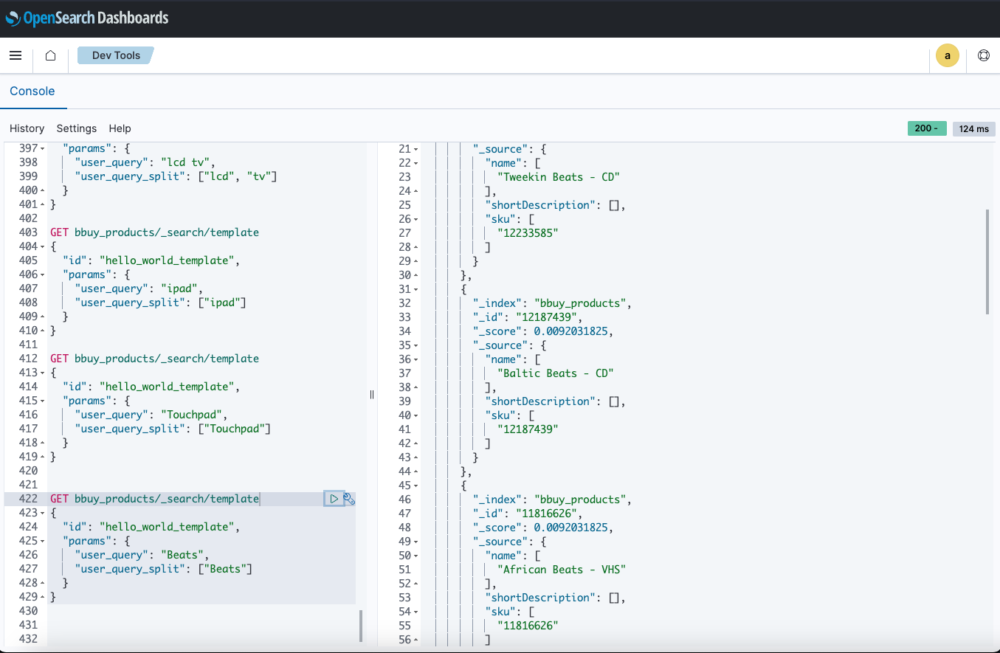
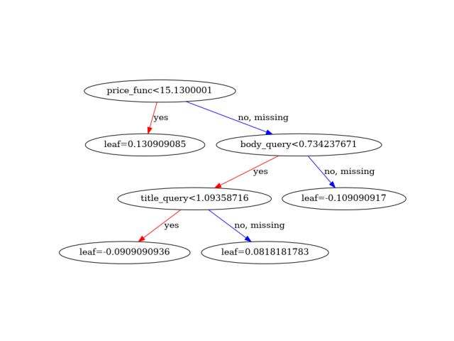

# Week 1 Exercises

Check to make sure the indexes are there: `GET /_cat/indices?v`
This should return something like this:
```bash
health status index                                     uuid                   pri rep docs.count docs.deleted store.size pri.store.size
green  open   .kibana_-152937574_admintenant_1          kUnDXzogTjShsBI7mcUV0g   1   0          1            0      5.1kb          5.1kb
green  open   .kibana_92668751_admin_1                  ZLgmJA-2TWCALeNAxfomcg   1   0         59            0     34.1kb         34.1kb
yellow open   security-auditlog-2023.10.30              J1X6D2nUTBKdR3jK6rOVeA   1   1         64            0    277.3kb        277.3kb
green  open   opensearch_dashboards_sample_data_flights 3mSunE6pTnyVgx04c1fRrQ   1   0      13059            0      5.9mb          5.9mb
yellow open   bbuy_queries                              i_krXHbJTcG__L9_4zHBNw   1   1    3730538            0    762.4mb        762.4mb
yellow open   bbuy_products                             toZa4IC1QIO1JR70QNK97g   1   1    1275077       360806      1.3gb          1.3gb
yellow open   search_fun_test                           EzBEA4GxQECOcbgZH-N-qA   1   1          4            0      6.9kb          6.9kb
green  open   .opendistro_security                      iln1t4KNQHC2PeYBnbzgtw   1   0         10            0     71.7kb         71.7kb
green  open   .kibana_1                                 GvnZo_00TL2H8Typ3ucrJQ   1   0          1            0      4.2kb          4.2kb
```

## Relevance

### Get the Top 10 most issued queries in the logs
The following query is a two-level aggregation on the BestBuy ecommerce dataset  and related product SKUs (Stock Keeping Units):
```bash
GET /bbuy_queries/_search
{
  "size": 0,
  "aggs": {
    "Query": {
      "terms": {
        "size": 10, 
        "field": "query.keyword"
      },
      "aggs":{
        "Docs":{
          "terms":{
            "size": 5,
            "field": "sku.keyword"
          }
        }
      }
    }
  }
}
```
The output looks like this:
```json
{
  "took": 2,
  "timed_out": false,
  "_shards": {
    "total": 1,
    "successful": 1,
    "skipped": 0,
    "failed": 0
  },
  "hits": {
    "total": {
      "value": 10000,
      "relation": "gte"
    },
    "max_score": null,
    "hits": []
  },
  "aggregations": {
    "Query": {
      "doc_count_error_upper_bound": 0,
      "sum_other_doc_count": 3594136,
      "buckets": [
        {
          "key": "lcd tv",
          "doc_count": 33044,
          "Docs": {
            "doc_count_error_upper_bound": 0,
            "sum_other_doc_count": 2642,
            "buckets": [
              {
                "key": "2620821",
                "doc_count": 14338
              },
              {
                "key": "2138389",
                "doc_count": 7150
              },
              {
                "key": "2893174",
                "doc_count": 5220
              },
              {
                "key": "1831054",
                "doc_count": 2520
              },
              {
                "key": "2047641",
                "doc_count": 1174
              }
            ]
          }
        },
        {
          "key": "2622037 2127204 2127213 2121716 2138291",
          "doc_count": 17062,
          "Docs": {
            "doc_count_error_upper_bound": 0,
            "sum_other_doc_count": 12730,
            "buckets": [
              {
                "key": "2138291",
                "doc_count": 1308
              },
              {
                "key": "2622037",
                "doc_count": 950
              },
              {
                "key": "2127213",
                "doc_count": 864
              },
              {
                "key": "2127204",
                "doc_count": 708
              },
              {
                "key": "2121716",
                "doc_count": 502
              }
            ]
          }
        },
        {
          "key": "Hp touchpad",
          "doc_count": 14780,
          "Docs": {
            "doc_count_error_upper_bound": 0,
            "sum_other_doc_count": 1048,
            "buckets": [
              {
                "key": "2842056",
                "doc_count": 8392
              },
              {
                "key": "2842092",
                "doc_count": 4806
              },
              {
                "key": "2947041",
                "doc_count": 226
              },
              {
                "key": "2884119",
                "doc_count": 170
              },
              {
                "key": "2884085",
                "doc_count": 138
              }
            ]
          }
        },
        {
          "key": "iPad",
          "doc_count": 11606,
          "Docs": {
            "doc_count_error_upper_bound": 0,
            "sum_other_doc_count": 4484,
            "buckets": [
              {
                "key": "1945531",
                "doc_count": 4282
              },
              {
                "key": "2339322",
                "doc_count": 978
              },
              {
                "key": "1945595",
                "doc_count": 914
              },
              {
                "key": "2842056",
                "doc_count": 568
              },
              {
                "key": "2339386",
                "doc_count": 380
              }
            ]
          }
        },
        {
          "key": "hp touchpad",
          "doc_count": 11230,
          "Docs": {
            "doc_count_error_upper_bound": 0,
            "sum_other_doc_count": 864,
            "buckets": [
              {
                "key": "2842056",
                "doc_count": 6226
              },
              {
                "key": "2842092",
                "doc_count": 3584
              },
              {
                "key": "2947041",
                "doc_count": 244
              },
              {
                "key": "2884119",
                "doc_count": 176
              },
              {
                "key": "2884085",
                "doc_count": 136
              }
            ]
          }
        },
        {
          "key": "iPhone 4s",
          "doc_count": 10800,
          "Docs": {
            "doc_count_error_upper_bound": 0,
            "sum_other_doc_count": 4820,
            "buckets": [
              {
                "key": "3487648",
                "doc_count": 2044
              },
              {
                "key": "3487784",
                "doc_count": 1954
              },
              {
                "key": "3487675",
                "doc_count": 678
              },
              {
                "key": "3487693",
                "doc_count": 672
              },
              {
                "key": "3566966",
                "doc_count": 632
              }
            ]
          }
        },
        {
          "key": "ipad",
          "doc_count": 10072,
          "Docs": {
            "doc_count_error_upper_bound": 0,
            "sum_other_doc_count": 3960,
            "buckets": [
              {
                "key": "1945531",
                "doc_count": 3798
              },
              {
                "key": "1945595",
                "doc_count": 808
              },
              {
                "key": "2339322",
                "doc_count": 794
              },
              {
                "key": "2842056",
                "doc_count": 428
              },
              {
                "key": "2408224",
                "doc_count": 284
              }
            ]
          }
        },
        {
          "key": "Beats",
          "doc_count": 9610,
          "Docs": {
            "doc_count_error_upper_bound": 0,
            "sum_other_doc_count": 4804,
            "buckets": [
              {
                "key": "9836718",
                "doc_count": 1622
              },
              {
                "key": "9492426",
                "doc_count": 1326
              },
              {
                "key": "1232474",
                "doc_count": 818
              },
              {
                "key": "8913606",
                "doc_count": 548
              },
              {
                "key": "9492408",
                "doc_count": 492
              }
            ]
          }
        },
        {
          "key": "Touchpad",
          "doc_count": 9336,
          "Docs": {
            "doc_count_error_upper_bound": 0,
            "sum_other_doc_count": 538,
            "buckets": [
              {
                "key": "2842056",
                "doc_count": 5436
              },
              {
                "key": "2842092",
                "doc_count": 2966
              },
              {
                "key": "2884119",
                "doc_count": 162
              },
              {
                "key": "2947041",
                "doc_count": 158
              },
              {
                "key": "2884085",
                "doc_count": 76
              }
            ]
          }
        },
        {
          "key": "LaborDay_Computers_20110902",
          "doc_count": 8856,
          "Docs": {
            "doc_count_error_upper_bound": 0,
            "sum_other_doc_count": 5080,
            "buckets": [
              {
                "key": "1623912",
                "doc_count": 2838
              },
              {
                "key": "3031648",
                "doc_count": 266
              },
              {
                "key": "1415148",
                "doc_count": 236
              },
              {
                "key": "2845071",
                "doc_count": 230
              },
              {
                "key": "9873408",
                "doc_count": 206
              }
            ]
          }
        }
      ]
    }
  }
}
```
The results look like this:


Important to note:
- No normalization on the queries yet. Because of this: `Hp touchpad` and `hp touchpad` are distinct queries. Also, `iPad` and `ipad` are distinct queries too. 
    - An analyzer is usually needed to normalize queries, but sometimes it's helpful to see the raw queries directly to see how/what users are typing.
- Some weird queries, like this `LaborDay_Computers_20110902`, but it's more likely that the search engine made the query automatically, such as the user clicking a promo banner or ad.
- This is an example of nested aggregation, useful pattern for getting high-level view of searcher behavior.
    - The outer aggregation is on the query field (to search by query)
    - The inner aggregation groups each of these buckets by SKU
    - The result is the top-clicked SKUs for each query.

- Another weird query: `2622037 2127204 2127213 2121716 2138291`

Searching the queries for it looks like this: `GET /bbuy_queries/_search?q=query.keyword:"2622037 2127204 2127213 2121716 2138291"`

The results look like this:
```json
{
  "took": 5,
  "timed_out": false,
  "_shards": {
    "total": 1,
    "successful": 1,
    "skipped": 0,
    "failed": 0
  },
  "hits": {
    "total": {
      "value": 10000,
      "relation": "gte"
    },
    "max_score": 5.3874235,
    "hits": [
      {
        "_index": "bbuy_queries",
        "_id": "EQ_afosBN-9G3tf62XC6",
        "_score": 5.3874235,
        "_source": {
          "user": "1e6af9cdc736be612f1ff5b66efdc6790907075a",
          "sku": 2343102,
          "category": "abcat0101001",
          "query": "2622037 2127204 2127213 2121716 2138291",
          "click_time": "2011-10-04T13:40:51.508000",
          "query_time": "2011-10-04T13:36:41.786000"
        }
      },
      {
        "_index": "bbuy_queries",
        "_id": "6Q_afosBN-9G3tf63XD_",
        "_score": 5.3874235,
        "_source": {
          "user": "1ad676897f2bf9a860beb38a04bca5bf6f8edf8b",
          "sku": 2127213,
          "category": "abcat0101001",
          "query": "2622037 2127204 2127213 2121716 2138291",
          "click_time": "2011-10-06T20:37:13.942000",
          "query_time": "2011-10-06T20:36:17.519000"
        }
      },
      {
        "_index": "bbuy_queries",
        "_id": "TA_afosBN-9G3tf64XIr",
        "_score": 5.3874235,
        "_source": {
          "user": "1e76bb8cd468f29b782c23c18b928117325f7ec3",
          "sku": 2121716,
          "category": "abcat0101001",
          "query": "2622037 2127204 2127213 2121716 2138291",
          "click_time": "2011-10-06T21:07:43.760000",
          "query_time": "2011-10-06T21:07:24.174000"
        }
      },
      {
        "_index": "bbuy_queries",
        "_id": "oA_afosBN-9G3tf64nNL",
        "_score": 5.3874235,
        "_source": {
          "user": "1ae53d76566b5c10c76f16cd25d668809462762c",
          "sku": 1934087,
          "category": "abcat0302013",
          "query": "2622037 2127204 2127213 2121716 2138291",
          "click_time": "2011-10-04T20:33:22.969000",
          "query_time": "2011-10-04T20:32:08.278000"
        }
      },
      {
        "_index": "bbuy_queries",
        "_id": "Hg_afosBN-9G3tf65nT_",
        "_score": 5.3874235,
        "_source": {
          "user": "1ae9c8d9dc8792e5d33c9428713f8656778071a7",
          "sku": 2127204,
          "category": "abcat0101001",
          "query": "2622037 2127204 2127213 2121716 2138291",
          "click_time": "2011-10-07T13:23:03.843000",
          "query_time": "2011-10-07T13:22:11.749000"
        }
      },
      {
        "_index": "bbuy_queries",
        "_id": "Hw_afosBN-9G3tf65nT_",
        "_score": 5.3874235,
        "_source": {
          "user": "1ae9c8d9dc8792e5d33c9428713f8656778071a7",
          "sku": 2127213,
          "category": "abcat0101001",
          "query": "2622037 2127204 2127213 2121716 2138291",
          "click_time": "2011-10-07T13:25:09.964000",
          "query_time": "2011-10-07T13:22:11.749000"
        }
      },
      {
        "_index": "bbuy_queries",
        "_id": "Pg_afosBN-9G3tf65nT_",
        "_score": 5.3874235,
        "_source": {
          "user": "1aeada7b63e991ad937479563480ad76bd5d1823",
          "sku": 3184708,
          "category": "pcmcat247400050000",
          "query": "2622037 2127204 2127213 2121716 2138291",
          "click_time": "2011-10-03T16:26:02.110000",
          "query_time": "2011-10-03T16:24:59.948000"
        }
      },
      {
        "_index": "bbuy_queries",
        "_id": "Dw_afosBN-9G3tf65nX_",
        "_score": 5.3874235,
        "_source": {
          "user": "1af14d261011bc6078271c42e3b16b61f5480e32",
          "sku": 2864446,
          "category": "cat02015",
          "query": "2622037 2127204 2127213 2121716 2138291",
          "click_time": "2011-10-08T17:20:59.552000",
          "query_time": "2011-10-08T17:20:09.895000"
        }
      },
      {
        "_index": "bbuy_queries",
        "_id": "EA_afosBN-9G3tf65nX_",
        "_score": 5.3874235,
        "_source": {
          "user": "1af14d261011bc6078271c42e3b16b61f5480e32",
          "sku": 2864437,
          "category": "cat02015",
          "query": "2622037 2127204 2127213 2121716 2138291",
          "click_time": "2011-10-08T17:21:27.793000",
          "query_time": "2011-10-08T17:20:09.895000"
        }
      },
      {
        "_index": "bbuy_queries",
        "_id": "jw_afosBN-9G3tf67Hdz",
        "_score": 5.3874235,
        "_source": {
          "user": "1aff80a2e01232123797e6fb37b3472ecc4326cf",
          "sku": 3590335,
          "category": "pcmcat247400050000",
          "query": "2622037 2127204 2127213 2121716 2138291",
          "click_time": "2011-10-06T21:39:02.913000",
          "query_time": "2011-10-06T21:36:46.614000"
        }
      }
    ]
  }
}
```


I search for an individual SKU with this: `GET /bbuy_products/_search?q=sku:2622037`

This returns this value -- a product: "Dynex™ - 19" Class - LED - 720p - 60Hz - HDTV" with productId `1218341074520`
```json
{
  "took": 2,
  "timed_out": false,
  "_shards": {
    "total": 1,
    "successful": 1,
    "skipped": 0,
    "failed": 0
  },
  "hits": {
    "total": {
      "value": 1,
      "relation": "eq"
    },
    "max_score": 13.902227,
    "hits": [
      {
        "_index": "bbuy_products",
        "_id": "2622037",
        "_score": 13.902227,
        "_source": {
          "productId": [
            "1218341074520"
          ],
          "sku": [
            "2622037"
          ],
          "name": [
            """Dynex™ - 19" Class - LED - 720p - 60Hz - HDTV"""
          ],
          "type": [
            "HardGood"
          ],
          "startDate": [
            "2011-07-24"
          ],
          "active": [
            "false"
          ],
          "regularPrice": [
            "159.99"
          ],
          "salePrice": [
            "159.99"
          ],
          "artistName": [],
          "onSale": [
            "false"
          ],
          "digital": [
            "false"
          ],
          "frequentlyPurchasedWith": [
            "9873241",
            "9881768",
            "9344934",
            "9881886",
            "9004356",
            "1065552",
            "1041455",
            "8939839",
            "3219034",
            "1080293"
          ],
          "accessories": [],
          "relatedProducts": [],
          "crossSell": [],
          "salesRankShortTerm": [
            "85551"
          ],
          "salesRankMediumTerm": [
            "23226"
          ],
          "salesRankLongTerm": [
            "18213"
          ],
          "bestSellingRank": [
            "85581"
          ],
          "url": [],
          "categoryPath": [
            "Best Buy",
            "TV & Home Theater",
            "TVs",
            "All Flat-Panel TVs"
          ],
          "categoryPathIds": [
            "cat00000",
            "abcat0100000",
            "abcat0101000",
            "abcat0101001"
          ],
          "categoryLeaf": [
            "abcat0101001"
          ],
          "categoryPathCount": 4,
          "customerReviewCount": [
            "119"
          ],
          "customerReviewAverage": [
            "4.2"
          ],
          "inStoreAvailability": [
            "false"
          ],
          "onlineAvailability": [
            "false"
          ],
          "releaseDate": [],
          "shippingCost": [
            "0.00"
          ],
          "shortDescription": [
            """ENERGY STAR Qualified
Best Buy Exclusive"""
          ],
          "shortDescriptionHtml": [
            "<font color=#0099ff><b>ENERGY STAR Qualified</b></font><br/><b>Best Buy Exclusive</b>"
          ],
          "class": [
            "SMALL FPTV 0-31\""
          ],
          "classId": [
            "478"
          ],
          "subclass": [
            "SMALL LCD"
          ],
          "subclassId": [
            "5151"
          ],
          "department": [
            "VIDEO"
          ],
          "departmentId": [
            "2"
          ],
          "bestBuyItemId": [
            "1590410"
          ],
          "description": [],
          "manufacturer": [
            "Dynex™"
          ],
          "modelNumber": [
            "DX-19E220A12"
          ],
          "image": [
            "http://images.bestbuy.com/BestBuy_US/images/products/2622/2622037_rc.jpg"
          ],
          "condition": [
            "New"
          ],
          "inStorePickup": [
            "false"
          ],
          "homeDelivery": [
            "false"
          ],
          "quantityLimit": [
            "1"
          ],
          "color": [],
          "depth": [],
          "height": [],
          "weight": [
            "6.4 lbs. with stand (5.9 lbs. without)"
          ],
          "shippingWeight": [
            "7.9366"
          ],
          "width": [
            "17.9\""
          ],
          "longDescription": [
            "This Dynex™ LED HDTV combines rich 5000:1 dynamic contrast, high 250 cd/m² brightness and wide 170° horizontal and 160° vertical viewing angles to enhance the sharpness and detail of your viewing experience."
          ],
          "longDescriptionHtml": [
            "This Dynex™ LED HDTV combines rich 5000:1 dynamic contrast, high 250 cd/m² brightness and wide 170° horizontal and 160° vertical viewing angles to enhance the sharpness and detail of your viewing experience."
          ],
          "features": [
            """18-1/2" screen measured diagonally from corner to corner
For optimal viewing in kitchens and small rooms.""",
            """Ultraslim design less than 1-3/4" deep
Comes with a table stand or can be mounted on a wall (with optional mounting kit, not included). VESA 100mm x 100mm compliant.""",
            """Incredible dynamic contrast ratio (5000:1)
For enhanced image color and vibrancy.""",
            """High brightness (250 cd/m²)
Offers an arresting viewing experience.""",
            """1366 x 768 pixel resolution
Supports 720p signals for stunning image clarity.""",
            """Two 3W speakers
Deliver simulated surround sound.""",
            """Sound leveler
Prevents fluctuations in sound that tend to happen when TV shows go to commercials or movie soundtracks play.""",
            """Inputs
Include 1 HDMI, 1 composite, 1 component video, 1 PC/VGA, and one 3.5mm PC audio.""",
            """Outputs
Include 1 analog audio.""",
            """1 HDMI input
HDMI cable not included. High-speed HDMI cable is the only connection that can deliver a full HDTV experience complete with an optimum picture and digital surround sound.""",
            """DVI interface
Provides a direct digital-to-digital video hookup with compatible devices.""",
            """Useful additional features
Include channel labeling and a sleep timer."""
          ]
        }
      }
    ]
  }
}
```


## Relevance Judgements

### Create the Search Template
Use the search template below, add this to the OpenSearch DevTools console, and then execute it to create the hand-tuned ranking search:
```bash
# Create the Search Template - Had to remove the Gaussian decay functions 
POST _scripts/hello_world_template
{
  "script": {
    "lang": "mustache",
    "source": {
      "size": 10,
      "_source": ["sku", "name", "shortDescription"],
      "query": {
        "function_score": {
          "query": {
            "bool": {
              "should": [
                {
                  "match": {
                    "name": {
                      "query": "{{user_query}}",
                      "fuzziness": "1",
                      "prefix_length": 2,
                      "boost": 0.01
                    }
                  }
                },
                {
                  "match_phrase": {
                    "name.hyphens": {
                      "query": "{{user_query}}",
                      "slop": 1,
                      "boost": 50
                    }
                  }
                },
                {
                  "multi_match": {
                    "query": "{{user_query}}",
                    "type": "phrase",
                    "slop": "6",
                    "minimum_should_match": "2<75%",
                    "fields": [
                      "name^10",
                      "name.hyphens^10",
                      "shortDescription^5",
                      "longDescription^5",
                      "department^0.5",
                      "sku",
                      "manufacturer",
                      "features",
                      "categoryPath"
                    ]
                  }
                },
                {
                  "terms": {
                    "sku": ["\"{{#user_query_split}}\",\"{{/user_query_split}}\""],
                    "boost": 50.0
                  }
                },
                {
                  "match": {
                    "name.hyphens": {
                      "query": "{{user_query}}",
                      "operator": "OR",
                      "minimum_should_match": "2<75%"
                    }
                  }
                }
              ],
              "minimum_should_match": 1
            }
          },
          "boost_mode": "multiply",
          "score_mode": "sum",
          "functions": [
            {
              "script_score": {
                "script": "0.0001"
              }
            }
          ]
        }
      }
    },
    "params": {
      "user_query": "",
      "user_query_split": []
    }
  }
}
```

Once run, this should return: 
```json
{
  "acknowledged": true
}
```

### Use the Search Template

```bash
GET bbuy_products/_search/template
{
  "id": "hello_world_template",
  "params": {
    "user_query": "lcd tv",
    "user_query_split": ["lcd", "tv"]
  }
}
```


```bash
GET bbuy_products/_search/template
{
  "id": "hello_world_template",
  "params": {
    "user_query": "ipad",
    "user_query_split": ["ipad"]
  }
}
```


```bash
GET bbuy_products/_search/template
{
  "id": "hello_world_template",
  "params": {
    "user_query": "Touchpad",
    "user_query_split": ["Touchpad"]
  }
}
```


```bash
GET bbuy_products/_search/template
{
  "id": "hello_world_template",
  "params": {
    "user_query": "Beats",
    "user_query_split": ["Beats"]
  }
}
```


To collect relevance judgments, create a table with one row per query-result pair (for the top results for each query), where each row contains the following columns:
- Query.
- Summary of searcher intent. For example, if the query is “Beats”, that summary might be “Beats by Dr. Dre headphones” or “Over the ear headphones by Dr. Dre”.
- Product Id
- Product Name
- “Relevant” or “Not Relevant”

This process works best when there are multiple judges, and overlapping judgements so that each query-result pair is judged independently by at least 2 people. Then you can ask the following questions:
- Where did judges agree and disagree on your relevance judgments? Why?
- What fraction of results where relevant overall? Which queries performed best / worst?
- What were the ranks of the first relevant results?
- What kinds of mistakes did the search engine make? Can you identify potential causes?


# Measuring Relevance
- 2 paths to measure relevance:
  - Try to pout ourselves or others in the minds of searchers and make their judgments
  - Infer users' info needs from behavior (i.e. engagements in the platform)
- We want to make decisions based on aggregate data (collected at whatever scale we can afford)
  - Don't want decisions made based on one person's oponion (judge, user, or dev), or the highest paid person's opinion, or most expensive customer

- 2 ways to collect judgments:
  - Explicit human judgments: manually assign labels to rep sample of content you want to classify
    - But, it's expensive (time + money) and requires human judges to put themselves in position of users
  - Implicit behavioral judgments: mine user behavior (e.g. click data) to collect
    - Low cost, and judges are users
    - But, presentation bias since users only engage with content presented to them and conflates relevancy with desirability and other factors (i.e. user skiips relevant results and may decide to click on irrelevant results out of curiosity)
  
- What to collect in logs for search queries:
  - **Query**: what the user typed into the search box, ​​what the application sent to the search engine.
  - **Parameters**: any categories, facets, or other filters, as well as user-specified sort.
  - **Session**: timestamp, session id, referrer URL, etc.
  - **User**: id if user is logged in, IP address, device, browser, etc.
  - **Results**: ids and titles of all displayed results (with positions), pagination or scrolling information, summary information like number of results and facet counts. In other words, log everything that might influence a user to pick a search result.
  - **Engagement**: which results were clicked or had further engagement like a purchase.
  - **System**: index version, names and versions of ML models, A/B treatments, etc.
- Additional:
  - Track original query and spelling suggestions (+ where those suggestions automatically applied or just suggested to the user as "did you mean?")
  - Typeahead / autocomplete functionality, track both the characters the user typed and the selection completed

- Key Metrics:
  - **Precision (P)**: the proportion of search results that are relevant, with a common practice being to evaluate the precision of the top 10 results, or P@10, and to place higher importance on the ranking of these results using measures like average precision.
  - **Recall (R)**: the percentage of all relevant documents that are successfully retrieved, though it's challenging to quantify as the total number of relevant documents is often unknown, and it's recognized that there is a trade-off between recall and precision, particularly vital in research and legal discovery.
  - **Mean Reciprocal Rank (MRR)**: calculated by averaging the reciprocal (the reciprocal of x is 1/x) ranks of the first relevant result across multiple queries, serving well for both explicit and implicit feedback, and is particularly relevant when a single correct result is expected, with the preference being to count non-clicked queries as zero to avoid inflated performance measures. 
  - **Discounted Cumulative Gain (DCG)**: evaluates the quality of search results by giving more weight to the relevance of higher-ranked results and is nuanced enough to accommodate graded relevance, making it a favorite for businesses where minor changes in search result quality can have significant revenue implications.
  - Simple metrics:
    - Track when return zero results. It's better to show nothing than to confidently show garbage... but in general, no results means something went wrong
    - Find out if there's a way to satisfy user's needs or offer them something that's better than nothing.

- Simple things to do now (shoestring budget)
  - Collect behavioral data for implicit judgments: in-app analytics, log all results shown to the user (to show negative examples), or log representative random sample of sessions or users as large as resources practically allow.
  - Establish ongoing query triage process: on regular basis (i.e. monthly), as well as when major changes or notice any sudden changes in biz metrics... have team each judge results for first 50 most frequent queries and for a random sample of less frequent queries. Calculate key metrics like percision and MRR, and keep those in a spreadsheet or dashboard.
  - Pay close attention to agreement among judges: if folks disagree too often, need to align team.
  - Test in dev before going to prod how a change affects metrics


# Vectors and Token Weights
- Lucene: search engine core of Solr, Elastic, and OpenSearch ([link](https://lucene.apache.org/))
- Token-weighting approaches:
  - tf-idf ([link](https://en.wikipedia.org/wiki/Tf%E2%80%93idf))
  - BM25 ([link](https://en.wikipedia.org/wiki/Okapi_BM25))

- Purpose here is to measure similarity between queries and documents to return docs closest to the query
  - Similarity and closeness are what we are after
  - Vectors: line segment from origin to a point in space (aka our documents and queries)
    - We're using an abbreviation of the Pythangorean Theorem (a² + b² = c²), not to get the length of a vector, but to get its direction from the origin.
    - In a 3D plane, vectors correspond to points on a unit sphere.
    - Use the cosine of the angle (b/c degrees and radians aren't easy to work with directly), which is equal to:
      - 1 at 0 degrees (same direction)
        - A cosine of 1 means 2 vectors point in the same direction, meaning the two vectors are identical
        - Sorting results by cosine is a way of sorting by similarity to the query.
      - -1 at 180 degrees (opposite direction)
      - 0 at 90 degress (right angle)
    - Smaller angle = closer the cosine is to 1, and the more similar the two vectors are
    - Larger angle = farther the cosine is from 1, and the more different the two vectors are
  - Query_Doc_Similarity = cosine(θ)
    - θ = degrees of angle made between Query line and Document line
  - Vector Space: language as a space with thousands of dimensions, one for each word
    - Documents and queries mean the space has hundereds or thousands of dimensions
    - Vector is just like a point, and its coordinates are 1 for each words it contains and 0 for all other words, since most coords are 0s, these are sparse vectors

Example: Represent pre-read materials as vectors like this:

| Doc | brown | dog | dogs | fox | jumped | lazy | lead | out | over | paint |
|:--|:--:|:--:|:--:|:--:|:--:|:--:|:--:|:--:|:--:|:--:|
| Doc A | 1 |   | 1 | 1 | 1 | 1 | 1 |   | 1 |   |
| Doc B |   | 1 |   | 1 | 1 |   | 1 |   |   |   |
| Doc C | 1 |   |   |   |   |   | 1 |   |   |   |

Example: Represent queries as vectors:

| Doc | brown | dog | dogs | fox | jumped | lazy | lead | out | over | paint |
|:--|:--:|:--:|:--:|:--:|:--:|:--:|:--:|:--:|:--:|:--:|
| brown dog  | 1 | 1 |   |   |   |   |   |   |   |   |
| lazy fox   |   |   |   | 1 |   | 1 |   |   |   |   |

- Operations with vectors:
  - **Dot product**: scalar value resulting from multiplying the corresponding entries of the two sequences of numbers and then summing those products.
    ```bash
    a * b = (a1 * b1) + (a2 * b2) + ... + (an * bn)
    ```
  - **Cosine**: cosine of the angle θ between two vectors is a measure of how much they point in the same direction.
    ```bash
    cos(θ) = (a * b) / (||a|| * ||b||)
    ```
    - When both vectors are unit vectors (have a magnitude of 1), the dot product gives you the cosine of the angle between them.
    - Math: `a * b = cos(θ)`

  - Dot product of two vectors: form of multiplication where line up 2 arrays, multiply each pair of values from same dimension, and take sum of those products:

  ```bash
  a = (1,4,-2)
  b = (-2,1,7)
  a * b = 1 * (-2) + 4 * 1 + (-2) * 7
  = -2 + 4 - 14 = -12
  ```

- To measure similarity between two vectors (a query and a document)...
  - If two vectors are unit vectors (are of length 1), then you compute their dot product
    - To measure length of vector, compute square root of dot product with itself (aka Pythagorean Theorem)
  - If a vector isn't a unit vector (not of length 1), then normalize it by dividing the vector (dividing each element of the vector) by the length of the vector
    - This looks like:
      ```bash
      ||a|| = √(a * a)
      cos(θ) = (a * b) / ||a||||b||
      ```
    - Example: compute the cosine between the vectors `(1, -2, -2)` and `(2, -1, 2)`
      - Normalize `(1,-2,2)` into unit vector, compute it's length as square root of sum of squares of the components.
        - The magnitude of vector `a` is:
        ```bash
        ||a|| = √(1² + (-2)² + 2²) = √(9) = 3
        ```
        - Resulting `a` unit vector is: `(1/3, -2/3, 2/3)`
      - Normalize `(2, -1, 2)` into unit vector
        - The magnitude of vector `b` is:
        ```bash
        ||b|| = √(2² + (-1)² + 2²) = √(9) = 3
        ```
        - Resulting `b` unit vector is: `(2/3, -1/3, 2/3)`
      - Take dot product to obtain cosine: 
        ```bash
        dp = a * b = (1/3 * 2/3) + (-2/3 * -1/3) + (2/3 * 2/3)
        dp = a * b = (2/9) + (2/9) + (4/9)
        dp = a * b = (8/9)
        dp = 8/9 != 0
        ```
      - The dot product (aka cosine) is 8/9, and does not qual 0, implying that the vectors are not orthogonal (not at right angles to each other), and have positive cosine similarity, meaning there is an acute angle between them.

- Use `tf-idf` to assign token weights for coordinates instead of giving them a weight of 1
  - Give weight (significance) to tokens we believe to be important.
  - A token repeated in a doc is more important to a doc. Measure this as a term frequency (`tf`), optionally normalizing to the doc length.
  - A token occuring in fewer docs in index is more important to the docs in which it occurs. Measure this as the inverse doc frequency (`idf`), and use the negative of the logarithm of the inverse document frequency.
  - The `tf-idf` is the product of these two quantities: `tf * idf`

- Example:


| Documents | Analysis | Equation |
|----------|----------|----------|
| dog, dogs, lazy, out, ... | Occurs in 1 document | -log(1/3) = 0.477 |
| brown, fox, jumped, lead | Occurs in 2 documents | -log(2/3) = 0.176 |
| red | Occurs in 3 documents | -log(3/3) = 0 |

To analyze the `tf-idf` scores, let's review the data again:

| Doc | brown | dog | dogs | fox | jumped | lazy | lead | out | over | paint |
|:--|:--:|:--:|:--:|:--:|:--:|:--:|:--:|:--:|:--:|:--:|
| Doc A | 1 |   | 1 | 1 | 1 | 1 | 1 |   | 1 |   |
| Doc B |   | 1 |   | 1 | 1 |   | 1 |   |   |   |
| Doc C | 1 |   |   |   |   |   | 1 |   |   |   |

### Calculate the `tf-idf` score of "dog"
- "dog" appears in only 1 doc (Doc B) of the 3
- Calculate this with the equation:
  ```bash
  IDF(t) = -log(N/nt)
    N = number of docs in collection
    nt = number of docs where term t appears
  IDF = -log(1/3)
  IDF = -(-0.477)
  IDF = 0.477

  TF assumed to be 1
  TF-IDF = 1 * 0.477
  TF-IDF = 0.477
  ```

### Calculate the `tf-idf` score of "fox"
- "fox" appears in 2 docs (Doc A and B) of the 3
- Calculate this with the equation:
  ```bash
  IDF(t) = -log(N/nt)
    N = number of docs in collection
    nt = number of docs where term t appears
  IDF = -log(2/3)
  IDF = -(-0.176)
  IDF = 0.176

  TF assumed to be 1
  TF-IDF = 1 * 0.176
  TF-IDF = 0.176
  ```

### Calculate the `tf-idf` score of "lead"
- "lead" occurs in all 3 docs (3/3)
- Calculate this with the equation:
  ```bash
  IDF(t) = -log(N/nt)
    N = number of docs in collection
    nt = number of docs where term t appears
  IDF = -log(3/3)
  IDF = -(0)
  IDF = 0

  TF assumed to be 1
  TF-IDF = 1 * 0
  TF-IDF = 0
  ```

- In general, `tf-idf` favors words repeated in docs (making tf higher), but infrequent in the index (making idf higher)
- Indexing is an opportunity to compute tf values for reach doc token, and compute idf values for each token when all docs are indexed.
  - To use values for ranking, important they be efficiently available at run time, meaning we store weights as payloads in the inverted index.
  - Search engine should do this automatically but this is an FYI
- Document size matters - the tf size can be normalized by doc length... if this doesn't happen, then `tf * idf` score can favor long docs over short ones, leading to inaccurate relevant results.
  - Normalizing tf by doc length is contentious, but important to consider

# How Search Engines Work
- Most engines have multi-phase ranking approach:
  - Start with relatively cheap scoring function (`tf-idf` or `BM25`)
  - Reduce results to the top scoring docs from that function
  - Proceed with a series of more sophisticated and expensive scoring functions on successively smaller subsets of results
- OpenSearch calls this above rescoring, or cascading ranking - results cascade fromone ranker to the next until final results returned.
- Multiphase ranking approach is computationally efficient, addresses concerns like search result diversity and business rules
- After many changes and tweaks, Machine learning comes in so that humans make relevance judgments and machine optimizes a scoring function based on those judgments.

# Query-Dependent vs. Query-Independent Signals
- **Query-dependent signals**: relate the query to the document and are good for determining relevance.
  - Include the tf-idf and BM25 scores, and can be simpler (e.g. # of query tokens that overlap with tokens in the doc's title field) or more complex (e.g. cosine usng a machine-learned vector space)
  - Tend to be at the heart of relevance, focusing on the relationship between doc and query.
- **Query-independent signals**: ignore the query and are good for determining desirability.
  - Include a doc's popularity, or in context like ecommerce - the price, sales, rank
  - Less about relevance and more about desirability
  - Indicate which relevant results users actually want
  - Drive clicks and purchases just as much as relevance, so these signals make a big difference
  - Can compute these offline, so it's cheap and easy to use them for sorting results at run-time.
- Strategy: use query-dependent signals to determine set of relevant results, and then use query-independent signals to sort the relevant results by their desirability.

# Common Techniques
- **Analyzers**: Refine the quality of tokens extracted from text for improved indexing and ranking by utilizing stemming, punctuation handling, and NLP tools, mindful of language nuances and reindexing needs.
- **Field and document boosting**: Adjust search importance of specific fields or documents to enhance relevance signals, using a straightforward approach with significant impact.
- **Content understanding**: Leverage external resources, rules, or machine learning to enrich content representation in the index for better retrieval and ranking.
- **Synonyms**: Enhance recall by mapping different terms to the same concepts, but manage synonym lists carefully to avoid contextually inappropriate matches.
- **Autophrasing**: Increase precision by identifying and treating multi-token phrases as single semantic units in queries, such as “dress shirt.”
- **Query understanding**: Improve how queries are interpreted and matched using external resources, rules, or machine learning to reflect user intent better.
- **Learning to rank (LTR)**: Employ machine learning for scalable and systematic ranking optimization, based on available data.
- **Pseudo relevance feedback**: Utilize initial search results to refine and discover more pertinent information, despite higher computational costs.
- **Experimentation**: Test different indexing and ranking strategies through offline analysis and online A/B testing to find the most effective approach.
- **Manual overrides**: Apply direct, specific adjustments to search responses for immediate problem-solving, avoiding over-reliance that can lead to complex management issues.
- **User experience**: Address search challenges not only with retrieval and ranking but also through user interface features like autocomplete, faceted search, and spelling correction.

# Relevance Tuning Pitfalls
- **Overfitting**: Avoid crafting models that only excel on specific training data without generalizing well to new, real-world data.
- **Failure to iterate**: Embrace an agile, iterative process for relevance tuning, understanding that initial attempts are unlikely to be perfect.
- **Premature Optimization**: Resist tuning relevance too finely before having substantial data and user feedback to guide decisions.
- **Relying on anecdotal data (anecdata)**: Base relevance adjustments on comprehensive data rather than isolated, possibly non-representative, anecdotes.
- **Lack of tracking or infrastructure**: Ensure the necessary infrastructure for tracking and analyzing search data is in place before attempting relevance tuning.
- **Ignorance of tradeoffs**: Recognize the inherent tradeoffs in relevance tuning, especially between precision and recall, and make informed decisions accordingly.
- **Pursuing diminishing returns**: Be aware of the point at which further investment in relevance tuning yields progressively smaller benefits.
- **Tunnel vision**: Consider the larger context of search sessions and user interactions beyond the search box when addressing relevance.
- **Configuration issues**: Verify that poor search performance isn't due to basic configuration errors before delving into more complex relevance issues.

# Multi-Phase Ranking and LTR

Goal: apply multi-phase ranking to implement learning to rank (LTR) by combining a rules-based approach with a machine learning approach.

- using a multi-phase ranking appraoch manages the tradeoff between model quality and efficiency/speed.
  - Example: 1st ranker uses BM25, then next ranker could feed its 1000 top-scoring results to a classifier, which could feed top 100 results to a more expensive model to obtain final ranking.
  - Stakes increase when focus on the top few results (huge engagement drop between first and second positions)
  - OpenSearch has a **rescoring framework** so that we don't need to fetch a large number of results, score them, send them onto the next ranker, etc. all manually.

## Rescoring
- Using values in a doc, along with a user-defined function, as part of scoring
- OpenSearch/Elastic calls this Function Score query - which can be expensive, making it a good candidate for rescoring
- Basic tool for multi-phase ranking: after scoring using one approach, pick off its top-scoring results and rescore them with another approach.

### Run baseline simple match all query on the `searchml_test` index

If this index doesn't exist yet, create this in the OpenSearch console:
```bash
PUT /searchml_test/_doc/doc_a
{
  "id": "doc_a",
  "title": "Fox and Hounds",
  "body": "The quick red fox jumped over the lazy brown dogs.",
  "price": "5.99",
  "in_stock": "true",
  "category": "childrens"}

PUT /searchml_test/_doc/doc_b
{
    "id": "doc_b",
    "title": "Fox wins championship",
    "body": "Wearing all red, the Fox jumped out to a lead in the race over the Dog.",
    "price": "15.13",
    "in_stock": "true",
    "category": "sports"}

PUT /searchml_test/_doc/doc_c
{
    "id": "doc_c",
    "title": "Lead Paint Removal",
    "body": "All lead must be removed from the brown and red paint.",
    "price": "150.21",
    "in_stock": "false",
    "category": "instructional"}

PUT /searchml_test/_doc/doc_d
{
        "id": "doc_d",
        "title": "The Three Little Pigs Revisted",
        "price": "3.51",
        "in_stock": "true",
        "body": "The big, bad wolf huffed and puffed and blew the house down. The end.",
        "category": "childrens"}
```

## Baseline query
Running this baseline query as the foundation
```bash
GET searchml_test/_search
{
  "query": {
      "bool": {
          "must": [
              {"match_all": {}}
          ],
          "filter": [
              {"term": {"category": "childrens"}}
          ]
      }
  }
}
```
This is the output:
```json
{
  "took": 2,
  "timed_out": false,
  "_shards": {
    "total": 1,
    "successful": 1,
    "skipped": 0,
    "failed": 0
  },
  "hits": {
    "total": {
      "value": 2,
      "relation": "eq"
    },
    "max_score": 1,
    "hits": [
      {
        "_index": "searchml_test",
        "_id": "doc_a",
        "_score": 1,
        "_source": {
          "id": "doc_a",
          "title": "Fox and Hounds",
          "body": "The quick red fox jumped over the lazy brown dogs.",
          "price": "5.99",
          "in_stock": "true",
          "category": "childrens"
        }
      },
      {
        "_index": "searchml_test",
        "_id": "doc_d",
        "_score": 1,
        "_source": {
          "id": "doc_d",
          "title": "The Three Little Pigs Revisted",
          "price": "3.51",
          "in_stock": "true",
          "body": "The big, bad wolf huffed and puffed and blew the house down. The end.",
          "category": "childrens"
        }
      }
    ]
  }
}
```

## Run a rescoring query:
- `function_score` is included in the query
- original score matches `query_weight` are worth 1 * score (1x), and second query scores are worth 2 * score (2x):
  - First doc should be scored like this: (1x1) + 2xprice = (1x1) + 2 * 5.99 = 12.98
  - Second doc scored simply as original score (1.0)

```bash
POST searchml_test/_search
{
  "query": {
      "bool": {
          "must": [
              {"match_all": {}}
          ],
          "filter": [
              {"term": {"category": "childrens"}}
          ]
      }
  },
  "rescore": {
    "query": {
      "rescore_query":{
        "function_score":{
          "field_value_factor": {
            "field": "price",
            "missing": 1
          }
        }
        
      },
      "query_weight": 1.0,
      "rescore_query_weight": 2.0
    },
    "window_size": 1 
  }
}
```

Output of this is:
```json
{
  "took": 105,
  "timed_out": false,
  "_shards": {
    "total": 1,
    "successful": 1,
    "skipped": 0,
    "failed": 0
  },
  "hits": {
    "total": {
      "value": 2,
      "relation": "eq"
    },
    "max_score": 12.98,
    "hits": [
      {
        "_index": "searchml_test",
        "_id": "doc_a",
        "_score": 12.98,
        "_source": {
          "id": "doc_a",
          "title": "Fox and Hounds",
          "body": "The quick red fox jumped over the lazy brown dogs.",
          "price": "5.99",
          "in_stock": "true",
          "category": "childrens"
        }
      },
      {
        "_index": "searchml_test",
        "_id": "doc_d",
        "_score": 1,
        "_source": {
          "id": "doc_d",
          "title": "The Three Little Pigs Revisted",
          "price": "3.51",
          "in_stock": "true",
          "body": "The big, bad wolf huffed and puffed and blew the house down. The end.",
          "category": "childrens"
        }
      }
    ]
  }
}
```

### 🐞 Debugging: Error running rescoring query: `illegal_argument_exception` - Text fields are not optimised for operations that require per-document field data like aggregations and sorting

I got this error after doing the PUTs and then running the above rescoring query:
```json
{
  "error": {
    "root_cause": [
      {
        "type": "illegal_argument_exception",
        "reason": "Text fields are not optimised for operations that require per-document field data like aggregations and sorting, so these operations are disabled by default. Please use a keyword field instead. Alternatively, set fielddata=true on [price] in order to load field data by uninverting the inverted index. Note that this can use significant memory."
      }
    ],
    "type": "search_phase_execution_exception",
    "reason": "all shards failed",
    "phase": "query",
    "grouped": true,
    "failed_shards": [
      {
        "shard": 0,
        "index": "searchml_test",
        "node": "aTFYW_tGScGCPHJazjKLsQ",
        "reason": {
          "type": "illegal_argument_exception",
          "reason": "Text fields are not optimised for operations that require per-document field data like aggregations and sorting, so these operations are disabled by default. Please use a keyword field instead. Alternatively, set fielddata=true on [price] in order to load field data by uninverting the inverted index. Note that this can use significant memory."
        }
      }
    ],
    "caused_by": {
      "type": "illegal_argument_exception",
      "reason": "Text fields are not optimised for operations that require per-document field data like aggregations and sorting, so these operations are disabled by default. Please use a keyword field instead. Alternatively, set fielddata=true on [price] in order to load field data by uninverting the inverted index. Note that this can use significant memory.",
      "caused_by": {
        "type": "illegal_argument_exception",
        "reason": "Text fields are not optimised for operations that require per-document field data like aggregations and sorting, so these operations are disabled by default. Please use a keyword field instead. Alternatively, set fielddata=true on [price] in order to load field data by uninverting the inverted index. Note that this can use significant memory."
      }
    }
  },
  "status": 400
}
```

This is because `price` is treated as a text field, not for numeric operations to perform sorting or aggregations. It seems the mapping for index not been set explicitly so the `price` field can't be inferred by OpenSearch b/c of the quotes.

To fix this:
- Delete Index:
  ```bash
  DELETE /searchml_test
  ```

- Define correct mappings for index before index any docs - tell OS the `price` field is numeric and not text
  ```bash
  PUT /searchml_test
  {
    "mappings": {
      "properties": {
        "id": { "type": "keyword" },
        "title": { "type": "text" },
        "body": { "type": "text" },
        "price": { "type": "float" },
        "in_stock": { "type": "boolean" },
        "category": { "type": "keyword" }
      }
    }
  }
  ```

  This should give an output:
  ```json
  {
    "acknowledged": true,
    "shards_acknowledged": true,
    "index": "searchml_test"
  }
  ```

- Re-index docs with correct mappings
  ```bash
  PUT /searchml_test/_doc/doc_a
  {
    "id": "doc_a",
    "title": "Fox and Hounds",
    "body": "The quick red fox jumped over the lazy brown dogs.",
    "price": 5.99,
    "in_stock": true,
    "category": "childrens"
  }

  ... [Repeat for other documents]
  ```

- Run `rescore` query again after mappings and docs correctly set up
  - Change "window_size": 1 to a larger number to rescore more than just the top document, as window_size defines the number of top documents to be rescored.


## Cascade twice example
- Remove "childrens" filter to first get all docs, then boost on a phrase and then boost on price:

Baseline:
```bash
POST searchml_test/_search
{
  "query": {
      "match_all": {}
  }
}
```
This yields 4 docs, all scored as 1.0:
```json
{
  "took": 4,
  "timed_out": false,
  "_shards": {
    "total": 1,
    "successful": 1,
    "skipped": 0,
    "failed": 0
  },
  "hits": {
    "total": {
      "value": 4,
      "relation": "eq"
    },
    "max_score": 1,
    "hits": [
      {
        "_index": "searchml_test",
        "_id": "doc_a",
        "_score": 1,
        "_source": {
          "id": "doc_a",
          "title": "Fox and Hounds",
          "body": "The quick red fox jumped over the lazy brown dogs.",
          "price": "5.99",
          "in_stock": "true",
          "category": "childrens"
        }
      },
      {
        "_index": "searchml_test",
        "_id": "doc_b",
        "_score": 1,
        "_source": {
          "id": "doc_b",
          "title": "Fox wins championship",
          "body": "Wearing all red, the Fox jumped out to a lead in the race over the Dog.",
          "price": "15.13",
          "in_stock": "true",
          "category": "sports"
        }
      },
      {
        "_index": "searchml_test",
        "_id": "doc_c",
        "_score": 1,
        "_source": {
          "id": "doc_c",
          "title": "Lead Paint Removal",
          "body": "All lead must be removed from the brown and red paint.",
          "price": "150.21",
          "in_stock": "false",
          "category": "instructional"
        }
      },
      {
        "_index": "searchml_test",
        "_id": "doc_d",
        "_score": 1,
        "_source": {
          "id": "doc_d",
          "title": "The Three Little Pigs Revisted",
          "price": "3.51",
          "in_stock": "true",
          "body": "The big, bad wolf huffed and puffed and blew the house down. The end.",
          "category": "childrens"
        }
      }
    ]
  }
}
```

Rescore:
```bash
POST searchml_test/_search
{
  "query": {
      "match_all": {}
  },
  "rescore": [
    {
      "query": {
        "rescore_query":{
          "match_phrase":{
            "body":{
              "query": "Fox jumped"
            }
          }
        },
        "query_weight": 1.0,
        "rescore_query_weight": 2.0
      },
      "window_size": 2
    },
    {
      "query": {
        "rescore_query":{
          "function_score":{
            "field_value_factor": {
              "field": "price",
              "missing": 1
            }
          }
        },
        "query_weight": 1.0,
        "rescore_query_weight": 4.0
      },
      "window_size": 1
    }
  ]
}
```
Notice in the output how `doc_a` and `doc_b` have scores ~27 and ~3.6 respectively.
- Cascade went over 2 results, then 1: 
  - Rank 1 (`doc_a`) boosted by both the phrase match AND the price boost
  - Rank 2 (`doc_b`) boosted by phrase match "Fox jumped"
  - Ranks 3 (`doc_c`) and 4 (`doc_d`) have original score of 1.0.
```json
{
  "took": 17,
  "timed_out": false,
  "_shards": {
    "total": 1,
    "successful": 1,
    "skipped": 0,
    "failed": 0
  },
  "hits": {
    "total": {
      "value": 4,
      "relation": "eq"
    },
    "max_score": 28.000904,
    "hits": [
      {
        "_index": "searchml_test",
        "_id": "doc_a",
        "_score": 28.000904,
        "_source": {
          "id": "doc_a",
          "title": "Fox and Hounds",
          "body": "The quick red fox jumped over the lazy brown dogs.",
          "price": "5.99",
          "in_stock": "true",
          "category": "childrens"
        }
      },
      {
        "_index": "searchml_test",
        "_id": "doc_b",
        "_score": 3.5107706,
        "_source": {
          "id": "doc_b",
          "title": "Fox wins championship",
          "body": "Wearing all red, the Fox jumped out to a lead in the race over the Dog.",
          "price": "15.13",
          "in_stock": "true",
          "category": "sports"
        }
      },
      {
        "_index": "searchml_test",
        "_id": "doc_c",
        "_score": 1,
        "_source": {
          "id": "doc_c",
          "title": "Lead Paint Removal",
          "body": "All lead must be removed from the brown and red paint.",
          "price": "150.21",
          "in_stock": "false",
          "category": "instructional"
        }
      },
      {
        "_index": "searchml_test",
        "_id": "doc_d",
        "_score": 1,
        "_source": {
          "id": "doc_d",
          "title": "The Three Little Pigs Revisted",
          "price": "3.51",
          "in_stock": "true",
          "body": "The big, bad wolf huffed and puffed and blew the house down. The end.",
          "category": "childrens"
        }
      }
    ]
  }
}
```

## Altering Results
- Manually specified results: include or exclude specific results for specific queries (ads, landing pages, requests from execs, etc.)
- Pinned queries: have search engines handle these manually
  - Often implmeented with search templates or upstream app-based logic layers or rules engines

```bash
POST searchml_test/_search
{
  "query": {
    "bool": {
      "must": {
        "match_all": {}
      },
      "should": {
        "constant_score": {
          "filter": {
            "term": {
              "id": "doc_d"
            }
          },
          "boost": 10000
        }
      }
    }
  },
  "rescore": [
    {
      "query": {
        "rescore_query":{
          "match_phrase":{
            "body":{
              "query": "Fox jumped"
            }
          }
        },
        "query_weight": 1.0,
        "rescore_query_weight": 2.0
      },
      "window_size": 2
    },
    {
      "query": {
        "rescore_query":{
          "function_score":{
            "field_value_factor": {
              "field": "price",
              "missing": 1
            }
          }
        },
        "query_weight": 1.0,
        "rescore_query_weight": 4.0
      },
      "window_size": 1
    }
  ]
}
```
The output is the following - notice `doc_d` has a huge boost advantage over the other items in the list:
```json
{
  "took": 15,
  "timed_out": false,
  "_shards": {
    "total": 1,
    "successful": 1,
    "skipped": 0,
    "failed": 0
  },
  "hits": {
    "total": {
      "value": 4,
      "relation": "eq"
    },
    "max_score": 10015.04,
    "hits": [
      {
        "_index": "searchml_test",
        "_id": "doc_d",
        "_score": 10015.04,
        "_source": {
          "id": "doc_d",
          "title": "The Three Little Pigs Revisted",
          "price": "3.51",
          "in_stock": "true",
          "body": "The big, bad wolf huffed and puffed and blew the house down. The end.",
          "category": "childrens"
        }
      },
      {
        "_index": "searchml_test",
        "_id": "doc_a",
        "_score": 4.040904,
        "_source": {
          "id": "doc_a",
          "title": "Fox and Hounds",
          "body": "The quick red fox jumped over the lazy brown dogs.",
          "price": "5.99",
          "in_stock": "true",
          "category": "childrens"
        }
      },
      {
        "_index": "searchml_test",
        "_id": "doc_b",
        "_score": 1,
        "_source": {
          "id": "doc_b",
          "title": "Fox wins championship",
          "body": "Wearing all red, the Fox jumped out to a lead in the race over the Dog.",
          "price": "15.13",
          "in_stock": "true",
          "category": "sports"
        }
      },
      {
        "_index": "searchml_test",
        "_id": "doc_c",
        "_score": 1,
        "_source": {
          "id": "doc_c",
          "title": "Lead Paint Removal",
          "body": "All lead must be removed from the brown and red paint.",
          "price": "150.21",
          "in_stock": "false",
          "category": "instructional"
        }
      }
    ]
  }
}
```

### 🐞 Debugging: Boost not working

When I ran the above query, I didn't get the results returned in the order I'd expect with `doc_d` at the top. It was the previous questions' order.

To try and fix what I was seeing, I ran this as a way to learn how to boost:
```bash
POST /searchml_test/_search
{
  "query": {
    "bool": {
      "must": {
        "match_all": {}
      },
      "should": {
        "constant_score": {
          "filter": {
            "term": {
              "id": "doc_d"
            }
          },
          "boost": 10000
        }
      }
    }
  }
}
```

The output was:
```json
{
  "took": 4,
  "timed_out": false,
  "_shards": {
    "total": 1,
    "successful": 1,
    "skipped": 0,
    "failed": 0
  },
  "hits": {
    "total": {
      "value": 4,
      "relation": "eq"
    },
    "max_score": 10001,
    "hits": [
      {
        "_index": "searchml_test",
        "_id": "doc_d",
        "_score": 10001,
        "_source": {
          "id": "doc_d",
          "title": "The Three Little Pigs Revisted",
          "price": "3.51",
          "in_stock": "true",
          "body": "The big, bad wolf huffed and puffed and blew the house down. The end.",
          "category": "childrens"
        }
      },
      {
        "_index": "searchml_test",
        "_id": "doc_a",
        "_score": 1,
        "_source": {
          "id": "doc_a",
          "title": "Fox and Hounds",
          "body": "The quick red fox jumped over the lazy brown dogs.",
          "price": "5.99",
          "in_stock": "true",
          "category": "childrens"
        }
      },
      {
        "_index": "searchml_test",
        "_id": "doc_b",
        "_score": 1,
        "_source": {
          "id": "doc_b",
          "title": "Fox wins championship",
          "body": "Wearing all red, the Fox jumped out to a lead in the race over the Dog.",
          "price": "15.13",
          "in_stock": "true",
          "category": "sports"
        }
      },
      {
        "_index": "searchml_test",
        "_id": "doc_c",
        "_score": 1,
        "_source": {
          "id": "doc_c",
          "title": "Lead Paint Removal",
          "body": "All lead must be removed from the brown and red paint.",
          "price": "150.21",
          "in_stock": "false",
          "category": "instructional"
        }
      }
    ]
  }
}
```

Then I layered the rescoring in after the boost query as shown in the above example. See example above.
This can also work:
```bash
POST searchml_test/_search
{
  "query": {
    "bool": {
      "should": [
      {
        "constant_score": {
          "filter": {
            "term": {
              "id": "doc_d"
            }
          },
          "boost": 10000
        }
      },
      {"match_all": {}}
      ]
    }
  },
  "rescore": [
    {
      "query": {
        "rescore_query":{
          "match_phrase":{
            "body":{
              "query": "Fox jumped"
            }
          }
        },
        "query_weight": 1.0,
        "rescore_query_weight": 2.0
      },
      "window_size": 2
    },
    {
      "query": {
        "rescore_query":{
          "function_score":{
            "field_value_factor": {
              "field": "price",
              "missing": 1
            }
          }
        },
        "query_weight": 1.0,
        "rescore_query_weight": 4.0
      },
      "window_size": 1
    }
  ]
}
```

## Reranking through Rules, Scripts and Custom Scoring
- Script and Script Score query comes with a number of prebuild scoring options.
  - Option for re-ranking results outside of the engine in app
  - But, staying inside the engine optimizes access to the data as its procesed + saves you from having to take extra passes over it
- Scripting slows down scoring and can get unwieldy to manage scripts

### Rescore on price with a script only for `doc_a`
```bash
POST searchml_test/_search
{
  "query": {
      "match_all": {}
  },
  "rescore": [
    {
      "query": {
        "rescore_query":{
          "function_score":{
            "script_score": {
              "script":{
                "source": """
                if (doc['id'].value == "doc_a"){
                  return doc.price.value;
                }
                return 1;
                """
              }
            }
          }
        },
        "query_weight": 1.0,
        "rescore_query_weight": 1.0
      },
      "window_size": 10
    }
  ]
}
```

The output is below.
- `doc_a` gets score of price (5.99) + 1 (due to match_all score) = 6.99
- All other docs get a score of 1 (match_all score) + 1 (non `doc_a` case in script) = 2

```json
{
  "took": 2,
  "timed_out": false,
  "_shards": {
    "total": 1,
    "successful": 1,
    "skipped": 0,
    "failed": 0
  },
  "hits": {
    "total": {
      "value": 4,
      "relation": "eq"
    },
    "max_score": 6.99,
    "hits": [
      {
        "_index": "searchml_test",
        "_id": "doc_a",
        "_score": 6.99,
        "_source": {
          "id": "doc_a",
          "title": "Fox and Hounds",
          "body": "The quick red fox jumped over the lazy brown dogs.",
          "price": "5.99",
          "in_stock": "true",
          "category": "childrens"
        }
      },
      {
        "_index": "searchml_test",
        "_id": "doc_b",
        "_score": 2,
        "_source": {
          "id": "doc_b",
          "title": "Fox wins championship",
          "body": "Wearing all red, the Fox jumped out to a lead in the race over the Dog.",
          "price": "15.13",
          "in_stock": "true",
          "category": "sports"
        }
      },
      {
        "_index": "searchml_test",
        "_id": "doc_c",
        "_score": 2,
        "_source": {
          "id": "doc_c",
          "title": "Lead Paint Removal",
          "body": "All lead must be removed from the brown and red paint.",
          "price": "150.21",
          "in_stock": "false",
          "category": "instructional"
        }
      },
      {
        "_index": "searchml_test",
        "_id": "doc_d",
        "_score": 2,
        "_source": {
          "id": "doc_d",
          "title": "The Three Little Pigs Revisted",
          "price": "3.51",
          "in_stock": "true",
          "body": "The big, bad wolf huffed and puffed and blew the house down. The end.",
          "category": "childrens"
        }
      }
    ]
  }
}
```

#### 🐞 Debugging: search_phrase_execution_exception // all shards failed

In the above script, I originally had `id.keyword` as opposed to just `id`. This is because the `keyword` type is used directly without needing a `.keyword` suffix in the script. In my mapping, the id field is directly of type keyword. There's no sub-field; the field itself is the exact match keyword type. That's why I need to reference it with doc['id'].value.

This caused the following error:
```json
{
  "error": {
    "root_cause": [
      {
        "type": "script_exception",
        "reason": "runtime error",
        "script_stack": [
          "org.opensearch.search.lookup.LeafDocLookup.get(LeafDocLookup.java:87)",
          "org.opensearch.search.lookup.LeafDocLookup.get(LeafDocLookup.java:55)",
          "if (doc['id.keyword'].value == \"doc_a\"){\n                  ",
          "        ^---- HERE"
        ],
        "script": " ...",
        "lang": "painless",
        "position": {
          "offset": 25,
          "start": 17,
          "end": 76
        }
      }
    ],
    "type": "search_phase_execution_exception",
    "reason": "all shards failed",
    "phase": "query",
    "grouped": true,
    "failed_shards": [
      {
        "shard": 0,
        "index": "searchml_test",
        "node": "aTFYW_tGScGCPHJazjKLsQ",
        "reason": {
          "type": "script_exception",
          "reason": "runtime error",
          "script_stack": [
            "org.opensearch.search.lookup.LeafDocLookup.get(LeafDocLookup.java:87)",
            "org.opensearch.search.lookup.LeafDocLookup.get(LeafDocLookup.java:55)",
            "if (doc['id.keyword'].value == \"doc_a\"){\n                  ",
            "        ^---- HERE"
          ],
          "script": " ...",
          "lang": "painless",
          "position": {
            "offset": 25,
            "start": 17,
            "end": 76
          },
          "caused_by": {
            "type": "illegal_argument_exception",
            "reason": "No field found for [id.keyword] in mapping"
          }
        }
      }
    ]
  },
  "status": 400
}
```

A couple options to adjust the index mapping to include a keyword field for id:
- Update the mapping (if no data is yet indexed or you can afford to reindex your data) or 
- Reindex with a new mapping. After updating the mapping, must reindex data to ensure that the keyword subfield is populated for the existing documents. Here's an example of how to add a keyword field to an existing text field:
```bash
PUT searchml_test/_mapping
{
  "properties": {
    "id": {
      "type": "text",
      "fields": {
        "keyword": { 
          "type": "keyword"
        }
      }
    }
    // include other field definitions here
  }
}
```

### Rescore on price with a Script Score query decay function 
- Use an exponential decay function anchored at an origin (zero for cheap, 150 for expensive)
- Use exponential decay as you get further out

Boost low cost items:
```bash
# Boost low cost items:
POST searchml_test/_search
{
  "query": {
      "match_all": {}
  },
  "rescore": [
    {
      "query": {
        "rescore_query":{
          "function_score":{
            "functions":[
              {
                  "exp": {
                    "price":{ 
                      "origin": "0",
                    "scale": "4",
                      "decay": "0.3"
                    }
                }
              }
              ]
          }
        },
        "query_weight": 1.0,
        "rescore_query_weight": 1.0
      },
      "window_size": 10
    }
  ]
}
```
The output is below. Notice how the order goes from lowest price to highest price:
- doc_d: 3.51
- doc_a: 5.99
- doc_b: 15.13
- doc_c: 150.21

```json
{
  "took": 2,
  "timed_out": false,
  "_shards": {
    "total": 1,
    "successful": 1,
    "skipped": 0,
    "failed": 0
  },
  "hits": {
    "total": {
      "value": 4,
      "relation": "eq"
    },
    "max_score": 1.3476753,
    "hits": [
      {
        "_index": "searchml_test",
        "_id": "doc_d",
        "_score": 1.3476753,
        "_source": {
          "id": "doc_d",
          "title": "The Three Little Pigs Revisted",
          "price": "3.51",
          "in_stock": "true",
          "body": "The big, bad wolf huffed and puffed and blew the house down. The end.",
          "category": "childrens"
        }
      },
      {
        "_index": "searchml_test",
        "_id": "doc_a",
        "_score": 1.1648121,
        "_source": {
          "id": "doc_a",
          "title": "Fox and Hounds",
          "body": "The quick red fox jumped over the lazy brown dogs.",
          "price": "5.99",
          "in_stock": "true",
          "category": "childrens"
        }
      },
      {
        "_index": "searchml_test",
        "_id": "doc_b",
        "_score": 1.0105247,
        "_source": {
          "id": "doc_b",
          "title": "Fox wins championship",
          "body": "Wearing all red, the Fox jumped out to a lead in the race over the Dog.",
          "price": "15.13",
          "in_stock": "true",
          "category": "sports"
        }
      },
      {
        "_index": "searchml_test",
        "_id": "doc_c",
        "_score": 1,
        "_source": {
          "id": "doc_c",
          "title": "Lead Paint Removal",
          "body": "All lead must be removed from the brown and red paint.",
          "price": "150.21",
          "in_stock": "false",
          "category": "instructional"
        }
      }
    ]
  }
}
```

Boost high cost items:
```bash
POST searchml_test/_search
{
  "query": {
      "match_all": {}
  },
  "rescore": [
    {
      "query": {
        "rescore_query":{
          "function_score":{
            "functions":[
              {
                  "exp": {
                    "price":{ 
                      "origin": "150",
                    "scale": "40",
                      "decay": "0.3"
                    }
                }
              }
              ]
          }
        },
        "query_weight": 1.0,
        "rescore_query_weight": 1.0
      },
      "window_size": 10
    }
  ]
}
```

The output is below. Notice the order is in reverse:
- doc_c: 150.21
- doc_b: 15.13
- doc_a: 5.99
- doc_d: 3.51

```json
{
  "took": 2,
  "timed_out": false,
  "_shards": {
    "total": 1,
    "successful": 1,
    "skipped": 0,
    "failed": 0
  },
  "hits": {
    "total": {
      "value": 4,
      "relation": "eq"
    },
    "max_score": 1.9936988,
    "hits": [
      {
        "_index": "searchml_test",
        "_id": "doc_c",
        "_score": 1.9936988,
        "_source": {
          "id": "doc_c",
          "title": "Lead Paint Removal",
          "body": "All lead must be removed from the brown and red paint.",
          "price": "150.21",
          "in_stock": "false",
          "category": "instructional"
        }
      },
      {
        "_index": "searchml_test",
        "_id": "doc_b",
        "_score": 1.0172577,
        "_source": {
          "id": "doc_b",
          "title": "Fox wins championship",
          "body": "Wearing all red, the Fox jumped out to a lead in the race over the Dog.",
          "price": "15.13",
          "in_stock": "true",
          "category": "sports"
        }
      },
      {
        "_index": "searchml_test",
        "_id": "doc_a",
        "_score": 1.0131071,
        "_source": {
          "id": "doc_a",
          "title": "Fox and Hounds",
          "body": "The quick red fox jumped over the lazy brown dogs.",
          "price": "5.99",
          "in_stock": "true",
          "category": "childrens"
        }
      },
      {
        "_index": "searchml_test",
        "_id": "doc_d",
        "_score": 1.0121644,
        "_source": {
          "id": "doc_d",
          "title": "The Three Little Pigs Revisted",
          "price": "3.51",
          "in_stock": "true",
          "body": "The big, bad wolf huffed and puffed and blew the house down. The end.",
          "category": "childrens"
        }
      }
    ]
  }
}
```

## Learning to Rank
- LTR is the application of machine learning to the ranking function in search
  - Need judgments on documents and set of features we think contribute to the relevance of a document to a query
- 3 ways to frame ranking as ML problem:
  - The 2 most common:
    - Pointwise model: predicts the score of each result
    - Pairwise model: treats ranking as a series of binary classification problems to determine the order of each pair of results.
  - 1 less common:
    - Listwise model: simultaneously optimizes the entire sequence of results presented to the user.
      - Most accurately reflects the goal of the search engine, its cost and complexity limit it's practical use
- LTR on OpenSearch follows these steps:
  1. Initialize LTR storage
  2. Populate OS LTR feature store for application with feature set (contains one or more features, like sales rank or text of a field)
  3. Collect judgments explicitly or implicitly (i.e. explicit judgments or implicit judgments based on query-click logs)
  4. Join features with the judgements by "logging the feature stcores" to create a training data set - executing queries to retrieve defined features for each doc, gathering associated weights and writing out results
  5. Train and test model
  6. Deploy model to OpenSearch
  7. Search with LTR in application 

### Step 1: Initialize LTR Storage

As referenced in `ltr_toy.py`, run this in an ipython client instance:
```py
import json
import sys
import tempfile
from urllib.parse import urljoin

import requests
import xgboost as xgb
from opensearchpy import OpenSearch
import matplotlib.pyplot as plt
from xgboost import XGBClassifier
from xgboost import plot_tree

#######################
#
# Setup work
#
#######################
host = 'localhost'
port = 9200
base_url = "https://{}:{}/".format(host, port)
auth = ('admin', 'admin')  # For testing only. Don't store credentials in code.

# Create the client with SSL/TLS enabled, but hostname and certificate verification disabled.
client = OpenSearch(
    hosts=[{'host': host, 'port': port}],
    http_compress=True,  # enables gzip compression for request bodies
    http_auth=auth,
    # client_cert = client_cert_path,
    # client_key = client_key_path,
    use_ssl=True,
    verify_certs=False,
    ssl_assert_hostname=False,
    ssl_show_warn=False,
)
# Add our sample document to the index.
docs = [
    {
        "id": "doc_a",
        "title": "Fox and Hounds",
        "body": "The quick red fox jumped over the lazy brown dogs.",
        "price": "5.99",
        "in_stock": True,
        "category": "childrens"},
    {
        "id": "doc_b",
        "title": "Fox wins championship",
        "body": "Wearing all red, the Fox jumped out to a lead in the race over the Dog.",
        "price": "15.13",
        "in_stock": True,
        "category": "sports"},
    {
        "id": "doc_c",
        "title": "Lead Paint Removal",
        "body": "All lead must be removed from the brown and red paint.",
        "price": "150.21",
        "in_stock": False,
        "category": "instructional"},
    {
        "id": "doc_d",
        "title": "The Three Little Pigs Revisited",
        "price": "3.51",
        "in_stock": True,
        "body": "The big, bad wolf huffed and puffed and blew the house down. The end.",
        "category": "childrens"},
    {
        "id": "doc_e",
        "title": "Pigs in a Blanket and Other Recipes",
        "price": "27.50",
        "in_stock": True,
        "body": "Pigs in a blanket aren't as cute as you would think given it's a food and not actual pigs wrapped in blankets.",
        "category": "instructional"},
    {
        "id": "doc_f",
        "title": "Dogs are the best",
        "body": "Dogs beat cats every day of the week and twice on Sunday. A dog is always up for doing something.  Since there are so many dog breeds, there is a dog for everyone!",
        "price": "50.99",
        "in_stock": True,
        "category": "childrens"},
    {
        "id": "doc_g",
        "title": "Dog",
        "body": "Dogs rule",
        "price": "5.99",
        "in_stock": True,
        "category": "childrens"},
    {
        "id": "doc_h",
        "title": "Dog: The bounty hunter: living in the red",
        "body": "Dog is a bounty hunter who goes on pretend missions with his friends, one of whom is the Fox",
        "price": "125.99",
        "in_stock": True,
        "category": "sports"},
]

# Create a new index
index_name = 'searchml_ltr'
index_body = {
    'settings': {
        'index': {
            'query': {
                'default_field': "body"
            }
        }
    },
    "mappings": {
        "properties": {
            "title": {"type": "text", "analyzer": "english"},
            "body": {"type": "text", "analyzer": "english"},
            "in_stock": {"type": "boolean"},
            "category": {"type": "keyword", "ignore_above": "256"},
            "price": {"type": "float"}
        }
    }
}

client.indices.delete(index_name, ignore_unavailable=True)
client.indices.create(index_name, body=index_body)
# Index our documents
print("Indexing our documents")
for doc in docs:
    doc_id = doc["id"]
    print("\tIndexing {}".format(doc_id))
    client.index(
        index=index_name,
        body=doc,
        id=doc_id,
        refresh=True
    )

# Verify they are in:
print("We indexed:\n{}".format(client.cat.count(index_name, params={"v": "true"})))

#######################
#
# Step 1: Setup LTR storage
#
#######################

# Turn on the LTR store and name it the same as our index
ltr_store_name = index_name
ltr_store_path = "_ltr/" + ltr_store_name

print("Create our LTR store")
# LTR requests are not supported by the OpenSearchPy client, so we will drop down to using Python's Requests library
ltr_model_path = urljoin(base_url, ltr_store_path)
# Delete any old storage
resp = requests.delete(ltr_model_path, auth=auth, verify=False)
print("\tDeleted old store response status: %s" % resp.status_code)
# Create our new LTR storage
resp = requests.put(ltr_model_path, auth=auth, verify=False)
print("\tCreate the new store response status: %s" % resp.status_code)

#######################
#
# Step 2: Setup LTR Featureset
#
#######################
featureset_name = "ltr_toy"
headers = {"Content-Type": 'application/json'}
featureset_path = urljoin(ltr_model_path + "/", "_featureset/{}".format(featureset_name))
# Upload our feature set to our model
body_query_feature_name = "body_query"
title_query_feature_name = "title_query"
price_func_feature_name = "price_func"
print("\tUpload our features to the LTR storage")
ltr_feature_set = {"featureset": {
    "features": [
        {  # Instead of using our multifield query_string match, break it out into parts
            "name": title_query_feature_name,
            "params": ["keywords"],
            "template_language": "mustache",
            "template": {
                "match": {
                    "title": "{{keywords}}"
                }
            }
        },
        {  # Instead of using our multifield query_string match, break it out into parts
            "name": body_query_feature_name,
            "params": ["keywords"],
            "template_language": "mustache",
            "template": {
                "match": {
                    "body": "{{keywords}}"
                }
            }
        },
        # factor in price, albeit naively for this purpose, in practice we should normalize it, which we will do in the project!
        {
            "name": ("%s" % price_func_feature_name),
            "template_language": "mustache",
            "template": {
                "function_score": {
                    "functions": [{
                        "field_value_factor": {
                            "field": "price",
                            "missing": 0
                        }
                    }],
                    "query": {
                        "match_all": {}
                    }
                }
            }

        }
    ]
}}
resp = requests.post(featureset_path, headers=headers, data=json.dumps(ltr_feature_set), auth=auth, verify=False)

#######################
#
# Step 3: Collect Judgments
#
#######################
# Create a place to store our judgments
class Judgment:

    def __init__(self, query, doc_id, display_name, grade=0, features=[], query_str=None):
        self.query = query
        self.query_str = query_str
        self.doc_id = doc_id
        self.display_name = display_name
        self.grade = grade
        self.features = features

    # Modified from https://github.com/o19s/elasticsearch-ltr-demo/blob/master/train/judgments.py
    def toXGBFormat(self):
        featuresAsStrs = ["%s:%s" % (idx + 1, feature.get('value', 0)) for idx, feature in enumerate(self.features)]
        comment = "# %s\t%s" % (self.doc_id, self.query_str)
        return "%s\tqid:%s\t%s %s" % (self.grade, self.query, "\t".join(featuresAsStrs), comment)


# Create a map for tracking queries
queries = {1: "dogs", 2: "red fox", 3: "wolf huffed AND puffed OR pig"}
# A map where the key is the query id and the value is a list of judgments, one per document rated for that query
judgments = {}

# Loop over queries, execute a search
for query in queries:
    # Used to get the original queries to create the judgments
    query_obj = {
        'size': 5,
        'query': {
            'multi_match': {
                'query': queries[query],
                'fields': ['title^2', 'body']
            }
        }
    }
    print("################\nExecuting search: qid: {}; query: {}\n##########".format(query, queries[query]))
    response = client.search(body=query_obj, index=index_name)
    hits = response['hits']['hits']
    if len(hits) > 0:
        print(
            "For each hit answer the question: 'Is this hit relevant(1) or not relevant(0) to the query: {}?':".format(
                queries[query]))
        judge_vals = judgments.get(query)
        if judge_vals is None:
            judge_vals = []
            judgments[query] = judge_vals
        for hit in hits:
            print("Title: {}\n\nBody: {}\n".format(hit['_source']['title'], hit['_source']['body']))
            print("Enter 0 or 1:")
            input = ""
            for input in sys.stdin.readline():
                grade = input.rstrip()
                if grade == "0" or grade == "1":
                    judgment = Judgment(query, hit['_id'], hit['_source']['title'], int(grade))
                    judge_vals.append(judgment)
                    break
                elif grade == "skip" or grade == "s":
                    break
                elif grade == "exit" or grade == 'e':
                    input = grade  # set this back to the trimmed grade so we can exit the outer loop.  Very clunky!
                    break
            if input == "exit" or input == "e":
                break  # break out of hits, this is ugly, but OK for what we are doing here

#######################
#
# Step 4: Create Training Data (AKA Feature Logging)
#
#######################
# Coming out of this loop, we should have an array of judgments
train_file = tempfile.NamedTemporaryFile(delete=False)
# Log our features by sending our query and it's judged documents to OpenSearch
for (idx, item) in enumerate(judgments.items()):
    judge_vals = item[1]
    # create a new SLTR query with an appropriate filter query
    doc_ids = []
    for judgment in judge_vals:
        # Note: we are executing one query per judgment doc id here because it's easier, but we could do this
        # by adding all the doc ids for this query and scoring them all at once and cut our number of queries down
        # significantly
        # Create our SLTR query, filtering so we only retrieve the doc id in question
        query_obj = {
            'query': {
                'bool': {
                    "filter": [  # use a filter so that we don't actually score anything
                        {
                            "terms": {
                                "_id": [judgment.doc_id]
                            }
                        },
                        {  # use the LTR query bring in the LTR feature set
                            "sltr": {
                                "_name": "logged_featureset",
                                "featureset": featureset_name,
                                "store": ltr_store_name,
                                "params": {
                                    "keywords": queries[judgment.query]
                                }
                            }
                        }
                    ]
                }
            },
            # Turn on feature logging so that we get weights back for our features
            "ext": {
                "ltr_log": {
                    "log_specs": {
                        "name": "log_entry",
                        "named_query": "logged_featureset"
                    }
                }
            }
        }
        # Run the query just like any other search
        response = client.search(body=query_obj, index=index_name)
        print(response)
        # For each response, extract out the features and build our training features
        # We are going to do this by iterating through the hits, which should be in doc_ids order and put the
        # values back onto the Judgment object, which has a place to store these.
        if response and len(response['hits']) > 0 and len(response['hits']['hits']) == 1:
            hits = response['hits']['hits']
            # there should only be one hit
            judgment.features = hits[0]['fields']['_ltrlog'][0]['log_entry']
            # 		<grade> qid:<query_id> <feature_number>:<weight>... # <doc_id> <comments>
            # see https://xgboost.readthedocs.io/en/latest/tutorials/input_format.html
            xgb_format = judgment.toXGBFormat() + "\n"
            print(xgb_format)
            train_file.write(bytes(xgb_format, 'utf-8'))
        else:
            print("Weirdness. Fix")

train_file.close()

#######################
#
# Step 5: Train and Test with XGBoost
#
#######################
# Modified from https://github.com/o19s/elasticsearch-learning-to-rank/blob/main/demo/xgboost-demo/xgb.py
# Read the LibSVM labels/features

# We need to tell XGB what are features are called so that we can properly write out a model after training
feat_map_file = tempfile.NamedTemporaryFile(delete=False)
feat_map_file.write(bytes("0\tna\tq\n", "utf-8"))
feat_map_file.write(bytes('1\t{}\tq\n'.format(title_query_feature_name), 'utf-8'))
feat_map_file.write(bytes('2\t{}\tq\n'.format(body_query_feature_name), 'utf-8'))
feat_map_file.write(bytes('3\t{}\tq\n'.format(price_func_feature_name), 'utf-8'))
feat_map_file.close()
dtrain = xgb.DMatrix(f'{train_file.name}?format=libsvm')
param = {'max_depth': 5,  'silent': 1, 'objective': 'reg:linear'}
num_round = 5
print("Training XG Boost")
bst = xgb.train(param, dtrain,
                num_round)  # Do the training.  NOTE: in this toy example we did not use any hold out data
model = bst.get_dump(fmap=feat_map_file.name, dump_format='json')

# We need to escape entries for uploading to OpenSearch, per the docs
model_str = '[' + ','.join(list(model)) + ']'

# Create our metadata for uploading the model
model_name = "ltr_toy_model"

os_model = {
    "model": {
        "name": model_name,
        "model": {
            "type": "model/xgboost+json",
            "definition": '{"objective":"reg:linear", "splits":' + model_str + '}'
        }
    }
}
#######################
#
# Step 6: Deploy your Model
#
#######################
# Upload the model to OpenSearch
model_path = urljoin(featureset_path + "/", "_createmodel")
print("Uploading our model to %s" % model_path)
response = requests.post(model_path, data=json.dumps(os_model), headers=headers, auth=auth, verify=False)
print("\tResponse: %s" % response)

#######################
#
# Step 7: Search with LTR
#
#######################
# issue a search!
print("Search with baseline")
query_obj = {
    'query': {
        'multi_match': {
            'query': queries[1],
            'fields': ['title^2', 'body']
        }
    },
}
response = client.search(body=query_obj, index=index_name)
print("Response:\n%s" % json.dumps(response, indent=True))
print("Search with LTR")

query_obj["rescore"] = {
    "window_size": 10,
    "query": {
        "rescore_query": {
            "sltr": {
                "params": {
                    "keywords": queries[1]
                },
                "model": model_name,
                # Since we are using a named store, as opposed to simply '_ltr', we need to pass it in
                "store": ltr_store_name,
                "active_features": [title_query_feature_name, body_query_feature_name, price_func_feature_name]
            }
        },
        "rescore_query_weight": "2" # Magic number, but let's say LTR matches are 2x baseline matches
    }
}
response = client.search(body=query_obj, index=index_name)
print("Response:\n%s" % json.dumps(response, indent=True))

# Optional visualization of our tree
model_plot = plot_tree(bst, feat_map_file.name)
model_plot.figure.savefig("ltr_toy_model.png")
# If you are running in an environment other than Gitpod that can display things, you can also uncomment the next line:
# plt.show()
```

### Outputs with training
- Provide judgements related to the dataset that are binary relevance judgements on some results
This will give the output like this:
```bash
Indexing our documents
        Indexing doc_a
        Indexing doc_b
        Indexing doc_c
        Indexing doc_d
        Indexing doc_e
        Indexing doc_f
        Indexing doc_g
        Indexing doc_h
We indexed:
epoch      timestamp count
1699239544 02:59:04  8

Create our LTR store
        Deleted old store response status: 200
        Create the new store response status: 200
        Upload our features to the LTR storage
################
Executing search: qid: 1; query: dogs
##########
For each hit answer the question: 'Is this hit relevant(1) or not relevant(0) to the query: dogs?':
Title: Dog

Body: Dogs rule

Enter 0 or 1:
1
Title: Dogs are the best

Body: Dogs beat cats every day of the week and twice on Sunday. A dog is always up for doing something.  Since there are so many dog breeds, there is a dog for everyone!

Enter 0 or 1:
1
Title: Dog: The bounty hunter: living in the red

Body: Dog is a bounty hunter who goes on pretend missions with his friends, one of whom is the Fox

Enter 0 or 1:
0
Title: Fox and Hounds

Body: The quick red fox jumped over the lazy brown dogs.

Enter 0 or 1:
1
Title: Fox wins championship

Body: Wearing all red, the Fox jumped out to a lead in the race over the Dog.

Enter 0 or 1:
0
################
Executing search: qid: 2; query: red fox
##########
For each hit answer the question: 'Is this hit relevant(1) or not relevant(0) to the query: red fox?':
Title: Fox and Hounds

Body: The quick red fox jumped over the lazy brown dogs.

Enter 0 or 1:
1
Title: Dog: The bounty hunter: living in the red

Body: Dog is a bounty hunter who goes on pretend missions with his friends, one of whom is the Fox

Enter 0 or 1:
0
Title: Fox wins championship

Body: Wearing all red, the Fox jumped out to a lead in the race over the Dog.

Enter 0 or 1:
0
Title: Lead Paint Removal

Body: All lead must be removed from the brown and red paint.

Enter 0 or 1:
0
################
Executing search: qid: 3; query: wolf huffed AND puffed OR pig
##########
For each hit answer the question: 'Is this hit relevant(1) or not relevant(0) to the query: wolf huffed AND puffed OR pig?':
Title: The Three Little Pigs Revisited

Body: The big, bad wolf huffed and puffed and blew the house down. The end.

Enter 0 or 1:
1
Title: Pigs in a Blanket and Other Recipes

Body: Pigs in a blanket aren't as cute as you would think given it's a food and not actual pigs wrapped in blankets.

Enter 0 or 1:
0
{'took': 4, 'timed_out': False, '_shards': {'total': 1, 'successful': 1, 'skipped': 0, 'failed': 0}, 'hits': {'total': {'value': 1, 'relation': 'eq'}, 'max_score': 0.0, 'hits': [{'_index': 'searchml_ltr', '_id': 'doc_g', '_score': 0.0, '_source': {'id': 'doc_g', 'title': 'Dog', 'body': 'Dogs rule', 'price': '5.99', 'in_stock': True, 'category': 'childrens'}, 'fields': {'_ltrlog': [{'log_entry': [{'name': 'title_query', 'value': 1.2986346}, {'name': 'body_query', 'value': 0.7342377}, {'name': 'price_func', 'value': 5.99}]}]}, 'matched_queries': ['logged_featureset']}]}}
1       qid:1   1:1.2986346     2:0.7342377     3:5.99 # doc_g  None

{'took': 2, 'timed_out': False, '_shards': {'total': 1, 'successful': 1, 'skipped': 0, 'failed': 0}, 'hits': {'total': {'value': 1, 'relation': 'eq'}, 'max_score': 0.0, 'hits': [{'_index': 'searchml_ltr', '_id': 'doc_f', '_score': 0.0, '_source': {'id': 'doc_f', 'title': 'Dogs are the best', 'body': 'Dogs beat cats every day of the week and twice on Sunday. A dog is always up for doing something.  Since there are so many dog breeds, there is a dog for everyone!', 'price': '50.99', 'in_stock': True, 'category': 'childrens'}, 'fields': {'_ltrlog': [{'log_entry': [{'name': 'title_query', 'value': 1.0935872}, {'name': 'body_query', 'value': 0.7156082}, {'name': 'price_func', 'value': 50.99}]}]}, 'matched_queries': ['logged_featureset']}]}}
1       qid:1   1:1.0935872     2:0.7156082     3:50.99 # doc_f None

{'took': 2, 'timed_out': False, '_shards': {'total': 1, 'successful': 1, 'skipped': 0, 'failed': 0}, 'hits': {'total': {'value': 1, 'relation': 'eq'}, 'max_score': 0.0, 'hits': [{'_index': 'searchml_ltr', '_id': 'doc_h', '_score': 0.0, '_source': {'id': 'doc_h', 'title': 'Dog: The bounty hunter: living in the red', 'body': 'Dog is a bounty hunter who goes on pretend missions with his friends, one of whom is the Fox', 'price': '125.99', 'in_stock': True, 'category': 'sports'}, 'fields': {'_ltrlog': [{'log_entry': [{'name': 'title_query', 'value': 0.742077}, {'name': 'body_query', 'value': 0.46032518}, {'name': 'price_func', 'value': 125.99}]}]}, 'matched_queries': ['logged_featureset']}]}}
0       qid:1   1:0.742077      2:0.46032518    3:125.99 # doc_h        None

{'took': 2, 'timed_out': False, '_shards': {'total': 1, 'successful': 1, 'skipped': 0, 'failed': 0}, 'hits': {'total': {'value': 1, 'relation': 'eq'}, 'max_score': 0.0, 'hits': [{'_index': 'searchml_ltr', '_id': 'doc_a', '_score': 0.0, '_source': {'id': 'doc_a', 'title': 'Fox and Hounds', 'body': 'The quick red fox jumped over the lazy brown dogs.', 'price': '5.99', 'in_stock': True, 'category': 'childrens'}, 'fields': {'_ltrlog': [{'log_entry': [{'name': 'title_query'}, {'name': 'body_query', 'value': 0.5410643}, {'name': 'price_func', 'value': 5.99}]}]}, 'matched_queries': ['logged_featureset']}]}}
1       qid:1   1:0     2:0.5410643     3:5.99 # doc_a  None

{'took': 2, 'timed_out': False, '_shards': {'total': 1, 'successful': 1, 'skipped': 0, 'failed': 0}, 'hits': {'total': {'value': 1, 'relation': 'eq'}, 'max_score': 0.0, 'hits': [{'_index': 'searchml_ltr', '_id': 'doc_b', '_score': 0.0, '_source': {'id': 'doc_b', 'title': 'Fox wins championship', 'body': 'Wearing all red, the Fox jumped out to a lead in the race over the Dog.', 'price': '15.13', 'in_stock': True, 'category': 'sports'}, 'fields': {'_ltrlog': [{'log_entry': [{'name': 'title_query'}, {'name': 'body_query', 'value': 0.49743986}, {'name': 'price_func', 'value': 15.13}]}]}, 'matched_queries': ['logged_featureset']}]}}
0       qid:1   1:0     2:0.49743986    3:15.13 # doc_b None

{'took': 2, 'timed_out': False, '_shards': {'total': 1, 'successful': 1, 'skipped': 0, 'failed': 0}, 'hits': {'total': {'value': 1, 'relation': 'eq'}, 'max_score': 0.0, 'hits': [{'_index': 'searchml_ltr', '_id': 'doc_a', '_score': 0.0, '_source': {'id': 'doc_a', 'title': 'Fox and Hounds', 'body': 'The quick red fox jumped over the lazy brown dogs.', 'price': '5.99', 'in_stock': True, 'category': 'childrens'}, 'fields': {'_ltrlog': [{'log_entry': [{'name': 'title_query', 'value': 1.4831866}, {'name': 'body_query', 'value': 2.0752847}, {'name': 'price_func', 'value': 5.99}]}]}, 'matched_queries': ['logged_featureset']}]}}
1       qid:2   1:1.4831866     2:2.0752847     3:5.99 # doc_a  None

{'took': 2, 'timed_out': False, '_shards': {'total': 1, 'successful': 1, 'skipped': 0, 'failed': 0}, 'hits': {'total': {'value': 1, 'relation': 'eq'}, 'max_score': 0.0, 'hits': [{'_index': 'searchml_ltr', '_id': 'doc_h', '_score': 0.0, '_source': {'id': 'doc_h', 'title': 'Dog: The bounty hunter: living in the red', 'body': 'Dog is a bounty hunter who goes on pretend missions with his friends, one of whom is the Fox', 'price': '125.99', 'in_stock': True, 'category': 'sports'}, 'fields': {'_ltrlog': [{'log_entry': [{'name': 'title_query', 'value': 1.4078112}, {'name': 'body_query', 'value': 0.8828025}, {'name': 'price_func', 'value': 125.99}]}]}, 'matched_queries': ['logged_featureset']}]}}
0       qid:2   1:1.4078112     2:0.8828025     3:125.99 # doc_h        None

{'took': 2, 'timed_out': False, '_shards': {'total': 1, 'successful': 1, 'skipped': 0, 'failed': 0}, 'hits': {'total': {'value': 1, 'relation': 'eq'}, 'max_score': 0.0, 'hits': [{'_index': 'searchml_ltr', '_id': 'doc_b', '_score': 0.0, '_source': {'id': 'doc_b', 'title': 'Fox wins championship', 'body': 'Wearing all red, the Fox jumped out to a lead in the race over the Dog.', 'price': '15.13', 'in_stock': True, 'category': 'sports'}, 'fields': {'_ltrlog': [{'log_entry': [{'name': 'title_query', 'value': 1.2809337}, {'name': 'body_query', 'value': 1.9079604}, {'name': 'price_func', 'value': 15.13}]}]}, 'matched_queries': ['logged_featureset']}]}}
0       qid:2   1:1.2809337     2:1.9079604     3:15.13 # doc_b None

{'took': 3, 'timed_out': False, '_shards': {'total': 1, 'successful': 1, 'skipped': 0, 'failed': 0}, 'hits': {'total': {'value': 1, 'relation': 'eq'}, 'max_score': 0.0, 'hits': [{'_index': 'searchml_ltr', '_id': 'doc_c', '_score': 0.0, '_source': {'id': 'doc_c', 'title': 'Lead Paint Removal', 'body': 'All lead must be removed from the brown and red paint.', 'price': '150.21', 'in_stock': False, 'category': 'instructional'}, 'fields': {'_ltrlog': [{'log_entry': [{'name': 'title_query'}, {'name': 'body_query', 'value': 1.0376424}, {'name': 'price_func', 'value': 150.21}]}]}, 'matched_queries': ['logged_featureset']}]}}
0       qid:2   1:0     2:1.0376424     3:150.21 # doc_c        None

{'took': 2, 'timed_out': False, '_shards': {'total': 1, 'successful': 1, 'skipped': 0, 'failed': 0}, 'hits': {'total': {'value': 1, 'relation': 'eq'}, 'max_score': 0.0, 'hits': [{'_index': 'searchml_ltr', '_id': 'doc_d', '_score': 0.0, '_source': {'id': 'doc_d', 'title': 'The Three Little Pigs Revisited', 'price': '3.51', 'in_stock': True, 'body': 'The big, bad wolf huffed and puffed and blew the house down. The end.', 'category': 'childrens'}, 'fields': {'_ltrlog': [{'log_entry': [{'name': 'title_query', 'value': 1.1272218}, {'name': 'body_query', 'value': 5.657528}, {'name': 'price_func', 'value': 3.51}]}]}, 'matched_queries': ['logged_featureset']}]}}
1       qid:3   1:1.1272218     2:5.657528      3:3.51 # doc_d  None

{'took': 2, 'timed_out': False, '_shards': {'total': 1, 'successful': 1, 'skipped': 0, 'failed': 0}, 'hits': {'total': {'value': 1, 'relation': 'eq'}, 'max_score': 0.0, 'hits': [{'_index': 'searchml_ltr', '_id': 'doc_e', '_score': 0.0, '_source': {'id': 'doc_e', 'title': 'Pigs in a Blanket and Other Recipes', 'price': '27.50', 'in_stock': True, 'body': "Pigs in a blanket aren't as cute as you would think given it's a food and not actual pigs wrapped in blankets.", 'category': 'instructional'}, 'fields': {'_ltrlog': [{'log_entry': [{'name': 'title_query', 'value': 1.1272218}, {'name': 'body_query', 'value': 2.2908108}, {'name': 'price_func', 'value': 27.5}]}]}, 'matched_queries': ['logged_featureset']}]}}
0       qid:3   1:1.1272218     2:2.2908108     3:27.5 # doc_e  None

Training XG Boost
/home/gitpod/.pyenv/versions/3.9.7/envs/search_with_ml/lib/python3.9/site-packages/xgboost/core.py:160: UserWarning: [02:16:53] WARNING: /workspace/src/objective/regression_obj.cu:209: reg:linear is now deprecated in favor of reg:squarederror.
  warnings.warn(smsg, UserWarning)
/home/gitpod/.pyenv/versions/3.9.7/envs/search_with_ml/lib/python3.9/site-packages/xgboost/core.py:160: UserWarning: [02:16:53] WARNING: /workspace/src/learner.cc:742: 
Parameters: { "silent" } are not used.

  warnings.warn(smsg, UserWarning)
Uploading our model to https://localhost:9200/_ltr/searchml_ltr/_featureset/ltr_toy/_createmodel
        Response: <Response [201]>
Search with baseline
Response:
{
 "took": 2,
 "timed_out": false,
 "_shards": {
  "total": 1,
  "successful": 1,
  "skipped": 0,
  "failed": 0
 },
 "hits": {
  "total": {
   "value": 5,
   "relation": "eq"
  },
  "max_score": 2.5972693,
  "hits": [
   {
    "_index": "searchml_ltr",
    "_id": "doc_g",
    "_score": 2.5972693,
    "_source": {
     "id": "doc_g",
     "title": "Dog",
     "body": "Dogs rule",
     "price": "5.99",
     "in_stock": true,
     "category": "childrens"
    }
   },
   {
    "_index": "searchml_ltr",
    "_id": "doc_f",
    "_score": 2.1871743,
    "_source": {
     "id": "doc_f",
     "title": "Dogs are the best",
     "body": "Dogs beat cats every day of the week and twice on Sunday. A dog is always up for doing something.  Since there are so many dog breeds, there is a dog for everyone!",
     "price": "50.99",
     "in_stock": true,
     "category": "childrens"
    }
   },
   {
    "_index": "searchml_ltr",
    "_id": "doc_h",
    "_score": 1.484154,
    "_source": {
     "id": "doc_h",
     "title": "Dog: The bounty hunter: living in the red",
     "body": "Dog is a bounty hunter who goes on pretend missions with his friends, one of whom is the Fox",
     "price": "125.99",
     "in_stock": true,
     "category": "sports"
    }
   },
   {
    "_index": "searchml_ltr",
    "_id": "doc_a",
    "_score": 0.5410643,
    "_source": {
     "id": "doc_a",
     "title": "Fox and Hounds",
     "body": "The quick red fox jumped over the lazy brown dogs.",
     "price": "5.99",
     "in_stock": true,
     "category": "childrens"
    }
   },
   {
    "_index": "searchml_ltr",
    "_id": "doc_b",
    "_score": 0.49743986,
    "_source": {
     "id": "doc_b",
     "title": "Fox wins championship",
     "body": "Wearing all red, the Fox jumped out to a lead in the race over the Dog.",
     "price": "15.13",
     "in_stock": true,
     "category": "sports"
    }
   }
  ]
 }
}
Search with LTR
Response:
{
 "took": 7,
 "timed_out": false,
 "_shards": {
  "total": 1,
  "successful": 1,
  "skipped": 0,
  "failed": 0
 },
 "hits": {
  "total": {
   "value": 5,
   "relation": "eq"
  },
  "max_score": 3.1707134,
  "hits": [
   {
    "_index": "searchml_ltr",
    "_id": "doc_g",
    "_score": 3.1707134,
    "_source": {
     "id": "doc_g",
     "title": "Dog",
     "body": "Dogs rule",
     "price": "5.99",
     "in_stock": true,
     "category": "childrens"
    }
   },
   {
    "_index": "searchml_ltr",
    "_id": "doc_f",
    "_score": 2.7606187,
    "_source": {
     "id": "doc_f",
     "title": "Dogs are the best",
     "body": "Dogs beat cats every day of the week and twice on Sunday. A dog is always up for doing something.  Since there are so many dog breeds, there is a dog for everyone!",
     "price": "50.99",
     "in_stock": true,
     "category": "childrens"
    }
   },
   {
    "_index": "searchml_ltr",
    "_id": "doc_h",
    "_score": 1.9471023,
    "_source": {
     "id": "doc_h",
     "title": "Dog: The bounty hunter: living in the red",
     "body": "Dog is a bounty hunter who goes on pretend missions with his friends, one of whom is the Fox",
     "price": "125.99",
     "in_stock": true,
     "category": "sports"
    }
   },
   {
    "_index": "searchml_ltr",
    "_id": "doc_a",
    "_score": -0.3758319,
    "_source": {
     "id": "doc_a",
     "title": "Fox and Hounds",
     "body": "The quick red fox jumped over the lazy brown dogs.",
     "price": "5.99",
     "in_stock": true,
     "category": "childrens"
    }
   },
   {
    "_index": "searchml_ltr",
    "_id": "doc_b",
    "_score": -0.41945636,
    "_source": {
     "id": "doc_b",
     "title": "Fox wins championship",
     "body": "Wearing all red, the Fox jumped out to a lead in the race over the Dog.",
     "price": "15.13",
     "in_stock": true,
     "category": "sports"
    }
   }
  ]
 }
}

```

This output creates an image of our judgments run, which looks like this: 


^ I wasn't initially able to find this file, so I used Linux to find the path to this file with: `find . -name "ltr_toy_model.png"`

### Testing if the SLTR query works:

#### SEARCH WITH BASELINE
```py
print("Search with baseline")
query_obj = {
    'query': {
        'multi_match': {
            'query': queries[1],
            'fields': ['title^2', 'body']
        }
    },
}
response = client.search(body=query_obj, index=index_name)
print("Response:\n%s" % json.dumps(response, indent=True))
```

Results are:
```json
Search with baseline
Response:
{
 "took": 2,
 "timed_out": false,
 "_shards": {
  "total": 1,
  "successful": 1,
  "skipped": 0,
  "failed": 0
 },
 "hits": {
  "total": {
   "value": 5,
   "relation": "eq"
  },
  "max_score": 2.5972693,
  "hits": [
   {
    "_index": "searchml_ltr",
    "_id": "doc_g",
    "_score": 2.5972693,
    "_source": {
     "id": "doc_g",
     "title": "Dog",
     "body": "Dogs rule",
     "price": "5.99",
     "in_stock": true,
     "category": "childrens"
    }
   },
   {
    "_index": "searchml_ltr",
    "_id": "doc_f",
    "_score": 2.1871743,
    "_source": {
     "id": "doc_f",
     "title": "Dogs are the best",
     "body": "Dogs beat cats every day of the week and twice on Sunday. A dog is always up for doing something.  Since there are so many dog breeds, there is a dog for everyone!",
     "price": "50.99",
     "in_stock": true,
     "category": "childrens"
    }
   },
   {
    "_index": "searchml_ltr",
    "_id": "doc_h",
    "_score": 1.484154,
    "_source": {
     "id": "doc_h",
     "title": "Dog: The bounty hunter: living in the red",
     "body": "Dog is a bounty hunter who goes on pretend missions with his friends, one of whom is the Fox",
     "price": "125.99",
     "in_stock": true,
     "category": "sports"
    }
   },
   {
    "_index": "searchml_ltr",
    "_id": "doc_a",
    "_score": 0.5410643,
    "_source": {
     "id": "doc_a",
     "title": "Fox and Hounds",
     "body": "The quick red fox jumped over the lazy brown dogs.",
     "price": "5.99",
     "in_stock": true,
     "category": "childrens"
    }
   },
   {
    "_index": "searchml_ltr",
    "_id": "doc_b",
    "_score": 0.49743986,
    "_source": {
     "id": "doc_b",
     "title": "Fox wins championship",
     "body": "Wearing all red, the Fox jumped out to a lead in the race over the Dog.",
     "price": "15.13",
     "in_stock": true,
     "category": "sports"
    }
   }
  ]
 }
}
```

#### SEARCH WITH LTR
```py
print("Search with LTR")

query_obj["rescore"] = {
    "window_size": 10,
    "query": {
        "rescore_query": {
            "sltr": {
                "params": {
                    "keywords": queries[1]
                },
                "model": model_name,
                "store": ltr_store_name,
                # Since we are using a named store, as opposed to simply '_ltr', we need to pass it in
                "active_features": [title_query_feature_name, body_query_feature_name, price_func_feature_name]
            }
        },
        "rescore_query_weight": "2" # Magic number, but let's say LTR matches are 2x baseline matches
    }
}
response = client.search(body=query_obj, index=index_name)
print("Response:\n%s" % json.dumps(response, indent=True))
```

Results are:
```json
Search with LTR
Response:
{
 "took": 5,
 "timed_out": false,
 "_shards": {
  "total": 1,
  "successful": 1,
  "skipped": 0,
  "failed": 0
 },
 "hits": {
  "total": {
   "value": 5,
   "relation": "eq"
  },
  "max_score": 3.4115756,
  "hits": [
   {
    "_index": "searchml_ltr",
    "_id": "doc_g",
    "_score": 3.4115756,
    "_source": {
     "id": "doc_g",
     "title": "Dog",
     "body": "Dogs rule",
     "price": "5.99",
     "in_stock": true,
     "category": "childrens"
    }
   },
   {
    "_index": "searchml_ltr",
    "_id": "doc_f",
    "_score": 2.7940412,
    "_source": {
     "id": "doc_f",
     "title": "Dogs are the best",
     "body": "Dogs beat cats every day of the week and twice on Sunday. A dog is always up for doing something.  Since there are so many dog breeds, there is a dog for everyone!",
     "price": "50.99",
     "in_stock": true,
     "category": "childrens"
    }
   },
   {
    "_index": "searchml_ltr",
    "_id": "doc_a",
    "_score": 1.3553706,
    "_source": {
     "id": "doc_a",
     "title": "Fox and Hounds",
     "body": "The quick red fox jumped over the lazy brown dogs.",
     "price": "5.99",
     "in_stock": true,
     "category": "childrens"
    }
   },
   {
    "_index": "searchml_ltr",
    "_id": "doc_h",
    "_score": 0.87295395,
    "_source": {
     "id": "doc_h",
     "title": "Dog: The bounty hunter: living in the red",
     "body": "Dog is a bounty hunter who goes on pretend missions with his friends, one of whom is the Fox",
     "price": "125.99",
     "in_stock": true,
     "category": "sports"
    }
   },
   {
    "_index": "searchml_ltr",
    "_id": "doc_b",
    "_score": -0.11376017,
    "_source": {
     "id": "doc_b",
     "title": "Fox wins championship",
     "body": "Wearing all red, the Fox jumped out to a lead in the race over the Dog.",
     "price": "15.13",
     "in_stock": true,
     "category": "sports"
    }
   }
  ]
 }
}
```

### Conclusion of Baseline vs. LTR
Two things happened in our complete end-to-end lifecycle of learning to rank (LTR):
- Scores changed because of the boosting effect across all docs from the additional LTR factors
- `doc_a` and `doc_h` swapped places because of the LTR match

## Overview of LTR

Used a Learning to Rank (LTR) model to reorder search results from an Elasticsearch instance based on a trained machine learning model that has learned which documents should be ranked higher for certain queries.

1. Baseline Search: First, a regular search is performed using a multi_match query that searches across specified fields (title and body in this case). This is considered the baseline because it does not use the LTR model. The multi_match query is a standard Elasticsearch query that matches the provided query (in this case, queries[1], which should be a string that represents the user's search terms) against the title and body fields of documents in the index, with the title being given twice the weight of the body.

2. LTR-Enhanced Search: Next, a search is performed that includes a "rescore" phase using the trained LTR model. The rescore phase reorders the search hits returned by the primary query based on additional criteria - in this case, the scores from the LTR model. The sltr parameter tells Elasticsearch to apply the trained LTR model named model_name, which is stored in ltr_store_name. This model takes the keywords (the same queries[1]) as parameters and applies the features title_query_feature_name, body_query_feature_name, and price_func_feature_name to score the documents.

3. Understanding the Query: The query object you see being constructed is essentially an instruction set for Elasticsearch on how to conduct the search. The first part without the rescore is a standard search. The rescore part injects the LTR model into the search process to reorder the documents according to the model's predictions.

4. Results Comparison: The two responses are then printed. The "baseline" response shows the results without LTR, and the "LTR" response shows the results after the documents have been rescored with the LTR model.

5. Observing Changes: When comparing the results, you are supposed to see the effects of the LTR model. Typically, this might mean different scoring and potentially a different ordering of documents. In the example provided, doc_a and doc_h swapped positions, indicating that the LTR model saw doc_a as more relevant to the query than doc_h, contrary to the baseline search without the LTR model.

The "query" is looking for documents that match the search terms in queries[1], and the LTR model is applied to rerank those documents according to what it has learned during training (which documents are most relevant for such queries).

If the a and h documents didn't switch, it could be because of the judgments made when training the model (how relevance of documents was ranked in the training data). These judgments would affect how the model learns to score and rank documents.

The learning process in an LTR system involves training a model on a set of features extracted from queries and documents, as well as judgments (often human-made) on the relevance of these documents to these queries. The system then learns to predict the relevance of new, unseen documents to new queries. The goal is to order the search results so that the more relevant documents (according to the model) come first.


# Debugging Relevance

## How was a query parsed?
See how a query was parsed with the validate endpoint of `explain=true`

### Simple:
```bash
GET /searchml_test/_validate/query?explain=true
{
  "query": {
      "term":{
        "title": "dog"
      }
  }
}
```

Output is:
```json
{
  "_shards": {
    "total": 1,
    "successful": 1,
    "failed": 0
  },
  "valid": true,
  "explanations": [
    {
      "index": "searchml_test",
      "valid": true,
      "explanation": "title:dog"
    }
  ]
}
```

### Complex:
```bash
GET /searchml_test/_validate/query?explain=true
{
  "query": {
      "bool":{
        "must":[
            {"query_string": {
                "query": "dogs OR cats OR \"bad wolf\" (house or puffed)"
            }}
        ]

      }
  }
}
```

Output is:
```json
{
  "_shards": {
    "total": 1,
    "successful": 1,
    "failed": 0
  },
  "valid": true,
  "explanations": [
    {
      "index": "searchml_test",
      "valid": true,
      "explanation": """+((category:dogs | MatchNoDocsQuery("failed [price] query, caused by number_format_exception:[For input string: "dogs"]") | MatchNoDocsQuery("failed [price] query, caused by number_format_exception:[For input string: "dogs"]") | title:dogs | body:dogs | id:dogs) (category:cats | MatchNoDocsQuery("failed [price] query, caused by number_format_exception:[For input string: "cats"]") | MatchNoDocsQuery("failed [price] query, caused by number_format_exception:[For input string: "cats"]") | id:cats | body:cats | title:cats) (body:"bad wolf" | MatchNoDocsQuery("failed [price] query, caused by number_format_exception:[For input string: "bad wolf"]") | MatchNoDocsQuery("failed [price] query, caused by number_format_exception:[For input string: "bad wolf"]") | title:"bad wolf" | id:bad wolf | category:bad wolf) (category:house or puffed | MatchNoDocsQuery("failed [price] query, caused by number_format_exception:[For input string: "house or puffed"]") | MatchNoDocsQuery("failed [price] query, caused by number_format_exception:[For input string: "house or puffed"]") | id:house or puffed | (title:house title:or title:puffed) | (body:house body:or body:puffed)))"""
    }
  ]
}
```

## How was a document analyzed?
- There could be a possible mismatch in text analyzers, so it's important tha tthe analyzers used for indexing and query processing be aligned. 
- OS provides `_analyze` API to see results of text analysis

### Analyze two sentences and output detailed explanations
```bash
# Analyze two sentences and output detailed explanations
GET /_analyze
{
  "analyzer": "english",
  "explain": "true",
  "text": ["Wearing all red, the Fox jumped out to a lead in the race over the Dog.", "All lead must be removed from the brown and red paint."]
}
```
Output is:
```json
{
  "detail": {
    "custom_analyzer": false,
    "analyzer": {
      "name": "english",
      "tokens": [
        {
          "token": "wear",
          "start_offset": 0,
          "end_offset": 7,
          "type": "<ALPHANUM>",
          "position": 0,
          "bytes": "[77 65 61 72]",
          "keyword": false,
          "positionLength": 1,
          "termFrequency": 1
        },
        {
          "token": "all",
          "start_offset": 8,
          "end_offset": 11,
          "type": "<ALPHANUM>",
          "position": 1,
          "bytes": "[61 6c 6c]",
          "keyword": false,
          "positionLength": 1,
          "termFrequency": 1
        },
        {
          "token": "red",
          "start_offset": 12,
          "end_offset": 15,
          "type": "<ALPHANUM>",
          "position": 2,
          "bytes": "[72 65 64]",
          "keyword": false,
          "positionLength": 1,
          "termFrequency": 1
        },
        {
          "token": "fox",
          "start_offset": 21,
          "end_offset": 24,
          "type": "<ALPHANUM>",
          "position": 4,
          "bytes": "[66 6f 78]",
          "keyword": false,
          "positionLength": 1,
          "termFrequency": 1
        },
        {
          "token": "jump",
          "start_offset": 25,
          "end_offset": 31,
          "type": "<ALPHANUM>",
          "position": 5,
          "bytes": "[6a 75 6d 70]",
          "keyword": false,
          "positionLength": 1,
          "termFrequency": 1
        },
        {
          "token": "out",
          "start_offset": 32,
          "end_offset": 35,
          "type": "<ALPHANUM>",
          "position": 6,
          "bytes": "[6f 75 74]",
          "keyword": false,
          "positionLength": 1,
          "termFrequency": 1
        },
        {
          "token": "lead",
          "start_offset": 41,
          "end_offset": 45,
          "type": "<ALPHANUM>",
          "position": 9,
          "bytes": "[6c 65 61 64]",
          "keyword": false,
          "positionLength": 1,
          "termFrequency": 1
        },
        {
          "token": "race",
          "start_offset": 53,
          "end_offset": 57,
          "type": "<ALPHANUM>",
          "position": 12,
          "bytes": "[72 61 63 65]",
          "keyword": false,
          "positionLength": 1,
          "termFrequency": 1
        },
        {
          "token": "over",
          "start_offset": 58,
          "end_offset": 62,
          "type": "<ALPHANUM>",
          "position": 13,
          "bytes": "[6f 76 65 72]",
          "keyword": false,
          "positionLength": 1,
          "termFrequency": 1
        },
        {
          "token": "dog",
          "start_offset": 67,
          "end_offset": 70,
          "type": "<ALPHANUM>",
          "position": 15,
          "bytes": "[64 6f 67]",
          "keyword": false,
          "positionLength": 1,
          "termFrequency": 1
        },
        {
          "token": "all",
          "start_offset": 72,
          "end_offset": 75,
          "type": "<ALPHANUM>",
          "position": 16,
          "bytes": "[61 6c 6c]",
          "keyword": false,
          "positionLength": 1,
          "termFrequency": 1
        },
        {
          "token": "lead",
          "start_offset": 76,
          "end_offset": 80,
          "type": "<ALPHANUM>",
          "position": 17,
          "bytes": "[6c 65 61 64]",
          "keyword": false,
          "positionLength": 1,
          "termFrequency": 1
        },
        {
          "token": "must",
          "start_offset": 81,
          "end_offset": 85,
          "type": "<ALPHANUM>",
          "position": 18,
          "bytes": "[6d 75 73 74]",
          "keyword": false,
          "positionLength": 1,
          "termFrequency": 1
        },
        {
          "token": "remov",
          "start_offset": 89,
          "end_offset": 96,
          "type": "<ALPHANUM>",
          "position": 20,
          "bytes": "[72 65 6d 6f 76]",
          "keyword": false,
          "positionLength": 1,
          "termFrequency": 1
        },
        {
          "token": "from",
          "start_offset": 97,
          "end_offset": 101,
          "type": "<ALPHANUM>",
          "position": 21,
          "bytes": "[66 72 6f 6d]",
          "keyword": false,
          "positionLength": 1,
          "termFrequency": 1
        },
        {
          "token": "brown",
          "start_offset": 106,
          "end_offset": 111,
          "type": "<ALPHANUM>",
          "position": 23,
          "bytes": "[62 72 6f 77 6e]",
          "keyword": false,
          "positionLength": 1,
          "termFrequency": 1
        },
        {
          "token": "red",
          "start_offset": 116,
          "end_offset": 119,
          "type": "<ALPHANUM>",
          "position": 25,
          "bytes": "[72 65 64]",
          "keyword": false,
          "positionLength": 1,
          "termFrequency": 1
        },
        {
          "token": "paint",
          "start_offset": 120,
          "end_offset": 125,
          "type": "<ALPHANUM>",
          "position": 26,
          "bytes": "[70 61 69 6e 74]",
          "keyword": false,
          "positionLength": 1,
          "termFrequency": 1
        }
      ]
    }
  }
}
```
What to look for is:
- stemming issues
- wrong offsets and positions
- missing or unexpected tokens

### Custom Analyzer of two sentences with a filter of "lowercase" and "snowball"

```bash
# Pass in a custom analyzer
GET /_analyze
{
  "tokenizer" : "standard",
  "filter" : ["lowercase", "snowball"],
  "explain": "true",
  "text": ["Wearing all red, the Fox jumped out to a lead in the race over the Dog.", "All lead must be removed from the brown and red paint."]
}
```

This outputted a TON more results. Some outputs of the Snowball (stemmer) part of analysis is:
```json
{
  "detail": {
    "custom_analyzer": true,
    "charfilters": [],
    "tokenizer": {
      "name": "standard",
      "tokens": [
        {
          "token": "Wearing",
          "start_offset": 0,
          "end_offset": 7,
          "type": "<ALPHANUM>",
          "position": 0,
          "bytes": "[57 65 61 72 69 6e 67]",
          "positionLength": 1,
          "termFrequency": 1
        },
        {
          "token": "all",
          "start_offset": 8,
          "end_offset": 11,
          "type": "<ALPHANUM>",
          "position": 1,
          "bytes": "[61 6c 6c]",
          "positionLength": 1,
          "termFrequency": 1
        },
        {
          "token": "red",
          "start_offset": 12,
          "end_offset": 15,
          "type": "<ALPHANUM>",
          "position": 2,
          "bytes": "[72 65 64]",
          "positionLength": 1,
          "termFrequency": 1
        },
        ...
```

## Why did this document match this query?
- OS has the `explain` API endpoint: explains why the document matches the query
- OS has `explain=true` query parameter: inlines the explanations with the rest of the search results.

### Explain why something is in a particular doc
```bash
# Explain a particular doc
POST /searchml_test/_explain/doc_a
{
  "query": {
      "bool":{
        "must":[
            {"query_string": {
                "query": "dogs"
            }}
        ]
      }
  }
}
```

The output is:
```json
{
  "_index": "searchml_test",
  "_id": "doc_a",
  "matched": true,
  "explanation": {
    "value": 1.3204864,
    "description": "max of:",
    "details": [
      {
        "value": 1.3204864,
        "description": "weight(body:dogs in 0) [PerFieldSimilarity], result of:",
        "details": [
          {
            "value": 1.3204864,
            "description": "score(freq=1.0), computed as boost * idf * tf from:",
            "details": [
              {
                "value": 2.2,
                "description": "boost",
                "details": []
              },
              {
                "value": 1.2039728,
                "description": "idf, computed as log(1 + (N - n + 0.5) / (n + 0.5)) from:",
                "details": [
                  {
                    "value": 1,
                    "description": "n, number of documents containing term",
                    "details": []
                  },
                  {
                    "value": 4,
                    "description": "N, total number of documents with field",
                    "details": []
                  }
                ]
              },
              {
                "value": 0.49853373,
                "description": "tf, computed as freq / (freq + k1 * (1 - b + b * dl / avgdl)) from:",
                "details": [
                  {
                    "value": 1,
                    "description": "freq, occurrences of term within document",
                    "details": []
                  },
                  {
                    "value": 1.2,
                    "description": "k1, term saturation parameter",
                    "details": []
                  },
                  {
                    "value": 0.75,
                    "description": "b, length normalization parameter",
                    "details": []
                  },
                  {
                    "value": 10,
                    "description": "dl, length of field",
                    "details": []
                  },
                  {
                    "value": 12.75,
                    "description": "avgdl, average length of field",
                    "details": []
                  }
                ]
              }
            ]
          }
        ]
      }
    ]
  }
}
```


### Explain as part of search
```bash
# Explain as a query
GET /searchml_test/_search?explain=true
{
  "query": {
      "bool":{
        "must":[
            {"query_string": {
                "query": "dogs OR cats OR \"bad wolf\" (house or puffed)"
            }}
        ]
      }
  }
}
```

Partial output is below:
```json
{
  "took": 12,
  "timed_out": false,
  "_shards": {
    "total": 1,
    "successful": 1,
    "skipped": 0,
    "failed": 0
  },
  "hits": {
    "total": {
      "value": 2,
      "relation": "eq"
    },
    "max_score": 4.6301885,
    "hits": [
      {
        "_shard": "[searchml_test][0]",
        "_node": "aTFYW_tGScGCPHJazjKLsQ",
        "_index": "searchml_test",
        "_id": "doc_d",
        "_score": 4.6301885,
        "_source": {
          "id": "doc_d",
          "title": "The Three Little Pigs Revisted",
          "price": "3.51",
          "in_stock": "true",
          "body": "The big, bad wolf huffed and puffed and blew the house down. The end.",
          "category": "childrens"
        },
        "_explanation": {
          "value": 4.6301885,
          "description": "sum of:",
          "details": [
            {
              "value": 2.3150942,
              "description": "max of:",
              "details": [
                {
                  "value": 2.3150942,
                  "description": """weight(body:"bad wolf" in 3) [PerFieldSimilarity], result of:""",
                  "details": [
                    {
                      "value": 2.3150942,
                      "description": "score(freq=1.0), computed as boost * idf * tf from:",
                      "details": [
                        {
                          "value": 2.2,
                          "description": "boost",
                          "details": []
                        },
                        {
                          "value": 2.4079456,
                          "description": "idf, sum of:",
                          "details": [
                            {
                              "value": 1.2039728,
                              "description": "idf, computed as log(1 + (N - n + 0.5) / (n + 0.5)) from:",
                              "details": [
                                {
                                  "value": 1,
                                  "description": "n, number of documents containing term",
                                  "details": []
                                },
                                {
                                  "value": 4,
                                  "description": "N, total number of documents with field",
                                  "details": []
                                }
                              ]
                            },
                            {
                              "value": 1.2039728,
                              "description": "idf, computed as log(1 + (N - n + 0.5) / (n + 0.5)) from:",
                              "details": [
                                {
                                  "value": 1,
                                  "description": "n, number of documents containing term",
                                  "details": []
                                },
                                {
                                  "value": 4,
                                  "description": "N, total number of documents with field",
                                  "details": []
                                }
                              ]
                            }
                          ]
                        },
                        {
                          "value": 0.43701798,
                          "description": "tf, computed as freq / (freq + k1 * (1 - b + b * dl / avgdl)) from:",
                          "details": [
                            {
                              "value": 1,
                              "description": "phraseFreq=1.0",
                              "details": []
                            },
                            {
                              "value": 1.2,
                              "description": "k1, term saturation parameter",
                              "details": []
                            },
                            {
                              "value": 0.75,
                              "description": "b, length normalization parameter",
                              "details": []
                            },
                            {
                              "value": 14,
                              "description": "dl, length of field",
                              "details": []
                            },
                            {
                              "value": 12.75,
                              "description": "avgdl, average length of field",
                              "details": []
                            }
                          ]
                        }
                      ]
                    }
                  ]
                }
              ]
            },
            {
              "value": 2.3150942,
              "description": "max of:",
              "details": [
                {
                  "value": 2.3150942,
                  "description": "sum of:",
                  "details": [
                    {
                      "value": 1.1575471,
                      "description": "weight(body:house in 3) [PerFieldSimilarity], result of:",
                      "details": [
                        {
                          "value": 1.1575471,
                          "description": "score(freq=1.0), computed as boost * idf * tf from:",
                          "details": [
                            {
                              ...

```

### Query log aggregations:
- Simple aggregations enable you to quicly see what docs were clicked on and help start to get insights about search performance.
- Example: An aggregation operation that...
  - First, Organizes the data into "buckets" based on the date field, with each bucket representing a 1-week interval (looking at data in weekly chunks)
  - Then, data divided by week, and the aggregation finds the most frequent search queries (limited to top 10 queries for each week)
  - Next, for each top 10 queries from the previous step, the aggregation finds the documents (identified by SKU or product ID in the field `sku.keyword`) that were clicked most frequently (limited to top 5 documents for each query)
  - Outcome of the aggregation is a list that shows, for each week, what the top search queries were and which documents were clicked the most in response to those queries
    - This is "a weekly snapshot of user behavior"
    - These are aggregations within aggregations: top 5 docs aggregation is nested within the top 10 queries aggregation, which is nested within the buckets on date aggregation
```bash
# Try out some query log aggregations
GET /bbuy_queries/_search
{
  "size": 0,
  "aggs": {
    "queries_per_week":{
      "date_histogram": {
        "field": "click_time",
        "interval": "week"
      },
      "aggs":{
       "Query": {
            "terms": {
              "size": 10, 
              "field": "query.keyword"
            },
            "aggs":{
              "Docs":{
                "terms":{
                  "size": 5,
                  "field": "sku.keyword"
                }
              }
            }
        }
      }
    }
  }
}
```
Partial outputs are:
```json
{
  "took": 2762,
  "timed_out": false,
  "_shards": {
    "total": 1,
    "successful": 1,
    "skipped": 0,
    "failed": 0
  },
  "hits": {
    "total": {
      "value": 10000,
      "relation": "gte"
    },
    "max_score": null,
    "hits": []
  },
  "aggregations": {
    "queries_per_week": {
      "buckets": [
        {
          "key_as_string": "2011-08-08 00:00:00.0",
          "key": 1312761600000,
          "doc_count": 118522,
          "Query": {
            "doc_count_error_upper_bound": 0,
            "sum_other_doc_count": 113592,
            "buckets": [
              {
                "key": "Watch the throne",
                "doc_count": 766,
                "Docs": {
                  "doc_count_error_upper_bound": 0,
                  "sum_other_doc_count": 0,
                  "buckets": [
                    {
                      "key": "3168067",
                      "doc_count": 566
                    },
                    {
                      "key": "3168049",
                      "doc_count": 182
                    },
                    {
                      "key": "2965038",
                      "doc_count": 16
                    },
                    {
                      "key": "1203048",
                      "doc_count": 2
                    }
                  ]
                }
              },
              {
                "key": "lady gaga",
                "doc_count": 550,
                "Docs": {
                  "doc_count_error_upper_bound": 0,
                  "sum_other_doc_count": 0,
                  "buckets": [
                    {
                      "key": "2588463",
                      "doc_count": 550
                    }
                  ]
                }
              },
              {
                "key": "iPad",
                "doc_count": 530,
                "Docs": {
                  "doc_count_error_upper_bound": 0,
                  "sum_other_doc_count": 164,
                  "buckets": [
                    {
                      "key": "1945531",
                      "doc_count": 260
                    },
                    {
                      "key": "2339322",
                      "doc_count": 32
                    },
                    {
                      "key": "1945674",
                      "doc_count": 28
                    },
                    {
                      "key": "1945595",
                      "doc_count": 24
                    },
                    {
                      "key": "1918265",
                      "doc_count": 22
                    }
                  ]
                }
              },
              {
                "key": "watch the throne",
                "doc_count": 518,
                "Docs": {
                  "doc_count_error_upper_bound": 0,
                  "sum_other_doc_count": 4,
                  "buckets": [
                    {
                      "key": "3168067",
                      "doc_count": 386
                    },
                    {
                      "key": "3168049",
                      "doc_count": 120
                    },
                    {
                      "key": "2965038",
                      "doc_count": 4
                    },
                    {
                      "key": "2842056",
                      "doc_count": 2
                    },
                    {
                      "key": "2884119",
                      "doc_count": 2
                    }
                  ]
                }
              },
              {
                "key": "Laptop",
                "doc_count": 478,
                "Docs": {
                  "doc_count_error_upper_bound": 0,
                  "sum_other_doc_count": 264,
                  "buckets": [
                    {
                      "key": "3048064",
                      "doc_count": 80
                    },
                    {
                      "key": "2833077",
                      "doc_count": 38
                    },
                    {
                      "key": "2738738",
                      "doc_count": 36
                    },
                    {
                      "key": "2660188",
                      "doc_count": 30
                    },
                    {
                      "key": "2845071",
                      "doc_count": 30
                    }
                  ]
                }
              },
              {
                "key": "intel",
                "doc_count": 452,
                "Docs": {
                  "doc_count_error_upper_bound": 0,
                  "sum_other_doc_count": 316,
                  "buckets": [
                    {
                      "key": "2833077",
                      "doc_count": 38
                    },
                    {
                      "key": "3048064",
                      "doc_count": 36
                    },
                    {
                      "key": "9755322",
                      "doc_count": 32
                    },
                    {
                      "key": "2738738",
                      "doc_count": 16
                    },
                    {
                      "key": "2845071",
                      "doc_count": 14
                    }
                  ]
                }
              },
              {
                "key": "Laptops",
                "doc_count": 444,
                "Docs": {
                  "doc_count_error_upper_bound": 0,
                  "sum_other_doc_count": 194,
                  "buckets": [
                    {
                      "key": "3048064",
                      "doc_count": 100
                    },
                    {
                      "key": "2738738",
                      "doc_count": 46
                    },
                    {
                      "key": "9755322",
                      "doc_count": 38
                    },
                    {
                      "key": "2660188",
                      "doc_count": 36
                    },
                    {
                      "key": "2833077",
                      "doc_count": 30
                    }
                  ]
                }
              },
              {
                "key": "Ipad",
                "doc_count": 400,
                "Docs": {
                  "doc_count_error_upper_bound": 0,
                  "sum_other_doc_count": 138,
                  "buckets": [
                    {
                      "key": "1945531",
                      "doc_count": 186
                    },
                    {
                      "key": "2339322",
                      "doc_count": 32
                    },
                    {
                      "key": "1945595",
                      "doc_count": 18
                    },
                    {
                      "key": "1945674",
                      "doc_count": 14
                    },
                    {
                      "key": "1918265",
                      "doc_count": 12
                    }
                  ]
                }
              },
              {
                "key": "ipad",
                "doc_count": 396,
                "Docs": {
                  "doc_count_error_upper_bound": 0,
                  "sum_other_doc_count": 116,
                  "buckets": [
                    {
                      "key": "1945531",
                      "doc_count": 172
                    },
                    {
                      "key": "1945595",
                      "doc_count": 52
                    },
                    {
                      "key": "2339322",
                      "doc_count": 24
                    },
                    {
                      "key": "2902155",
                      "doc_count": 18
                    },
                    {
                      "key": "2339386",
                      "doc_count": 14
                    }
                  ]
                }
              },
              {
                "key": "portal2",
                "doc_count": 394,
                "Docs": {
                  "doc_count_error_upper_bound": 0,
                  "sum_other_doc_count": 0,
                  "buckets": [
                    {
                      "key": "2146696",
                      "doc_count": 394
                    }
                  ]
                }
              }
            ]
          }
        },
        {
          "key_as_string": "2011-08-15 00:00:00.0",
          "key": 1313366400000,
          "doc_count": 145348,
          "Query": {
            "doc_count_error_upper_bound": 0,
            "sum_other_doc_count": 128598,
            "buckets": [
              {
                "key": "Hp touchpad",
                "doc_count": 3554,
                "Docs": {
                  "doc_count_error_upper_bound": 0,
                  "sum_other_doc_count": 162,
                  "buckets": [
                    {
                      "key": "2842056",
                      "doc_count": 2142
                    },
                    {
                      "key": "2842092",
                      "doc_count": 1124
                    },
                    {
                      "key": "2947041",
                      "doc_count": 82
                    },
                    {
                      "key": "2012188",
                      "doc_count": 26
                    },
                    {
                      "key": "2817582",
                      "doc_count": 18
                    }
                  ]
                }
              },
              {
                "key": "Touchpad",
                "doc_count": 3496,
                "Docs": {
                  "doc_count_error_upper_bound": 0,
                  "sum_other_doc_count": 108,
                  "buckets": [
                    {
                      "key": "2842056",
                      "doc_count": 2204
                    },
                    {
                      "key": "2842092",
                      "doc_count": 1052
                    },
                    {
                      "key": "2947041",
                      "doc_count": 92
                    },
                    {
                      "key": "2596483",
                      "doc_count": 24
                    },
                    {
                      "key": "2012188",
                      "doc_count": 16
                    }
                  ]
                }
              },
              {
                "key": "hp touchpad",
                "doc_count": 2772,
                "Docs": {
                  "doc_count_error_upper_bound": 0,
                  "sum_other_doc_count": 142,
                  "buckets": [
                    {
                      "key": "2842056",
                      "doc_count": 1664
                    },
                    {
                      "key": "2842092",
                      "doc_count": 820
                    },
                    {
                      "key": "2947041",
                      "doc_count": 106
                    },
                    {
                      "key": "2817582",
                      "doc_count": 24
                    },
                    {
                      "key": "2012188",
                      "doc_count": 16
                    }
                  ]
                }
              },
              {
                "key": "touchpad",
                "doc_count": 2564,
                "Docs": {
                  "doc_count_error_upper_bound": 0,
                  "sum_other_doc_count": 132,
                  "buckets": [
                    {
                      "key": "2842056",
                      "doc_count": 1590
                    },
                    {
                      "key": "2842092",
                      "doc_count": 710
                    },
                    {
                      "key": "2947041",
                      "doc_count": 92
                    },
                    {
                      "key": "2596483",
                      "doc_count": 22
                    },
                    {
                      "key": "2475916",
                      "doc_count": 18
                    }
                  ]
                }
              },
              {
                "key": "OnlineMidnightSale_Computing",
                "doc_count": 1354,
                "Docs": {
                  "doc_count_error_upper_bound": 0,
                  "sum_other_doc_count": 716,
                  "buckets": [
                    {
                      "key": "2560082",
                      "doc_count": 456
                    },
                    {
                      "key": "2660188",
                      "doc_count": 52
                    },
                    {
                      "key": "2012188",
                      "doc_count": 48
                    },
                    {
                      "key": "1454049",
                      "doc_count": 44
                    },
                    {
                      "key": "2840076",
                      "doc_count": 38
                    }
                  ]
                }
              },
              ...
```