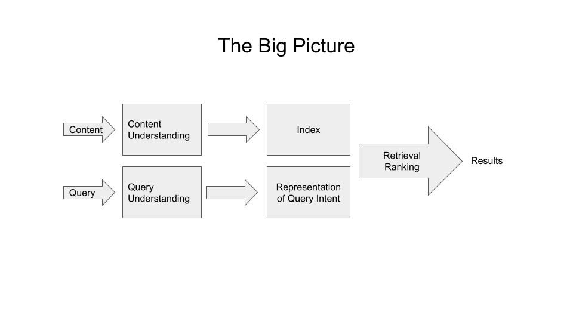

# Week 2: Content Understanding

# Content Understanding

High level understanding of search:
- Content understanding represents each piece of content in the index.
- Query understanding represents each search query as a search intent.
- Relevance of content is a function of query and content understanding.
- Ranking orders the relevant, retrieved content by its desirability.



So far, process has been:
- passing in content (in the index) through an analyzer and adding weights to use statistical methods like tf*idf to capture words or tokens based on importance
- Not really "content understanding"

Sophisticated processes look like:
- combo of holistic (whole-document) and reductionist (focusing on words or phrases) techniques to categorize queries and recognize entities
- Data varience and content size differences leads to variety of approaches

**Content Understanding**: look past literal representation of content as series of words to see what the content is about. 
- How we enrich a piece of content to better represent its meaning in the index
- If you have raw text:
    - **Content Classification**: maps entire doc to a topic that we can assign to a field
        - Example: Article from MIT Press --> Technology, Machine Learning, Artificial Intelligence
    - **Content Annotation**: detects words and phrases within a doc that correspond to entities that we can extract into fields
        - Example: Article from MIT Press --> Google, YouTube, The New York Times
    - **Content Embedding**: transforms doc or fields into mathematical vectors to use in machine learning models 
        - Example: Article from MIT Press --> Vector Store

Approaches include:
- **Classification**: holistic approach mapping a document to 1 or more predefined categories, using hand-tuned rules or machine learning. Con
- **Annotation**: reductionist approach recognizing and labeling individual tokens or spans of tokens within a document, using hand-tuned rules or machine learning.
- **Embedding**: either holistic or reductionist way to map tokens, spans, or entire documents to a vector space (kind of geometry where mathematical nearness corresponds to similarity in meaning). Embeddings are at the heart of AI!

# Content Classification
- Mapping a doc to a sequence of tokens (even if weighted), leads to naive content representation. 
    - Classify the document as a whole
- This is because:
    - Having a word in a doc doesn't mean the document is about that word (token weighting = crude and brittle)
    - If a word has a high tf (repeated a lot) and doesn't occur in many other documents (high idf), the word isn't necessarily essential in describing what the document is about (e.g., "the", "and", "AI")
    - Identifying the most important words in a document as a set would be cumbersome to use as a category or topic (e.g. "meow", "purr", and "claws" is about cats, but not immediately obvious to a search engine)
    - Tokens are a good starting point for content representation, but better to distill them into a representation that's easier to work with... and then use categories and topics in filters, rules, and as inputs for ML models
- Content classification = how to map a document to a category
    - Method #1: Rule-based Classification: using rules
    - Method #2: Machine-Learned Classification: using machine learning

## Method #1: Rule-based Classification
- Apply explicit rules to the content to perform classification, either individually hand-crafted (i.e. doc contains word "election", it is classified as "Politics"), or can be the output of automation (i.e. mining index statistics, external content resources, or histocial human behavior).

### **Regular expressions**: match a word or substring (easiest way)
- Example: If a doc's product title contains the token “phone” (or the stemmed token “phon”), then classify its product type is “Mobile Phones”.
- Example: Match docs with tokens ending in “ism” to the topic “Politics”.
- Easy to cover a lot of ground, but can just as easily accidentally include lots of unintended matches
- Use regular expressions - string matching expressions that can combine token and substring matching with boolean operators
- [Regular expression syntax for Elastic / OpenSearch](https://www.elastic.co/guide/en/elasticsearch/reference/current/regexp-syntax.html)
- Must be used with care:
    - Start as a substring match or a few substring with an AND or OR
    - Bound to find edge cases... endless battle towards an untenable situation that you can't maintain
- Weakness: focuses on individual tokens

Example of regular expression: `.*phone.*&~(.*case.*|.*cover.*|.*microphone.*|.*headphone.*)`
The OpenSearch query:
```bash
GET /bbuy_products/_search
{
  "query": {
    "regexp": {
      "name": {
        "flags": "ALL",
        "value": ".*phone.*&~(.*case.*|.*cover.*|.*microphone.*|.*headphone.*)",
        "case_insensitive": true
      }
    }
  }
}
```


### **Mining rules**: mine rules from index statistics, external content resources, or histoical human behavior, in a way that is heuristic (simpler/more scalable way)
- Strength: looks more holistically at the tokens in a doc
- Process #1: Associate each category with a set of tokens (passed through analyzer) either by hand or on some external resource like Wikipedia... then assign a doc to a category if its tokens overlapped significantly with those of the category (threshold to balance precision and recall)... and imporve process by using tf*idf weighting to emphasize tokens that contribute more to the doc
- Process #2: Mining historical searcher behavior - map search queries to categories... then mine logs to see what docs users click on when they perform those queries and assign them to categories accordingly (clicks as threshold to balance precision and recall)
    - Some biases: presentation bias that user can only click on results the search engine presents to them


## Method #2: Machine-Learned Classification
- More complex and robust than rules-based approaches
- Machine Learning = learning from data; finding patterns in known data that generalize to unknown data

### Training Data
- Need a collection of training data as labeled examples to train the model
- Model = pattern or set of patterns found in training data to hopefully generalize beyond training data (e.g. linear model on weighted sum of signals; decision tree model as flow of yes-no-questions on whether a signal is less than or greater than threshold value)
- After finding patterns in training data, apply knowledge to unknown data - where training a model comes in
    - Training data is a collection of content-category pairs
- 2 requirements for principled ML approach:
    - Traning data must be representative, random sample of the content to which the model will be applied and that the model will see in the wild; or it will be biased. Also, must keep the data fresh too.
    - Important to test data separate from training data and use that test data for evaluation only, not for learning (to avoid cheating)

### The Importance of Representative Training Data 
- Obtaining labels for training data comes from:
    - Collecting explicit human judgements
    - Deriving implicity human judgments from user behavior
    - Generating heuristic labels

### Models
- Supervised vs. Unsupervised Learning:
    - Supervised models: rely on labeled data
    - Unsupervised models: learn patterns from unlabeled data (i.e. clustering)
- Common ML models:
    - Logistic Regression: binary classification model that makes decisions by learning a set of weights to apply to features in a linear combination.
    - Decision Trees: familiy of binary classification models that makes decisions based on a series of feature value splits 
        - Modern approaches use ensemble methods and gradient-boosted decision trees (i.e. XGboost) 
    - Neural Networks: family of models based on how networks of neurons work in the brain
        - Deep learning: uses multiple-layered networks (e.g. Recurrent Neural Networks(RNN), Convolutional Neural Networks (CNN), and transformers).
        - fastText is a tool built on NNs
- Important to know when building with ML:
    - ML models only as good as the data used to train them
    - Data transformation is where most of the hard work for ML is done
    - For most apps, simple models are good enough and additional sophistication leads to added complexity and computational cost for diminishing returns (aka start simple before starting with costly/complex setups at first)
    - Be wary of biased training data and understand the labels in your training data


### Embeddings

- Tokens carry meaning but they are challenging to work with as units of meaning
- Word embeddings map tokens, spans of tokens, or entire documents to a vector space geometry where mathematical distance corresponds to semantic difference in meaning.
- Word embedding approaches stem from `word2vec`: `“fork” + “scoop” - “spikes” = “spoon”.`
- Modern word embeddings models: GloVe, fastText, BERT, ELMo
    - fastText: 
        - free, opens-source model by Facebook's AI Research (FAIR) lab, written in C++ (for speed) and provides Python API and CLI + pre-trained word vectors for 294 languages
        - CLI gives enough functionality and flexibility to train and test a classifier from labeled data without writing code


# Model Training with fastText
Instruct fastText to train a supervised learning model on a food/cooking dataset, with the goal of learning to classify text into predefined categories based on the labels in training data. Then, use the predict command with fastText to ask questions and returns labels.

## Download test data for `fastText`
Run: `~/fastText-0.9.2/fasttext`

See output:
```bash
usage: fasttext <command> <args>

The commands supported by fasttext are:

  supervised              train a supervised classifier
  quantize                quantize a model to reduce the memory usage
  test                    evaluate a supervised classifier
  test-label              print labels with precision and recall scores
  predict                 predict most likely labels
  predict-prob            predict most likely labels with probabilities
  skipgram                train a skipgram model
  cbow                    train a cbow model
  print-word-vectors      print word vectors given a trained model
  print-sentence-vectors  print sentence vectors given a trained model
  print-ngrams            print ngrams given a trained model and word
  nn                      query for nearest neighbors
  analogies               query for analogies
  dump                    dump arguments,dictionary,input/output vectors
```

Run:
```bash
wget https://dl.fbaipublicfiles.com/fasttext/data/cooking.stackexchange.tar.gz
tar -xvzf cooking.stackexchange.tar.gz
head cooking.stackexchange.txt
```

Output is the first 10 lines of labeled training data:
```bash
--2023-11-19 01:04:57--  https://dl.fbaipublicfiles.com/fasttext/data/cooking.stackexchange.tar.gz
Resolving dl.fbaipublicfiles.com (dl.fbaipublicfiles.com)... 3.163.189.14, 3.163.189.51, 3.163.189.108, ...
Connecting to dl.fbaipublicfiles.com (dl.fbaipublicfiles.com)|3.163.189.14|:443... connected.
HTTP request sent, awaiting response... 200 OK
Length: 457609 (447K) [application/x-tar]
Saving to: ‘cooking.stackexchange.tar.gz’

cooking.stackexchange.tar.g 100%[==========================================>] 446.88K  --.-KB/s    in 0.03s   

2023-11-19 01:04:58 (17.3 MB/s) - ‘cooking.stackexchange.tar.gz’ saved [457609/457609]

cooking.stackexchange.id
cooking.stackexchange.txt
readme.txt
__label__sauce __label__cheese How much does potato starch affect a cheese sauce recipe?
__label__food-safety __label__acidity Dangerous pathogens capable of growing in acidic environments
__label__cast-iron __label__stove How do I cover up the white spots on my cast iron stove?
__label__restaurant Michelin Three Star Restaurant; but if the chef is not there
__label__knife-skills __label__dicing Without knife skills, how can I quickly and accurately dice vegetables?
__label__storage-method __label__equipment __label__bread What's the purpose of a bread box?
__label__baking __label__food-safety __label__substitutions __label__peanuts how to seperate peanut oil from roasted peanuts at home?
__label__chocolate American equivalent for British chocolate terms
__label__baking __label__oven __label__convection Fan bake vs bake
__label__sauce __label__storage-lifetime __label__acidity __label__mayonnaise Regulation and balancing of readymade packed mayonnaise and other sauces
```

## Train a model with `fastText`

Split labeled data (15404 entries) into 2 subsets, one for training and one for testing:
Run:
```bash
head -12404 cooking.stackexchange.txt > cooking.train
tail -3000 cooking.stackexchange.txt > cooking.test
```

Train first classifier:
Run:
```bash
~/fastText-0.9.2/fasttext supervised -input cooking.train -output model_cooking
```

Output looks like this:
```bash
Read 0M words
Number of words:  14543
Number of labels: 735
Progress: 100.0% words/sec/thread:    1113 lr:  0.000000 avg.loss: 10.116734 ETA:   0h 0m 0s
```

Test it interactively:
```bash
~/fastText-0.9.2/fasttext predict model_cooking.bin -
```

Now feed it some examples:
- How do I make sourdough? --> `__label__baking`
- How do I make a pizza? --> `__label__baking`
- How do I bake a cake? --> `__label__baking`
- What is cheesecake made of? --> `__label__baking`
- What is a delicious fruit? --> `__label__baking`
- What is a savory spice? --> `__label__baking`
- is fruit good or bad? --> `__label__food-safety`

The output is this:
```bash
How do I make sourdough?
__label__baking
How do I make a pizza?
__label__baking
How do I bake a cake?
__label__baking
What is cheesecake made of?
__label__baking
What is a delicious fruit?
__label__baking
What is a savory spice?
__label__baking
is fruit good or bad?
__label__food-safety
```

Test model on evaluation set:
Run:
```bash
~/fastText-0.9.2/fasttext test model_cooking.bin cooking.test
```

Output is:
```bash
N       3000
P@1     0.14
R@1     0.0607
```
- 1st line: 3,000 examples were evaluated
- 2nd line: precision is 1 - 0.14 (fraction of the time that the top-predicted label is a correct one: 14%)
- 3rd line: recall at 1 is 6.07% (lower because a document can have multiple labels)

Predict more than just the single most likely label for each doc - such as ask it for the top  5:
Run:
```bash
~/fastText-0.9.2/fasttext test model_cooking.bin cooking.test 5
```

Output is:
```bash
N       3000
P@5     0.0686
R@5     0.148
```
^ Increased recall by adding additional predicted labels for each example BUT lost a lot of precision (because 2nd - 5th best predictions are less likely to be correct than the first ones)

## Tuning the model to increase recall and precision

```bash
cat cooking.stackexchange.txt | sed -e "s/\([.\!?,'/()]\)/ \1 /g" | tr "[:upper:]" "[:lower:]" > cooking.preprocessed.txt
head -12404 cooking.preprocessed.txt > cooking.train
tail -3000 cooking.preprocessed.txt > cooking.test
```
^ Now files are in lowercase and there are spaces separating punctuation out, will result in different tokenization

Train and evaluate again:
Run:
```bash
~/fastText-0.9.2/fasttext supervised -input cooking.train -output model_cooking
~/fastText-0.9.2/fasttext test model_cooking.bin cooking.test
```

Output is:
```bash
Read 0M words
Number of words:  8952
Number of labels: 735
Progress: 100.0% words/sec/thread:    1046 lr:  0.000000 avg.loss: 10.055043 ETA:   0h 0m 0s
N       3000
P@1     0.172
R@1     0.0742
```
^ Precision increased to 17% (from 14% initially), not great, but moving in the right direction. 

## Tune the learner with epochs
- fastText, like most neural network approaches, gets better as it iterates
- It's applying optimization technique called gradient descent (stochastic gradient descent) to tune its model to fit its training data... and each iteration through the training data is an epoch.
    - Default for fastText is 5 epochs... increasing it to 25 will improve the iterative understanding of the data:

Run:
```bash
~/fastText-0.9.2/fasttext supervised -input cooking.train -output model_cooking -epoch 25
~/fastText-0.9.2/fasttext test model_cooking.bin cooking.test
```

Output:
```bash
Read 0M words
Number of words:  8952
Number of labels: 735
Progress: 100.0% words/sec/thread:    1061 lr:  0.000000 avg.loss:  7.204033 ETA:   0h 0m 0s
N       3000
P@1     0.52
R@1     0.225
```
^ Huge improvement in precision to above 50% (52% compared to 17% at the start)

Now, trying with 100 epochs to improve even more:
```bash
~/fastText-0.9.2/fasttext supervised -input cooking.train -output model_cooking -epoch 100
~/fastText-0.9.2/fasttext test model_cooking.bin cooking.test
```

```bash
Read 0M words
Number of words:  8952
Number of labels: 735
Progress: 100.0% words/sec/thread:    1086 lr:  0.000000 avg.loss:  3.217236 ETA:   0h 0m 0s
N       3000
P@1     0.54
R@1     0.234
```
^ Only a slight improvement in precision to 54%, but facing diminishing returns for spending 0h18m45s (~20 mins) of training time. Increasing epochs only gets you so far - can squeeze as much as signal as you can from training data by repeatedly iterating through it, but ultimately run out of juice.

## Tune the learner with learning rate
- Learning Rate = a real number set between 0 and 1 determines how quickly the model adjusts to each example it encounters in the training data
    - 0: model doesn't learn at all
    - 1: model reacts strongly to each example
- fastText sets default learning rate at 0.1

### Learning rate set to 1.0 (increases precision)
Run:
```bash
~/fastText-0.9.2/fasttext supervised -input cooking.train -output model_cooking -lr 1.0 -epoch 25
~/fastText-0.9.2/fasttext test model_cooking.bin cooking.test
```

Output is:
```bash
Read 0M words
Number of words:  8952
Number of labels: 735
Progress: 100.0% words/sec/thread:     858 lr:  0.000000 avg.loss:  4.481978 ETA:   0h 0m 0s
N       3000
P@1     0.588
R@1     0.254
```
^ This boosted precision to 59%

### Learning rate set to 0.01 (decreases precision)
Run:
```bash
~/fastText-0.9.2/fasttext supervised -input cooking.train -output model_cooking -lr 0.01 -epoch 25
~/fastText-0.9.2/fasttext test model_cooking.bin cooking.test
```

Output is:
```bash
Read 0M words
Number of words:  8952
Number of labels: 735
Progress: 100.0% words/sec/thread:    1036 lr:  0.000000 avg.loss: 10.713539 ETA:   0h 0m 0s
N       3000
P@1     0.096
R@1     0.0415
```
^ Yikes! This decreased the precision significantly... down to ~10%. 

A higher learning rate is better, and not surprising, because of the small amount of data in in this training data set.

### Can this happen mechanically? Enter Hyperparameter Tuning/Optimizaiton
- It's quite difficult to manually tune parameters and know what to pick.
- Better for a machine to do this for you by performing automatic hyperparameter optimization

## Tune the learner with ngrams
- fastText normally learns from individual tokens
- `ngrams` are sequences of two or more tokens, useful for content understanding
    - Example: "machine learning" is a 2-word phrase often denotes a single concept that is not just the sum of two words

### Retrain model to account for bigrams with `-wordNgrams 2`

Run:
```bash
~/fastText-0.9.2/fasttext supervised -input cooking.train -output model_cooking -lr 1.0 -epoch 25 -wordNgrams 2
~/fastText-0.9.2/fasttext test model_cooking.bin cooking.test
```

Output is:
```bash
Read 0M words
Number of words:  8952
Number of labels: 735
Progress: 100.0% words/sec/thread:    1066 lr:  0.000000 avg.loss:  3.179265 ETA:   0h 0m 0s
N       3000
P@1     0.614
R@1     0.266
```
^ Now precision is up to 61% (well up from 14%). but classifying single line of text into categories will never be perfect, as labels are not perfect. But this is how using machine learning to perform doc classification works!

# The parameters offered by fastText:

```bash
~/fastText-0.9.2/fasttext supervised

Empty input or output path.

The following arguments are mandatory:
  -input              training file path
  -output             output file path

The following arguments are optional:
  -verbose            verbosity level [2]

The following arguments for the dictionary are optional:
  -minCount           minimal number of word occurences [1]
  -minCountLabel      minimal number of label occurrences [0]
  -wordNgrams         max length of word ngram [1]
  -bucket             number of buckets [2000000]
  -minn               min length of char ngram [0]
  -maxn               max length of char ngram [0]
  -t                  sampling threshold [0.0001]
  -label              labels prefix [__label__]

The following arguments for training are optional:
  -lr                 learning rate [0.1]
  -lrUpdateRate       change the rate of updates for the learning rate [100]
  -dim                size of word vectors [100]
  -ws                 size of the context window [5]
  -epoch              number of epochs [5]
  -neg                number of negatives sampled [5]
  -loss               loss function {ns, hs, softmax, one-vs-all} [softmax]
  -thread             number of threads (set to 1 to ensure reproducible results) [12]
  -pretrainedVectors  pretrained word vectors for supervised learning []
  -saveOutput         whether output params should be saved [false]
  -seed               random generator seed  [0]

The following arguments are for autotune:
  -autotune-validation            validation file to be used for evaluation
  -autotune-metric                metric objective {f1, f1:labelname} [f1]
  -autotune-predictions           number of predictions used for evaluation  [1]
  -autotune-duration              maximum duration in seconds [300]
  -autotune-modelsize             constraint model file size [] (empty = do not quantize)

The following arguments for quantization are optional:
  -cutoff             number of words and ngrams to retain [0]
  -retrain            whether embeddings are finetuned if a cutoff is applied [false]
  -qnorm              whether the norm is quantized separately [false]
  -qout               whether the classifier is quantized [false]
  -dsub               size of each sub-vector [2]
```

# Python API

- Useful for search engine integrations
- Full documentation of [fastText Python API](https://fasttext.cc/docs/en/python-module.html)

Run these in sequence:
```bash
pyenv activate search_with_ml
ipython
import fasttext
help(fasttext.FastText)
```

Output:
```bash
Help on module fasttext.FastText in fasttext:

NAME
    fasttext.FastText

DESCRIPTION
    # Copyright (c) 2017-present, Facebook, Inc.
    # All rights reserved.
    #
    # This source code is licensed under the MIT license found in the
    # LICENSE file in the root directory of this source tree.

FUNCTIONS
    cbow(*kargs, **kwargs)
    
    eprint(*args, **kwargs)
    
    load_model(path)
        Load a model given a filepath and return a model object.
    
    read_args(arg_list, arg_dict, arg_names, default_values)
    
    skipgram(*kargs, **kwargs)
    
    supervised(*kargs, **kwargs)
    
    tokenize(text)
        Given a string of text, tokenize it and return a list of tokens
    
    train_supervised(*kargs, **kwargs)
        Train a supervised model and return a model object.
        
        input must be a filepath. The input text does not need to be tokenized
        as per the tokenize function, but it must be preprocessed and encoded
        as UTF-8. You might want to consult standard preprocessing scripts such
        as tokenizer.perl mentioned here: http://www.statmt.org/wmt07/baseline.html
        
        The input file must must contain at least one label per line. For an
        example consult the example datasets which are part of the fastText
        repository such as the dataset pulled by classification-example.sh.
    
    train_unsupervised(*kargs, **kwargs)
        Train an unsupervised model and return a model object.
        
        input must be a filepath. The input text does not need to be tokenized
        as per the tokenize function, but it must be preprocessed and encoded
        as UTF-8. You might want to consult standard preprocessing scripts such
        as tokenizer.perl mentioned here: http://www.statmt.org/wmt07/baseline.html
        
        The input field must not contain any labels or use the specified label prefix
        unless it is ok for those words to be ignored. For an example consult the
        dataset pulled by the example script word-vector-example.sh, which is
        part of the fastText repository.

DATA
    BOW = '<'
Help on module fasttext.FastText in fasttext:

NAME
    fasttext.FastText

DESCRIPTION
    # Copyright (c) 2017-present, Facebook, Inc.
    # All rights reserved.
    #
    # This source code is licensed under the MIT license found in the
    # LICENSE file in the root directory of this source tree.
```

## Train, test, and evaluate a model
- Using previously downloaded cooking data with Python API 

Run (have to be in the same directory as the cooking data/binaries + opened the ipython REPL in that same directory)
```py
model = fasttext.train_supervised(input="cooking.train")
model.predict("easy recipe for sourdough bread ?")
model.test("cooking.test")
```

Output:
```bash
Read 0M words
Number of words:  8952
Number of labels: 735
Progress: 100.0% words/sec/thread:    8244 lr:  0.000000 avg.loss: 10.077682 ETA:   0h 0m 0s
(3000, 0.18, 0.07784344817644515)
```

Run: `model.predict("easy recipe for sourdough bread ?")`
Output:
```bash
(('__label__bread',), array([0.29935071]))
```

Run: `model.test("cooking.test")`
Output:
```bash
(3000, 0.18, 0.07784344817644515)
```

### Improve parameters

Run:
```py
model = fasttext.train_supervised(input="cooking.train", lr=1.0, epoch=25, wordNgrams=2)
model.test("cooking.test")
```
Output:
```bash
Read 0M words
Number of words:  8952
Number of labels: 735
Progress: 100.0% words/sec/thread:   12885 lr:  0.000000 avg.loss:  3.188197 ETA:   0h 0m 0s
(3000, 0.6043333333333333, 0.2613521695257316)
```

Improved results are seen now when running:
Run:
```bash
model.test("cooking.test")
```
Output:
```bash
(3000, 0.6043333333333333, 0.2613521695257316)
```

# Content Annotation
- Another way to improve content understanding by enriching content to make it more findable, not by looking at an index entry holistically, but by focusing on a particular word or phrase
    - Example: Entity Recognition: mention of entities with the content text
    - Could be brands, place names, colors, etc. - recognized entities add structured data to the index in the form of attribute-value pairs (aka facets)
    - Can be used on rules or machine learning.

## Rule-Based Annotation
- Rules means matching strings or regular expressions
    - Example: product title contains string of form "<number> GB" - number represents storage capacity in gigabytes
- Big advantage for annotation b/c focuses on tokens or spans of tokens instead of the document as a whole
    - Easier to craft rules on strings or regular expressions
    - Can match patterns like phone numbers... but can get very complicated quickly

## Machine-Learned Annotations
- For annotating content, but with ML.
- Machine-learned annotation tricker than machine-learned classification b/c it has to make decisions about every token
    - Example: 
        - Part-of-Speech (POS) tagging: nouns, verbs, adjectives - given a text doc, a POS tagger annotates each token with a part of speech.
        - "Cats eat raw fish" --> Tokens annotated as (cats:noun, eat: verb, raw: adjective, fish: noun)

### NLTK for Parts-of-Speech Tagging
- NLTK = popular Python package for natural language processing (NLP)

Run (to activate the ipython instance):
```
ipython
```

Insert into ipython and run:
```py
import nltk
nltk.download('averaged_perceptron_tagger')
nltk.download('punkt')
str = "Cats eat raw fish."
tokens = nltk.word_tokenize(str)
nltk.pos_tag(tokens)
```

Output:
```bash
[nltk_data] Downloading package averaged_perceptron_tagger to
[nltk_data]     /home/gitpod/nltk_data...
[nltk_data]   Unzipping taggers/averaged_perceptron_tagger.zip.
[nltk_data] Downloading package punkt to /home/gitpod/nltk_data...
[nltk_data]   Unzipping tokenizers/punkt.zip.
Out[2]: [('Cats', 'NNS'), ('eat', 'VBP'), ('raw', 'JJ'), ('fish', 'NN'), ('.', '.')]
```
^ NLTK's POS tagger uses part-of-speech tags from the [Penn Treebank Project](https://www.ling.upenn.edu/courses/Fall_2003/ling001/penn_treebank_pos.html):
    - NNS: noun (plural)
    - VBP: verb (singular and present-tense, not in third-person)
    - JJ: adjective
    - NN: noun (singular)
Interesting because NLTK determined that "fish" was a noun and not a verb in this context.

### Named Entity Recognition (NER)
- NER = annotates tokens or spans of tokens as entities of particular types, such as person names, orgs, locations, etc.

Run in ipython:
```py
import nltk
nltk.download('words')
nltk.download('maxent_ne_chunker')
str = "Barack Obama served as the 44th President of the United States."
tokens = nltk.word_tokenize(str)
nltk.ne_chunk(nltk.pos_tag(tokens))
```

Output:
```bash
[nltk_data] Downloading package words to /home/gitpod/nltk_data...
[nltk_data]   Unzipping corpora/words.zip.
[nltk_data] Downloading package maxent_ne_chunker to
[nltk_data]     /home/gitpod/nltk_data...
[nltk_data]   Unzipping chunkers/maxent_ne_chunker.zip.
Tree('S', [Tree('PERSON', [('Barack', 'NNP')]), Tree('PERSON', [('Obama', 'NNP')]), ('served', 'VBD'), ('as', 'IN'), ('the', 'DT'), ('44th', 'CD'), ('President', 'NNP'), ('of', 'IN'), ('the', 'DT'), Tree('GPE', [('United', 'NNP'), ('States', 'NNPS')]), ('.', '.')])
```
^ NLTK correctly identifies "Barack Obama" as a person: `Tree('PERSON', [('Barack', 'NNP')]), Tree('PERSON', [('Obama', 'NNP')])` and "United States" as a geopolitical entity: `Tree('GPE', [('United', 'NNP'), ('States', 'NNPS')])`. NLTK implements NER as a chunker on top of the POS-tagged tokens and returns results as a tree.


# Synonyms
- Use fastText as a tool for unsupervised machine learning instead of supervised classification to learn vector representations for words based on how those words are used in context
    - When words have similar vectors (cosine between their vectors is close to 1), the words have similar meanings and may be useful as synonyms to improve recall

## Using fastText for Word Representations

Using text data from English Wikipedia (50k random lines) downloaded to use here: `/workspace/data/search_with_machine_learning_course/wiki_sample.txt.`

Run to create an unsupervised model from the content:
```bash
~/fastText-0.9.2/fasttext skipgram -input /workspace/search_with_machine_learning_course/data/wiki_sample.txt -output wiki -maxn 0 -minCount 20
```

Output:
```bash
Read 0M words
Number of words:  3066
Number of labels: 0
Progress: 100.0% words/sec/thread:    6153 lr:  0.000000 avg.loss:  2.424727 ETA:   0h 0m 0s
```

2 ways to generate unsupervised models:
- skipgram - preferred method to take advantage of contextual info
    - This was used above
    - `-maxn 0`: exclude subword info (parts of words)
        - remove unknown or rare words, stemming variations, etc. as they can introduce noise
    - `minCount 5`: specify minimum number of times a word must occur in the corpus to be included in the model
        - avoid unique or very rare words
        - default is 5, but a higher number like 50 will remove lots of misspellings and rare words, but too high may remove words that we would want to keep.
- cbow (continuous bag of words)

## Nearest Neighbors as Synonyms
- Once have mapping from words to vectors, we can generate synonym candidates
- fastText lib comes with nearest neighbor method to obtain synonyms

Run:
```bash
~/fastText-0.9.2/fasttext nn wiki.bin
```

Output:
```bash
Query word? politics
constitutional 0.832766
affairs 0.785269
coalition 0.775075
finance 0.774294
politicians 0.772895
parliamentary 0.771742
crown 0.771363
cabinet 0.760965
democratic 0.760475
justice 0.752549

Query word? linux
implementation 0.945991
applications 0.904878
input 0.901636
computers 0.898758
genetic 0.896133
application 0.890955
storage 0.888605
algorithm 0.884358
basic 0.884287
processing 0.879369

Query word? apple pie
nintendo 0.828582
cd 0.821098
dvd 0.781992
rom 0.778776
racing 0.762404
file 0.760268
paper 0.750391
agent 0.744784
introduction 0.744151
machine 0.741964
Query word? one 0
the 0
zero 0
two 0
and 0
a 0
to 0
romania 0
chance 0
symptoms 0

Query word? apple
nintendo 0.828582
cd 0.821098
dvd 0.781992
rom 0.778776
racing 0.762404
file 0.760268
paper 0.750391
agent 0.744784
introduction 0.744151
machine 0.741964

Query word? government
elections 0.76527
security 0.763091
parliamentary 0.75063
civilian 0.748669
minority 0.746113
affairs 0.743946
constitutional 0.74336
seats 0.741889
cabinet 0.73071
council 0.727113

Query word? election
elections 0.859713
vote 0.844896
voted 0.837635
elected 0.813116
labour 0.811273
appointed 0.810659
candidate 0.794924
parliamentary 0.782653
presidential 0.77821
deputy 0.771252
```

^ Analysis at the token level by using vectors and cosine similarity to find synonyms... but still relying on traditional inverted index to represent docs in search index. Any synonym generation will have to be incorporated into either content representation (e.g. populating field with synonyms) or query processing).
- More ambitious approach: treat entire document as a vector

# Integrating Content Understanding into Search
- Using tools ti imporve search experience

## Integrating Content Classification
- Content classification distills doc to what the doc is about
- When there's a match between query and category name assigned to piece of content, that is a strong relevance signal to use a boost or ranking feature

- What happens when new products arrive, or running marketplace and new sellers have products they want to sell, or products show up with wrong categories?
    - content classification can help ensure index has high-quality category field available for ranking
    - content classification can help when you are less likely to have highly structured data - automatically classifying text documents into topics makes text more discoverable
    - content classification is great for creating fields for faceting - when user enters broad or ambiguous query, refining content category can be a simple way to disambiguate the intent (i.e. "mixers" in audio equipment vs. kitchen appliances or "sony" in televisions vs. laptops)

## Integrating Content Annotation
- Annotations don't necessarily tell us what a doc is about, but may be useful as signals for retrieval, relevance, refinement
- Content annotations achieve most value when coupled with query understanding

## Integrating Synonyms
- To integrate synonyms into indexing to improve search, let analyzer for that field know about them, then doc indexed by all of the tokens it contains (with stemming and other processing specified by analyzer) and synonyms of those tokens
- Synonyms increase recall at expense of precision
- Method #1: best practice - to index a field with and without synonyms so search eapp retains ability to manage trade-off
- For hand-tuned models, common to give lower boost to synonym matches than exact matches
    - LTR allows training am odel to learn optimal way to factor in synonym matches
- Method #2: Other method for integrating synonyms is use them in query understanding

## Example of indexing content

### Using Part of Speech Tags for Search
- For POS indexing, index using Pattern Capture Token Filter - similar to DelimitedPayload Token Filter (except we want overlapping tokens) to output multiple tokens at the same position, to then incorporate into queries via "zero slop" phrase queries
- Tokens look like: `Apple#__NNP__ iPhone#__NN__ 13#__CD__`
- Token Filter configured like this regular expression with POSes denoted as __:
```bash
	"filter": [
      {
        "type": "pattern_capture",
        "patterns":["(.*)#(.*)"
          ]
      }
    ]
```

Running in OpenSearch:
```bash
GET _analyze
{
    "tokenizer": "whitespace",
    "filter": [
      {
        "type": "pattern_capture",
        "patterns":["(.*)#(.*)"
          ]
      }
    ]
  , "text": ["Apple#__NNP__ iPhone#__NN__ 13#__CD__"]  
}
```

Output is:
```json
{
  "tokens": [
    {
      "token": "Apple#__NNP__",
      "start_offset": 0,
      "end_offset": 13,
      "type": "word",
      "position": 0
    },
    {
      "token": "Apple",
      "start_offset": 0,
      "end_offset": 13,
      "type": "word",
      "position": 0
    },
    {
      "token": "__NNP__",
      "start_offset": 0,
      "end_offset": 13,
      "type": "word",
      "position": 0
    },
    {
      "token": "iPhone#__NN__",
      "start_offset": 14,
      "end_offset": 27,
      "type": "word",
      "position": 1
    },
    {
      "token": "iPhone",
      "start_offset": 14,
      "end_offset": 27,
      "type": "word",
      "position": 1
    },
    {
      "token": "__NN__",
      "start_offset": 14,
      "end_offset": 27,
      "type": "word",
      "position": 1
    },
    {
      "token": "13#__CD__",
      "start_offset": 28,
      "end_offset": 37,
      "type": "word",
      "position": 2
    },
    {
      "token": "13",
      "start_offset": 28,
      "end_offset": 37,
      "type": "word",
      "position": 2
    },
    {
      "token": "__CD__",
      "start_offset": 28,
      "end_offset": 37,
      "type": "word",
      "position": 2
    }
  ]
}
```